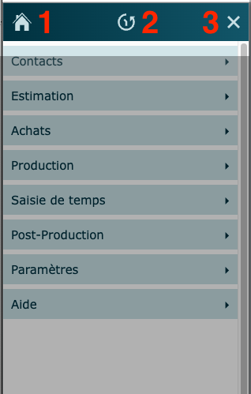
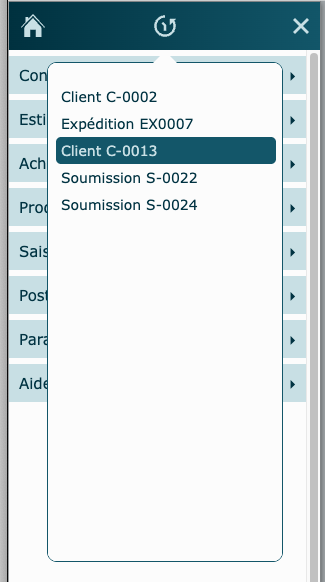
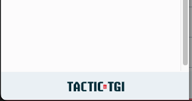

# Page d'accueil

---

## Menu latéral

### Boutons du haut 

### Retour à l'Accueil

1- Cliquez pour revenir à la page d'Accueil.

### Historique de navigation

2- Cliquez pour faire afficher l'historique de navigation.

Il contient les 10 derniers enregistrements officiels visités (tables principales de module).

Il permet de retourner rapidement au dernier travail effectué.

### Fermer le menu

3- Cliquez pour fermer le menu.

### Site internet

Cliquez pour accéder au site internet de Tactic-Tgi.

## Fermer le logiciel

Il est préférable de fermer complètement le logiciel à la fin de votre journée de travail. Utilisez le bouton à cet effet, dans le coin supérieur droit de l'écran.
