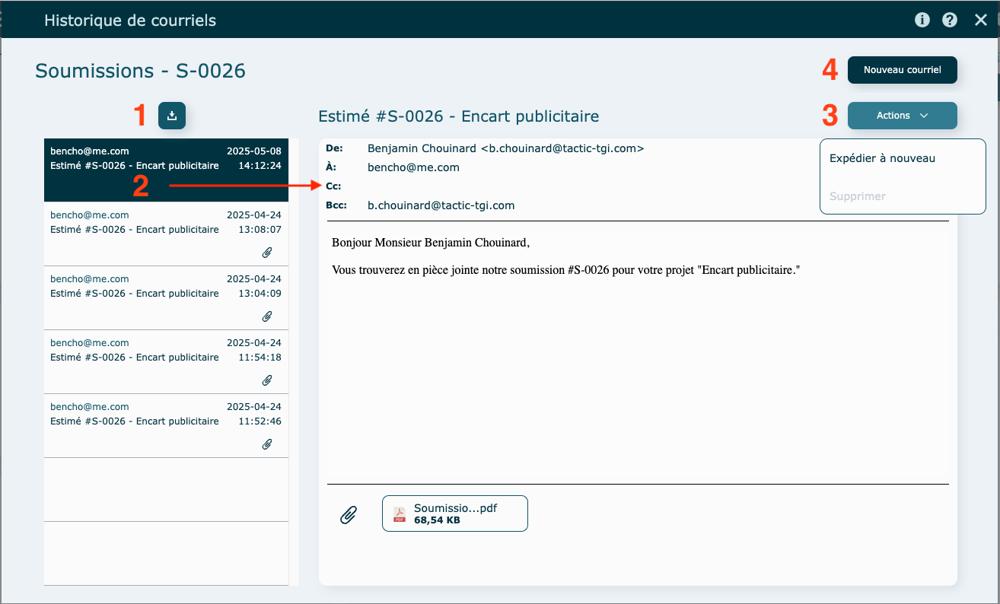

# Courriels

---

### Survol

Tous les envois de courriel passe par ce module-ci.

Les [modèles de courriels](../09-Paramètres/02-parametres.md#textes--modèles-de-courriels) déjà remplit dans vos paramètres système vous ferons sauver du temps.

De plus, comme l'information est centralisé, il vous sera facile de retrouver vos communications et d'y visionner l'historique.

---

### Envoi de formulaire par courriel

Par défaut, les champs suivants seront remplis, mais demeurent éditables :

- Expéditeur
- Destinataire
- Bcc

  Pour recevoir une copie du courriel dans votre boite de messagerie, laissez votre adresse, sinon vous pouvez l'enlever.

- Sujet
- Corps

  Le corps du courriel se remplit selon vos Paramètres système. Il vous est possible d'éditer ce texte dans l'onglet Saisie. L'onglet Aperçu, permet de visualiser le courriel tel qu'il sera reçu par votre destinataire.

- PDF du formulaire

  Cliquez sur le trombone pour joindre des fichiers supplémentaires.

Dans le coin supérieur droit, la flèche envoie le courriel et la poubelle le supprime.

**Exemple d'envoi d'une demande de Sous-traitance**

---

### Historique

Vous pouvez consulter l'historique de courriel dans l'un des modules suivants : Soumission, Demande de sous-traitance, Commandes, Expéditions , Factures.

Cliquez sur l'**enveloppe** pour visionner l'historique de courriels.

Enveloppe **grisé** : aucun courriel envoyé

Enveloppe **en couleur** : contient des courriels

#### Informations générales

1. Cliquez pour un insérer un courriel supplémentaire sous forme de **eml**
   - **eml** = courrier électronique sauvegardé en texte brut.
   - Cliquez sur le bouton pour choisir votre pièce jointe.
   

2. Consultez un courriel
   - Cliquez sur l'un des courriels afin d'afficher son contenu dans la partie de droite
3. Actions
   - Expédiez le courriel à nouveau
   - Supprimer
     Si le bouton est grisé, impossible de faire la suppression.
4. Envoyez un nouveau courriel en lien avec la demande.

