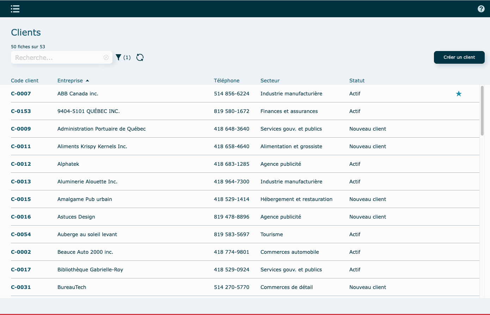
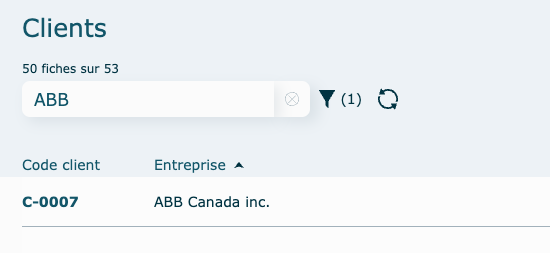
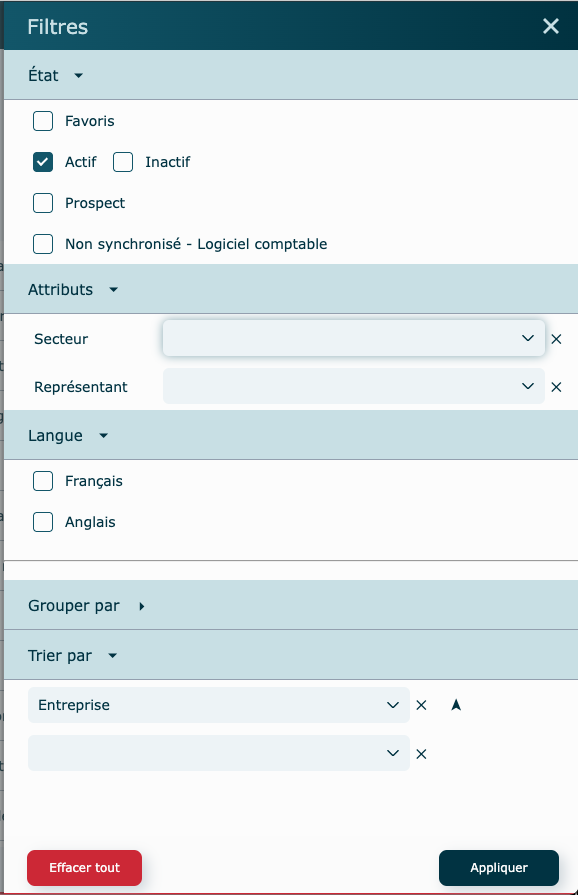

# Navigation

---

## Mode liste

La plupart des modules, se présente sous forme de liste à l'ouverture.
Une barre verticale vous permet de dérouler par le bas. 

Pour trier les informations de la liste, cliquez sur l'entête d'une colonne pour trier la liste en fonction de celle-ci.

## Barre de recherche

Inscrire l'information à rechercher.
Cliquez sur le X pour effacer la recherche.

## Filtres et tris

Propre à chaque module, il vous est possible d'appliquer différents filtres et/ou tris afin d'avoir une sélection plus précise des fiches à afficher.

Cliquez sur le bouton Appliquer au bas pour confirmer votre sélection.
Pour voir toutes les fiches, vous pouvez cliquer sur le bouton Effacer tout, mais en faisant ceci, l'affichage des listes pourrait être ralenti, puisqu'à ce moment, tous les enregistrements faits depuis le début seront montrés. 

Nous conseillons de sélectionner ce qui vous importe de voir, dans votre quotidien, plutôt que de chercher à tout montrer.  

## Consultation / Édition

Un clique sur une ligne va vous diriger vers la fiche détaillée de celle-ci, en mode consultation ou édition selon le module.

## Mode consultation

Vous permet de consulter la fiche détaillée d'un des enregistrements.

Pour modifier des informations, vous devrez généralement passer par le menu Actions, puis modifier, pour ouvrir une fenêtre d'édition. 

## Retour en arrière

Lorsque vous êtes en mode consultation, une icône en flèche vous permet de revenir à la liste. 

---