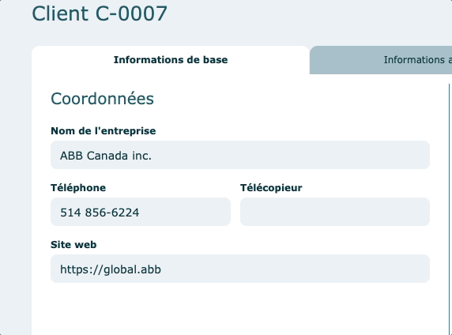

# Champs

---

### Champs éditables

Tous les champs qui ont un fond bleuté et ceux qui réagissent (ombre autour du champ) lorsqu'ils sont survolés avec la souris, sont éditables.

- Exemple

  

### Champs obligatoires

Tous les champs avec une petite étoile rouge doivent être obligatoirement remplis.

Vous ne pourrez enregistrer sans les avoir complétés

- Exemple

  

### Valeur manuelle

Lorsque vous voulez écraser une valeur qui s'est calculée automatiquement par le logiciel, vous pouvez entrer dans le champ et taper votre donnée.

Un indicateur visuel de couleur orangée sera appliqué sur le texte.
Pour revenir à la valeur par défaut, vous devrez effacer votre entrée et la couleur orangée disparaitra.

