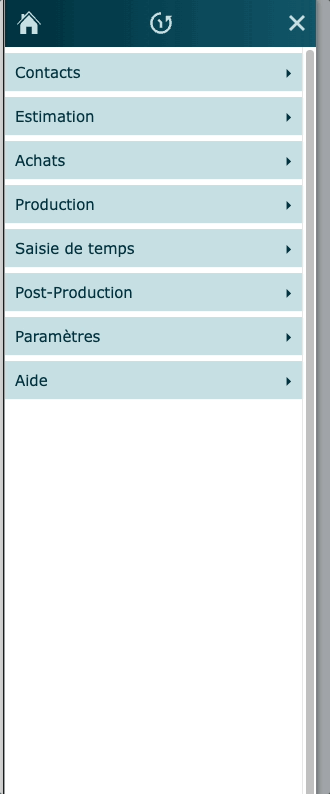
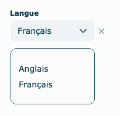

# Menus

---

## Menu latéral

Le menu latéral, au coin supérieur gauche de l'écran, est accessible à travers le logiciel et permet la navigation entre les sections des différents modules.

Chacun des modules contient des sections spécifiques.

Chaque section est identifiée avec un icône de référence à sa gauche.

Cliquez sur le nom de la section pour accéder aux modules.

## Menu déroulant - effacer le contenu

À travers le logiciel, vous aurez des menus déroulants vous permettant d'avoir une constance dans l'inscription des données. Ils sont habituellement populés par des données se trouvant ailleurs dans InterOP, dans les paramètres ou bien ont été configurés avec des données fixes.

Lorsque vous désirez effacer le contenu d'un menu déroulant, appuyez sur le petit X se trouvant à la droite du menu.

###