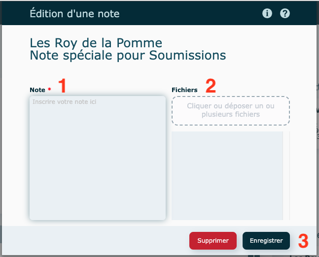

# Notes

---

### Notes provenant de la fiche client ou fournisseur

Dans le haut de chaque module, en mode consultation, cliquez sur le crayon pour visualisez les notes entrées dans la [fiche du client](../04-Contacts/clients.md) ou [fiche fournisseur](../04-Contacts/fournisseurs.md).

Vous avez la possibilité d'en créer de nouvelles au besoin.

### Notes (actions)

Lors de la création d'une nouvelle notes :

1. Inscrire votre note.
2. Insérez un fichier au besoin.
3. **Enregistrer**

#### Consulter, modifier ou supprimer une note

- Consulter

  - cliquez sur la ligne d'une des notes pour l'afficher
  - cliquez sur le X en haut à droite pour fermer la fenêtre

- Modifier

  apportez vos modifications dans la fiche et **Enregistrer**

- Supprimer

  dans la fiche, cliquez sur **Supprimer**

#### Pièce(s) jointe(s)

Cliquez sur cet icône ou glissez-déposez pour insérer un fichier. Aucune limite de pièces jointes.

- Cliquez sur l'une des pièces jointes pour sélectionner une action à effectuer.

  - Ouvrir
  - Enregistrer
  - Renommer
  - Supprimer

  

Le trombone indique qu'un fichier a été inséré dans la note et le chiffre en rouge le nombre de fichier(s) joint(s).

