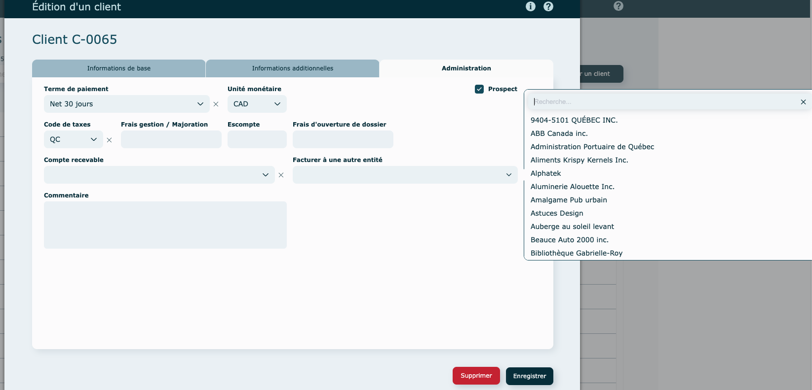

# Clients

---

## Survol

Ce module a été élaboré pour consigner toutes les informations relatives aux clients actuels et potentiels. En plus des contacts liés et des adresses d’expédition (sans limite de nombre), vous y retrouvez l’historique des soumissions, des dossiers, des bons d’expédition et des factures émises avec l’analyse des ventes par année.

De plus, l’utilisation de nos passerelles de connexion à votre logiciel comptable et/ou logiciel CRM permettent également de créer ou mettre ces informations à jour à un seul endroit dans interOP, puis déclencher la mise à jour automatiquement dans les logiciels connectés.

Ouverture du module en [mode liste](https://app.clickup.com/9017115504/v/dc/8cqcgvg-21377/8cqcgvg-17257?block=block-56d3904d-8421-44c4-8d23-f01b57d0f037).

Par défaut, le [filtre](https://app.clickup.com/9017115504/v/dc/8cqcgvg-21377/8cqcgvg-17257?block=block-d334b8fe-d65e-4449-a1d9-a27c07e19a53) est à Actif.

**En mode** [**consultation**](https://app.clickup.com/9017115504/v/dc/8cqcgvg-21377/8cqcgvg-17257?block=block-fab2c14a-4d75-4bad-9f1c-ba1f4f2460a3)

La portion du **haut** présente les coordonnées de base de l'entreprise.

À droite, se retrouvent les personnes contacts ainsi que les adresses d'expédition associées.

La portion du **bas** présente l'historique pour :

- les soumissions
- les dossiers de production
- les bons d'expédition
- les factures

Le dernier onglet permet de consigner différentes [notes](https://app.clickup.com/9017115504/v/dc/8cqcgvg-25937/8cqcgvg-26797?block=block-5a6456ba-b0e7-4627-a40b-138e6c08bd0c) segmentées par catégorie.

---

### Création d'un client

1. Revenir dans la liste des clients et cliquer sur **Créer un client**

   - **Coordonnées**
     Les champs marqués d'une [étoile](https://app.clickup.com/9017115504/v/dc/8cqcgvg-21377/8cqcgvg-17257?block=block-aeef2813-739d-4f73-8be3-fad739556f61) sont obligatoires.
     
     **Abonnement requis** pour cette [fonction](https://app.clickup.com/9017115504/v/dc/8cqcgvg-25937/8cqcgvg-27177?block=block-2e10d61b-8a21-40a6-bb11-4d5cbc05c3f7).
     
     Adresse à compléter ici ⤵️ 
     - **Renseignement additionnels**
       Identification expéditeur sur le bon d'expédition et les étiquettes.
       **Standard** ➝ Logo & coordonnées de votre entreprise.
       **Client** ➝ Logo de votre client à ajouter.
       **Aucune** ➝ Blank shipping (aucun logo/identification) 
   - **Administration**
     Les champs à compléter sont en fonction de votre système comptable. À noter que vous pouvez choisir de facturer à une autre entité (autre client de votre base de donnée).
     

2\. **Enregistrer**

---

### **Contact**

Icônes possibles à côté de chaque contact :

- Étoile ➝ Contact par défaut
- Calculatrice ➝ Responsable de la facturation ( possibilité d'un seul par client)
- Rond vert ➝ Identifie que le contact est synchronisé avec [Hubspot](https://app.clickup.com/9017115504/v/dc/8cqcgvg-25937/8cqcgvg-27077?block=block-50ac6ca8-f137-49bb-a9c9-b295a6682714)

Contact **Actif** : en couleur

Contact **Inactif** : grisé

#### Ajouter un contact

- Cliquer sur **l'icône** 
- Remplir la fiche : les champs marqués d'une [étoile](https://app.clickup.com/9017115504/v/dc/8cqcgvg-21377/8cqcgvg-17257?block=block-aeef2813-739d-4f73-8be3-fad739556f61) sont obligatoires.

  
- Spécifiez si le contact est celui par défaut, s'il est responsable de la facturation et/ou de l'envoi courriel de la facturation.

- **Enregistrer**

#### Consulter, modifier ou supprimer un contact

- Consulter

  - cliquez sur le nom d'un des contacts pour afficher sa fiche
  - cliquez sur Enregistrer pour sortir de la fenêtre.

- Modifier

  apportez vos modifications dans la fiche et cliquez sur **Enregistrer**

- Supprimer

  dans la fiche, cliquez sur **Supprimer**

  Si le bouton est grisé, impossible de faire la suppression car le contact est utilisé dans le système.

---

### Adresses

Icônes possibles à côté d'une adresse :

- Maison ➝ Adresse principale ( possiblité d'en désigner 1 seule)
- Petite planète : permet de voir l'itinéraire

#### Ajouter une adresse d'expédition

- Cliquer sur **l'icône** 
- Remplir la fiche

  **Abonnement requis** pour cette [fonction](https://app.clickup.com/9017115504/v/dc/8cqcgvg-25937/8cqcgvg-27177?block=block-2e10d61b-8a21-40a6-bb11-4d5cbc05c3f7).

  

  Adresse à compléter ⤵️ les champs marqués d'une [étoile](https://app.clickup.com/9017115504/v/dc/8cqcgvg-21377/8cqcgvg-17257?block=block-aeef2813-739d-4f73-8be3-fad739556f61) sont obligatoires.

  

- **Enregistrer**

#### Consulter, modifier ou supprimer une adresse

- Consulter

  - cliquez sur le nom de l'entreprise d'une des adresses pour afficher sa fiche
  - cliquez sur Enregistrer pour fermer la fenêtre

- Modifier

  apportez vos modifications dans la fiche et **Enregistrer**

- Supprimer

  dans la fiche, cliquez sur **Supprimer** Si le bouton est grisé, impossible de faire la suppression car l'adresse est utilisée dans le système.

---

### Notes

Les [notes](https://app.clickup.com/9017115504/v/dc/8cqcgvg-21377/8cqcgvg-17257?block=block-420eb67f-36d7-4f80-9b26-17ac642f4cd5) ajoutées ici seront visible dans le haut de tous les modules où le client est utilisé.

#### Ajouter une note

1. Cliquez sur l'onglet Notes
2. Cliquez sur **l'icône** 

Sélectionnez une catégorie.

Suivre les [instructions suivantes](https://app.clickup.com/9017115504/v/dc/8cqcgvg-21377/8cqcgvg-17257?block=block-f629445e-37c8-4518-83ba-9e80b9267668).

Pour consulter, modifier, supprimer une note ou insérer et consulter des pièces jointes, vous référez à cette [section](https://app.clickup.com/9017115504/v/dc/8cqcgvg-21377/8cqcgvg-17257?block=block-1f474c9b-58a9-4128-a20e-cd371aa4ac37).

---

### [Actions diverses](https://app.clickup.com/9017115504/v/dc/8cqcgvg-21377/8cqcgvg-17257?block=block-dfe6c8ce-fe79-4b29-bee3-9695d2ea4ab7)

#### En mode [consultation](https://app.clickup.com/9017115504/v/dc/8cqcgvg-21377/8cqcgvg-17257?block=block-fab2c14a-4d75-4bad-9f1c-ba1f4f2460a3)

- Modifier ce client

  Apporter vos modifications dans l'écran d'édition et **Enregistrer**

- Modifier le code client

  Suivre les étapes à l'écran.

  Souvent cette étape sera réservée à certains utilisateurs seulement.

- Rendre actif/inactif

  Inactif : le client apparaitra grisé dans la liste.

- Envoyer à Système comptable

  Synchroniser avec votre système comptable.

- Supprimer

  Supprimer la fiche contact si vous avez les accès pour le faire

  Si le bouton est grisé, impossible de faire la suppression car le client est utilisé ailleurs dans le logiciel. , rendre plutôt le client **Inactif.**

---

### Autres fonctionnalités

Dans l'onglet **Facture.**

#### Mettre à jour le total des ventes

L'actualisation des totaux ne se fait pas automatiquement.

Cliquez pour actualiser le total des ventes pour les 5 dernières années.

#### Créer une facture

Suivre les étapes de la [création](https://app.clickup.com/9017115504/v/dc/8cqcgvg-21377/8cqcgvg-17497?block=block-70a68f39-4342-45db-a2a7-0e1511584dc8) de nouvelle facture.

---

## Vidéo démo du module

[https://www.youtube.com/watch?v=y99c8--Omm0](https://www.youtube.com/watch?v=y99c8--Omm0)
