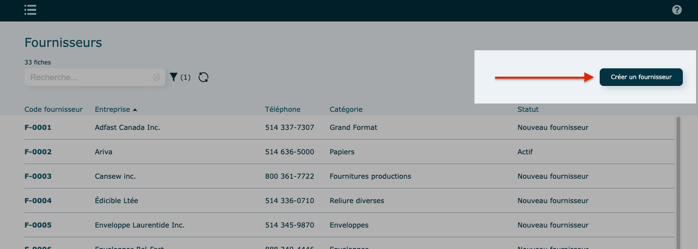
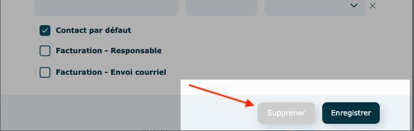
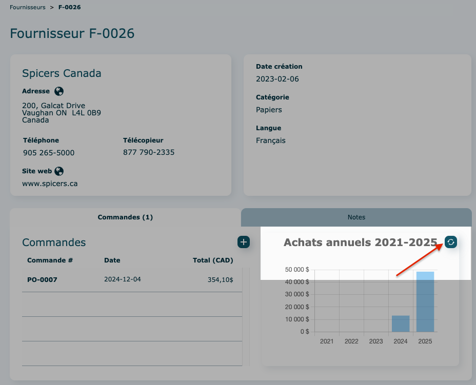

# Fournisseurs

---

## Survol

Ce module permet de saisir toutes les informations liées à vos sous-traitants et autres fournisseurs.

Ouverture du module en [mode liste](https://app.clickup.com/9017115504/v/dc/8cqcgvg-21377/8cqcgvg-17257?block=block-56d3904d-8421-44c4-8d23-f01b57d0f037).

Par défaut, le [filtre](https://app.clickup.com/9017115504/v/dc/8cqcgvg-21377/8cqcgvg-17257?block=block-d334b8fe-d65e-4449-a1d9-a27c07e19a53) est à Actif.

**En mode** [**consultation**](https://app.clickup.com/9017115504/v/dc/8cqcgvg-21377/8cqcgvg-17257?block=block-fab2c14a-4d75-4bad-9f1c-ba1f4f2460a3)

La portion du **haut** présente les coordonnées de base de l'entreprise.

À droite, se retrouvent les personnes [contacts](https://app.clickup.com/9017115504/v/dc/8cqcgvg-25937/8cqcgvg-26977?block=block-ac08fd6a-7041-46da-ad1c-076e0f8de9bb) associées à ce fournisseur.

La portion du **bas** présente l'historique pour :

- les bons de commande d’achat et l'analyse des achats totaux pour les 5 dernières années.

Le dernier onglet permet de consigner différentes [notes](https://app.clickup.com/9017115504/v/dc/8cqcgvg-25937/8cqcgvg-26977?block=block-bd056f4a-150f-48e4-bf86-389d17b24767).

---

### Création d'un fournisseur

1. Revenir dans la liste des clients et cliquer sur **Créer un fournisseur**

   - **Coordonnées**
     Les champs marqués d'une [étoile](https://app.clickup.com/9017115504/v/dc/8cqcgvg-21377/8cqcgvg-17257?block=block-aeef2813-739d-4f73-8be3-fad739556f61) sont obligatoires.
    

     **Abonnement requis** pour cette [fonction](https://app.clickup.com/9017115504/v/dc/8cqcgvg-25937/8cqcgvg-27177?block=block-2e10d61b-8a21-40a6-bb11-4d5cbc05c3f7).
     
     Adresse à compléter ici ⤵️ 
     
    - **Renseignement additionnels**
    
    - **Administration**
    

2\. **Enregistrer**

---

### **Contact**

Icônes possibles à côté de chaque contact :

- Étoile ➝ Contact par défaut

Contact **Actif** : en couleur

Contact **Inactif** : grisé

#### Ajouter un contact

- Cliquer sur **l'icône** 
- Remplir la fiche : les champs marqués d'une [étoile](https://app.clickup.com/9017115504/v/dc/8cqcgvg-21377/8cqcgvg-17257?block=block-aeef2813-739d-4f73-8be3-fad739556f61) sont obligatoires.

  
- Spécifiez si le contact est celui par défaut, s'il est responsable de la facturation et/ou de l'envoi courriel de la facturation.

- **Enregistrer**

#### Consulter, modifier ou supprimer un contact

- Consulter

  - cliquez sur le nom d'un des contacts pour afficher sa fiche
  - cliquez sur Enregistrer pour fermer la fenêtre

- Modifier

  apportez vos modifications dans la fiche et **Enregistrer**

- Supprimer

  dans la fiche, cliquez sur **Supprimer**

  À noter : Si le bouton est grisé, impossible de faire la suppression car le contact est utilisé dans le système.

  

---

### Notes

Les [notes](https://app.clickup.com/9017115504/v/dc/8cqcgvg-21377/8cqcgvg-17257?block=block-420eb67f-36d7-4f80-9b26-17ac642f4cd5) ajoutées ici seront visible dans le haut du module de commande où le fournisseur est utilisé.

#### Ajouter une note

1. Cliquer sur l'onglet Notes
2. Cliquer sur **l'icône** 

Suivre les [instructions suivantes](https://app.clickup.com/9017115504/v/dc/8cqcgvg-21377/8cqcgvg-17257?block=block-f629445e-37c8-4518-83ba-9e80b9267668).

Pour consulter, modifier, supprimer une note ou insérer et consulter des pièces jointes, vous référez à cette [section](https://app.clickup.com/9017115504/v/dc/8cqcgvg-21377/8cqcgvg-17257?block=block-1f474c9b-58a9-4128-a20e-cd371aa4ac37).

---

### [Actions diverses](https://app.clickup.com/9017115504/v/dc/8cqcgvg-21377/8cqcgvg-17257?block=block-dfe6c8ce-fe79-4b29-bee3-9695d2ea4ab7)

#### En mode consultation

- Modifier ce fournisseur

  - apporter vos modifications dans la fiche et Enregistrer

- Modifier le code fournisseur

  - Suivre les étapes à l'écran
    Souvent cette étape sera réservée à certains utilisateurs seulement.

- Rendre actif/inactif

  - Inactif : le fournisseur apparaitra grisé dans la liste

- Envoyer à Système comptable

  Synchroniser avec votre système comptable.

- Supprimer

  Si le bouton est grisé, impossible de faire la suppression car le fournisseur est utilisé ailleurs dans le logiciel. , rendre plutôt le fournisseur **Inactif.**

---

### Autres fonctionnalités

#### Créer une commande

Consultez cette [documentation](https://app.clickup.com/9017115504/v/dc/8cqcgvg-21377/8cqcgvg-17357?block=block-c30e9952-5b55-4d68-859c-28ed7b7a99de) .

#### Mettre à jour le total des achats

L'actualisation des totaux ne se fait pas automatiquement.

Cliquez pour actualiser le total des achats pour les 5 années.

---

## Vidéo démo du module

[https://www.youtube.com/watch?v=v3kYpor_W2I](https://www.youtube.com/watch?v=v3kYpor_W2I)
