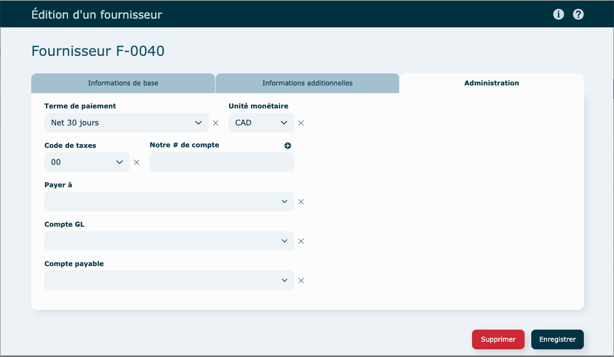
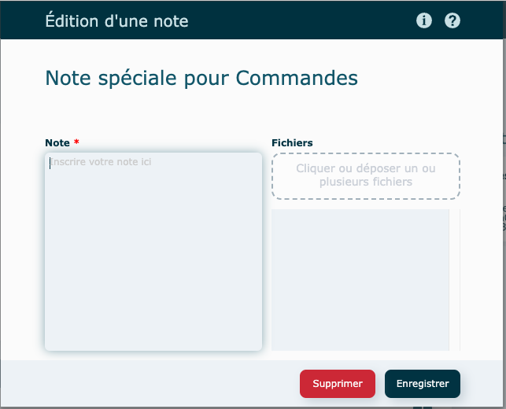

---

## Survol

Ce module permet de saisir toutes les informations liées à vos sous-traitants et autres fournisseurs.

Ouverture du module en [mode liste](../03-Fonctionnalités%20générales/02-navigation.md#mode-liste).

Par défaut, le [filtre](../03-Fonctionnalités%20générales/02-navigation.md#filtres-et-tris) est à Actif.

**En mode** [**consultation**](../03-Fonctionnalités%20générales/02-navigation.md#mode-consultation)

La portion du **haut** présente les coordonnées de base de l'entreprise.

À droite, se retrouvent les personnes [contacts](../04-Contacts/clients.md#contact) associées à ce fournisseur.

La portion du **bas** présente l'historique pour :

- les bons de commande d’achat et l'analyse des achats totaux pour les 5 dernières années.

Le dernier onglet permet de consigner différentes [notes](../03-Fonctionnalités%20générales/06-notes.md).

---

## Création d'un fournisseur

1. Revenir dans la liste des clients et cliquer sur **Créer un fournisseur**
   

   - **Coordonnées**
     Les champs marqués d'une [étoile](../03-Fonctionnalités%20générales/04-champs.md#champs-obligatoires) sont obligatoires.

     **Abonnement requis** pour cette [fonction](../03-Fonctionnalités%20générales/07-rechercheadresse.md).
     
     Adresse à compléter ici ⤵️
     

   - **Renseignement additionnels**
     
   - **Administration**
     

2\. **Enregistrer**

---

## Contact

Icônes possibles à côté de chaque contact :

- Étoile ➝ Contact par défaut

Contact **Actif** : en couleur

Contact **Inactif** : grisé

### Ajouter un contact

- Cliquer sur **l'icône** 
- Remplir la fiche : les champs marqués d'une [étoile](../03-Fonctionnalités%20générales/04-champs.md#champs-obligatoires) sont obligatoires.

  

- Spécifiez si le contact est celui par défaut, s'il est responsable de la facturation et/ou de l'envoi courriel de la facturation.

- **Enregistrer**

### Consulter, modifier ou supprimer un contact

- Consulter

  - cliquez sur le nom d'un des contacts pour afficher sa fiche
  - cliquez sur Enregistrer pour fermer la fenêtre

- Modifier

  apportez vos modifications dans la fiche et **Enregistrer**

- Supprimer

  dans la fiche, cliquez sur **Supprimer**

  À noter : Si le bouton est grisé, impossible de faire la suppression car le contact est utilisé dans le système.

  

---

## Notes

Les [notes](../03-Fonctionnalités%20générales/06-notes.md) ajoutées ici seront visible dans le haut du module de commande où le fournisseur est utilisé.

### Ajouter une note

1. Cliquer sur l'onglet Notes
2. Cliquer sur **l'icône** 

Suivre les [instructions suivantes](../03-Fonctionnalités%20générales/06-notes.md#notes-actions).

Pour consulter, modifier, supprimer une note ou insérer et consulter des pièces jointes, vous référez à cette [section](../03-Fonctionnalités%20générales/06-notes.md#notes-actions).

---

## Actions diverses

#### En mode consultation

- Modifier ce fournisseur

  - apporter vos modifications dans la fiche et Enregistrer

- Modifier le code fournisseur

  - Suivre les étapes à l'écran
    Souvent cette étape sera réservée à certains utilisateurs seulement.

- Rendre actif/inactif

  - Inactif : le fournisseur apparaitra grisé dans la liste

- Envoyer à Système comptable

  Synchroniser avec votre système comptable.

- Supprimer

  Si le bouton est grisé, impossible de faire la suppression car le fournisseur est utilisé ailleurs dans le logiciel. , rendre plutôt le fournisseur **Inactif.**

---

## Autres fonctionnalités

### Créer une commande

Consultez cette [documentation](../06-Achats/01-commandes.md#création-dune-commande) .

### Mettre à jour le total des achats

L'actualisation des totaux ne se fait pas automatiquement.

Cliquez pour actualiser le total des achats pour les 5 années.

---

## Vidéo démo du module

[https://www.youtube.com/watch?v=v3kYpor_W2I](https://www.youtube.com/watch?v=v3kYpor_W2I)
