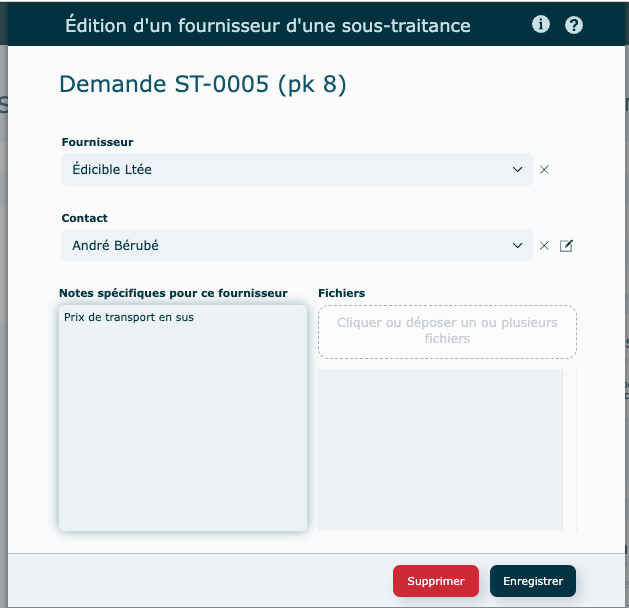

# Demandes sous-traitance

---

## Survol

Avec ce module, acheminez rapidement vos demandes de prix de sous-traitance à un ou plusieurs fournisseurs potentiels.

Ouverture du module en [mode liste](../03-Fonctionnalités%20générales/02-navigation.md#mode-liste).

Par défaut, le statut d'une demande est à **Nouvelle demande**.

Ce statut changera pour **Envoyée** lorsqu'elle sera envoyé par courriel à un fournisseur

---

## Demande de sous-traitance

### Créer

1. Cliquez sur **Créer une demande**
2. Remplir la fiche
   - Nom du projet
   - Quantités : Cliquez sur **+** pour ajouter des quantités
     par défaut, une nouvelle quantité créée sera le double de la précédente avec possibilité de la modifier.
   - Description de la demande
   - Date requise
   - Fichier(s) à joindre avec la demande

3\. Sélection de fournisseurs

- Cliquez sur **l'icône**
  - Sélectionnez un fournisseur

  

4\. Sélection d'un contact.
- Si le contact ne se trouve pas dans la liste, veuillez vous rendre dans le module Fournisseurs pour pouvoir le créer.
- Possibilité d'éditer le contact directement dans la demande.

5\. Ajoutez une [note](../03-Fonctionnalités%20générales/06-notes.md#notes-actions) et au besoin, les fichiers fournis par ce fournisseur (estimé, dessin technique, etc.) et **Enregistrer.**

####

### Visualiser

Cliquez sur l'oeil afin de visualiser une demande.

- PDF de la demande : un nouvel onglet ouvrira dans votre navigateur, pour visualiser et/ou imprimer et/ou télécharger votre demande.

  

### Envoyer

Cliquez sur l'enveloppe pour envoyer votre demande par courriel.

Suivre les instructions de [courriels.](../03-Fonctionnalités%20générales/01-courriels.md)

Enveloppe **grisé** : aucun courriel envoyé

Enveloppe **en couleu**r : courriel envoyé

---

## Actions diverses

#### **En mode [consultation](../03-Fonctionnalités%20générales/02-navigation.md#mode-consultation)**

- Dupliquer
- Supprimer

  si le bouton est grisé, impossible de faire la suppression car le no de demande est utilisé dans le logiciel.

---

## Informations supplémentaires

- Il est possible de créer une demande de sous-traitance et la « [Lier](../05-Estimation/01-soumissions.md#opérations-globales) » à une opération externe d'une soumission par la suite.

Si une soumission est liée à votre demande, vous pouvez la consulter en cliquant sur le numéro de soumission à droite du nom du Projet.

- Une demande de sous-traitance peut être créée à partir d'une [opération externe](../05-Estimation/01-soumissions.md#opérations-globales) d'une soumission.

---

## Vidéo démo du module

[https://www.youtube.com/watch?v=enbRlzHF3rM](https://www.youtube.com/watch?v=enbRlzHF3rM)
