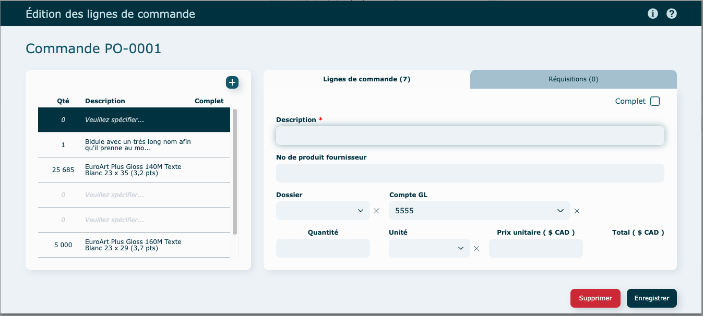

# Commandes

---

## Survol

Un outil essentiel pour créer des bons d’achat de sous-traitance ou de matières premières. Pourquoi ne pas imprimer les formulaires ou mieux encore les sauvegarder en format pdf avec envoi automatisé en pièce jointe d’un courriel? En quelques clics, tout est réglé.

Ouverture du module en [mode liste](../03-Fonctionnalités%20générales/02-navigation.md#mode-liste).

Par défaut, le [filtre](../03-Fonctionnalités%20générales/02-navigation.md#filtres-et-tris) est à statut : En préparation + Envoyée + Reçue partiellement.

---

## Création d'une commande

- Cliquez sur **Créer une commande** en haut à droite de la liste.

- Sélectionnez un fournisseur

  

 
- La création de votre commande se fera automatiquement.

Remplir les informations manquantes dans le haut de la fenêtre.

### Ajouter une ligne de commande

- Cliquez sur **l'icône** et choisir si vous voulez :

  - créer une ligne **depuis un produit**
    - sélectionnez un produit en cliquant sur sa ligne
    
    - inscrire une quantité
    - au besoin, sélectionnez un dossier et un compte GL associé
    

  - créer une **ligne manuelle** : remplir la description, quantité et autres informations pertinentes au besoin.
    

Ajoutez une note au besoin, dans le bas de la fenêtre de commande. Elle se retrouvera sur le formulaire envoyé au fournisseur. 

À noter que vous pouvez également créer une ligne de commande en vous trouvant dans la fenêtre d'édition des lignes de commandes.

### [Réquisitions](../06-Achats/01b-requisitions.md)

Onglet **Lignes de commande**

Cliquer sur la ligne du produit, puis cliquer sur le bouton **Calculatrice** afin de remplir automatiquement les quantités des lignes de commande à partir des réquisitions associées. Si vous ne commandez pas la même unité que celle utilisée pour faire la soumission et la réquisition, entré simplement la quantité et changer l'unité (ex : soumission aux pieds carrés mais achat en rouleau).

Onglet **Réquisitions**

Affiche les réquisitions liées à la commande, lorsque celles-ci ont été utilisées lors de sa création.

## Changement du fournisseur

Si vous avez des lignes de commandes créées à partir d'un produit existant, vous ne pourrez plus changer le fournisseur (la loupe disparaitra). La raison est que les produits sont toujours liés à un fournisseur.

Pour changer de fournisseur, vous devrez supprimer les lignes et les refaire manuellement.
Au besoin, vous rendre dans le produit en question pour ajouter un second fournisseur en plus de celui qui est choisi par défaut (favori).

## Compléter une commande

Le statut de la commande restera à "En préparation", le temps que la réception de la marchandise soit faite. 

Lorsque le magasiner reçoit les items, il doit se rendre dans un des items et cocher la case "Complet" sur tous les items reçus. Si une ou des réquisitions étaient liées à cette commande, leur statut changera pour **Reçu**.

La commande passera alors au statut **Complétée**. 

---

###

## Actions diverses

#### En mode [consultation](../03-Fonctionnalités%20générales/02-navigation.md#mode-consultation)

- Modifier le numéro de la commande

  Suivre les étapes à l'écran

- Dupliquer
- Annuler / Réutiliser la commande

  une commande annulée peut être réutilisée.

- Visualiser pdf : un nouvel onglet ouvrira dans votre navigateur, pour visualiser et/ou imprimer et/ou télécharger votre commande.

  

- Imprimer
- Envoyer par courriel

  suivre les instructions de [courriels](../03-Fonctionnalités%20générales/01-courriels.md).

  impossible d'envoyer une commande Annulée par courriel, le bouton sera grisé

---

## Vidéo démo du module

[https://www.youtube.com/watch?v=UNP2lrJgqVg](https://www.youtube.com/watch?v=UNP2lrJgqVg)
