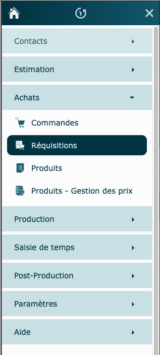
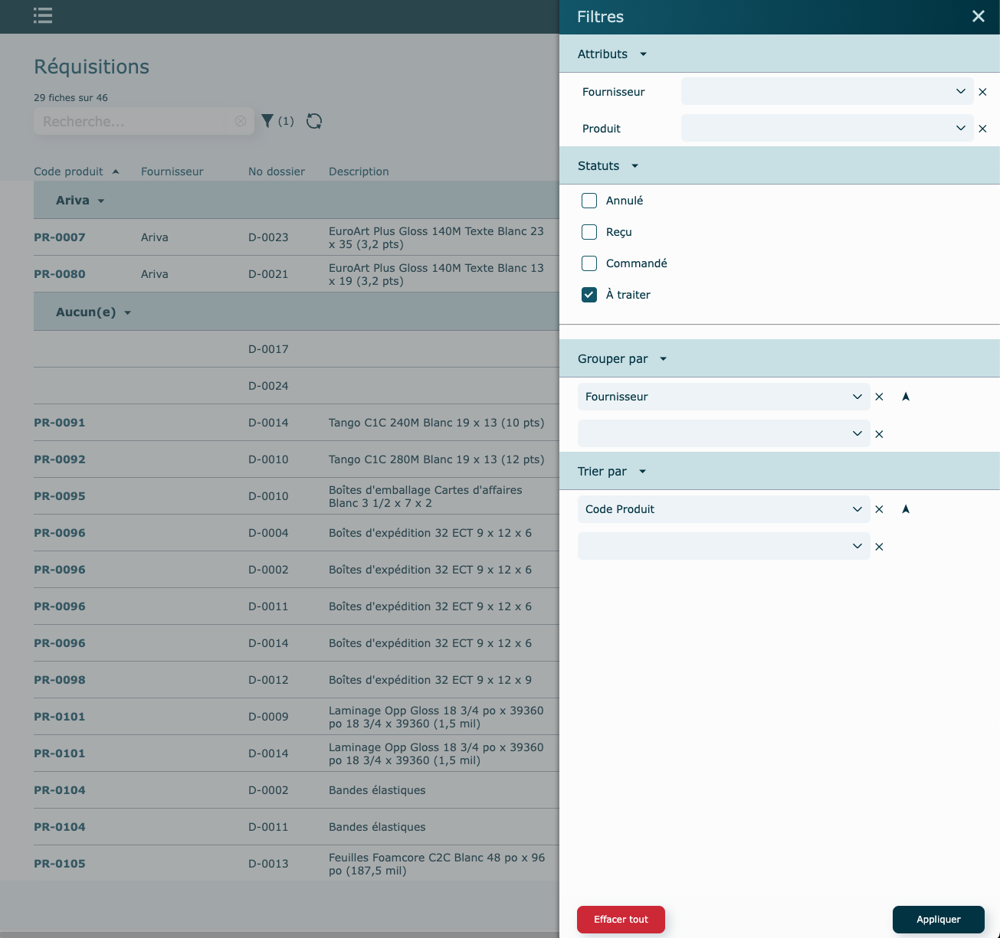
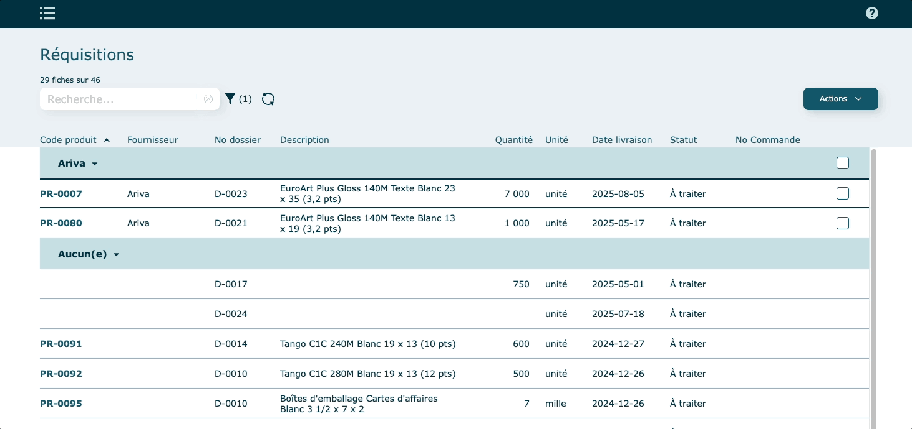
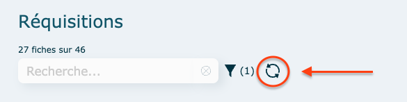
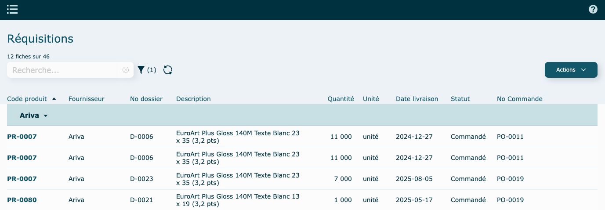
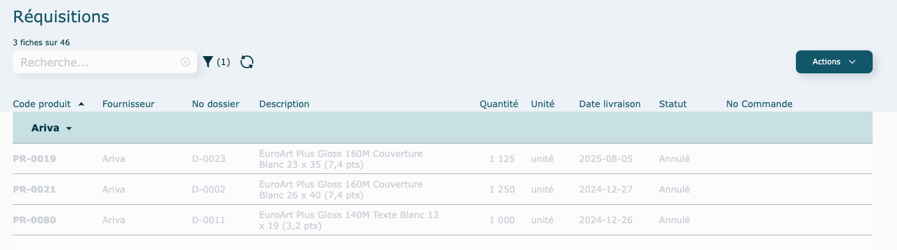
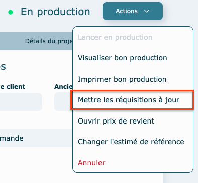

# Réquisitions d'achats

Les réquisitions sont accessibles dans le [menu latéral](../03-Fonctionnalités%20générales/05-menus.md#menu-latéral)

  
Elles sont créées à partir des dossiers que vous lancerez en production. Ceci vous permettra facilement de regrouper des achats à faire de support d'impression, de produits de finition ou d'emballage.

Remplir les critères souhaités dans la fenêtre **Filtres**, puis cliquez sur **Appliquer** pour générer la liste des réquisitions correspondant aux filtres appliqués. Par défaut, le filtre sera de voir les commandes **À traiter** seulement.

## Créer une commande depuis les réquisitions
  
Cochez les produits que vous souhaitez inclure dans la commande, en choissisant les lignes manuellement ou en cochant la case située dans l'entête bleue du fournisseur (ou selon le regroupement choisit) pour sélectionner tous les produits associés à celui-ci. 

Une fois votre sélection faite, cliquez sur **Actions** pour procéder soit à la commande des produits ou pour annuler les réquisitions.
 
 Un message de confirmation apparaitra pour vous mentionner que la commande a été faite. Vous devez ensuite vous rendre dans les commandes par le menu latéral pour la trouver. Vous pouvez donc faire plusieurs commandes avant de quitter les réquisitions pour aller les compléter dans l'autre module.

    

Cliquez sur le bouton **Rafraîchir** pour actualiser la liste des réquisitions affichées, pour vous assurez que toutes les réquisitions récentes s'y trouvent.

  

### Modification Fournisseur par défaut (favori)

Le fournisseur associé à une réquisition dont le statut est **À traiter** peut être modifié en cliquant directement sur la ligne. Une fenêtre s'ouvrira pour vous permettre de le changer. Seuls les fournisseurs liés à ce produit apparaitront.

## Réquisitions traitées

Par le tri, si vous décidez de visualiser les réquisitions qui ont été traitées, donc passées en commande, vous y verrez le numéro de commande au bout à droite.

En cliquant sur la ligne, vous pouvez voir le détail de la commande.

Si votre magasiner a réceptionné le matériel, donc qu'il a [coché la case "Complet"](../06-Achats/01-commandes.md#compléter-une-commande) dans la ligne de commande, le statut deviendra **Reçu**. Utiliser le filtre pour les visualiser. 

## Réquisitions Annulées

Si vous ne voulez pas passer en commande une réquisition, vous pouvez la sélectionner par la case et dans le menu Actions, faire **Annuler Réquisition**

Attention toutefois : une réquisition annulée ne pourra pas être réutilisée. Au besoin, il faudra aller manuellement ajouter l'achat sur une commande existante, en mentionnant le numéro de dossier.

## Comment paramétrer ce qui sera créer comme une réquisition ?

Vous avez un grand contrôle sur ce que vous voulez ou non qui soit créé comme une réquisition. Pour se faire, il suffit de vous rendre dans les [standards](../09-Paramètres/03-standards.md#réquisitions) et de cocher les cases pertinentes à vos processus de commandes. 

Vous avez également le contrôle à automatiser la création des réquisitions dès le lancement du dossier, ou bien vous pouvez décider de le faire manuellement depuis le module Dossiers.

## Mettre à jour les réquisitions

Si une réquisition n'a pas encore été traitée, vous pouvez la mettre à jour depuis le dossier lié. 

Vous pourrez alors changer de papier ou changer de quantité sans aucun soucis, du moment que la réquisition est au statut **À traiter**.
