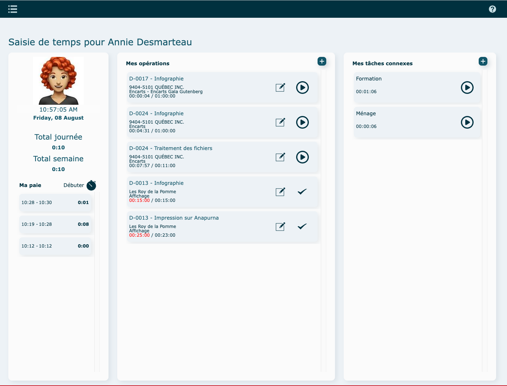
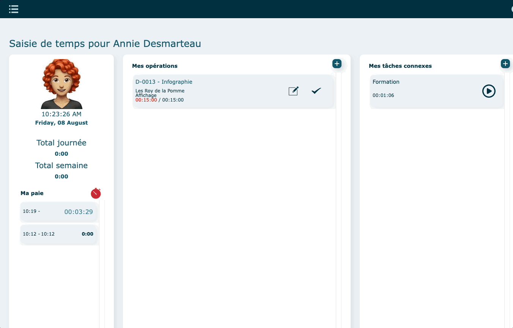
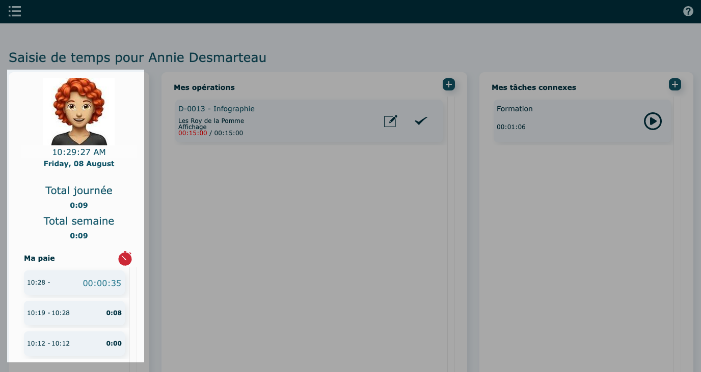
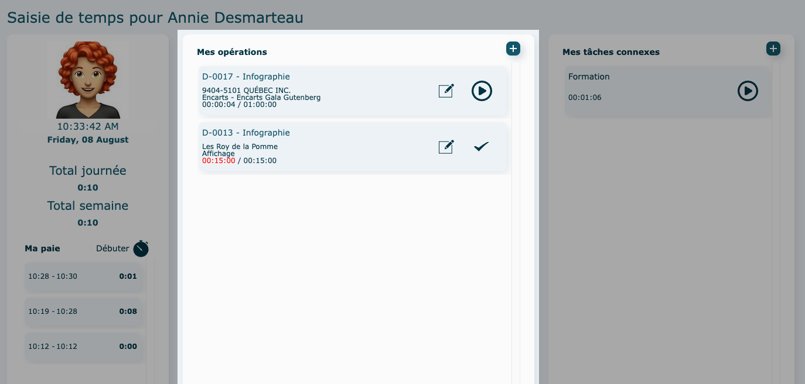
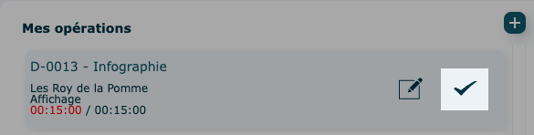
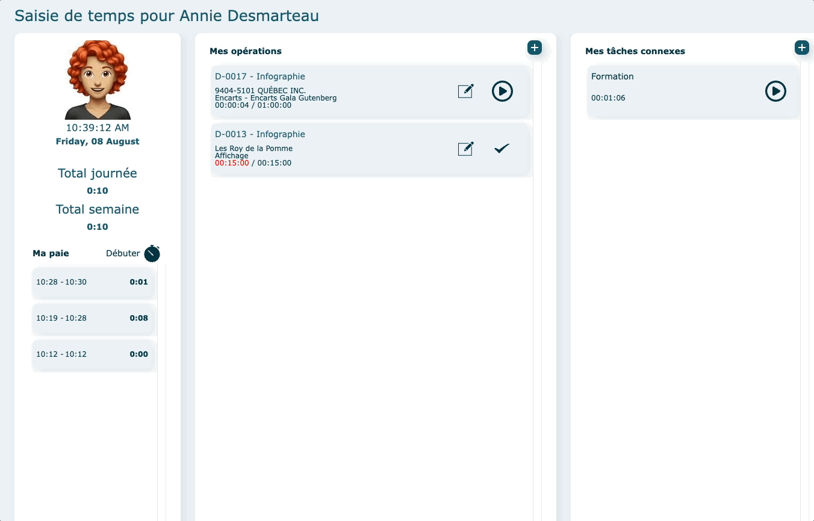
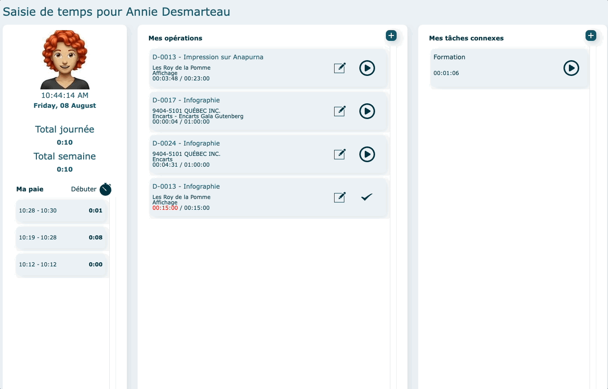
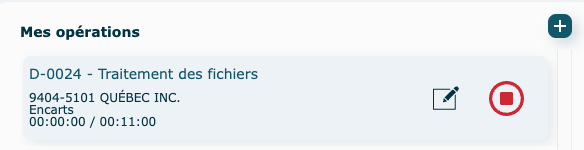
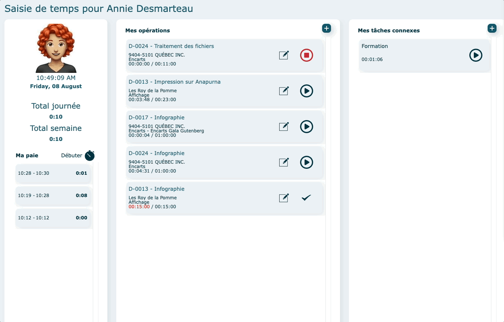
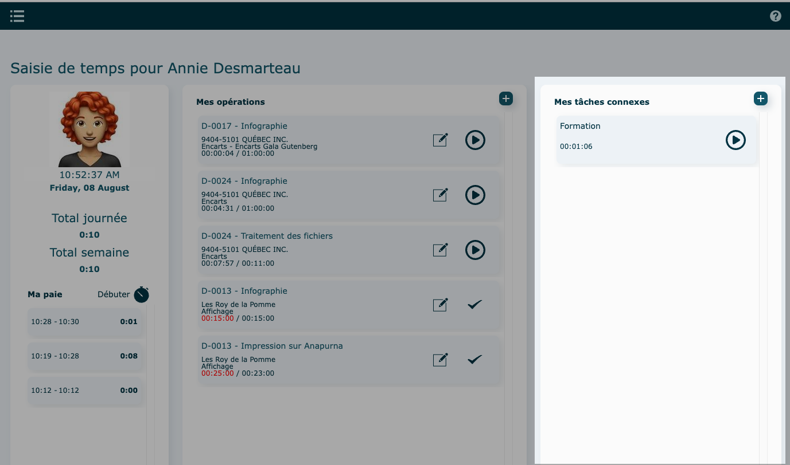

# Saisie de temps

* * *

  

# Survol

  

Grâce à ce module, vous pouvez consigner rapidement et clairement le temps investi dans des opérations de main-d’œuvre. La préparation des fiches de paie d’employés est aussi simplifiée.

Un mode d’affichage additionnel par station permet également à plusieurs employés d’utiliser le même appareil de saisie des temps.

  

  
  

#### Attributions

Les opérations et tâches connexes visibles proviennent des [attributions définies dans la fiche](../09-Paramètres/01b-utilisateurs.md#actions-diverses) de l'utilisateur.

*   Pour y accéder
    
    Cliquez sur la photo de l'employé dans le coin supérieur gauche.
    
    Apportez vos changements et cliquez sur **Enregistrer** (vous devez avoir les accès nécessaires pour le faire).
    
    
    
      
    

  

* * *

  

## En mode individuel

Le module s'ouvre directement sur l'interface de paie de l'employé.

  

### Ma Paie

Permet de débuter votre période de travail à comptabiliser.

Cette partie présente également le total d'heures de la journée et de la semaine en cours ainsi que tous vos punchs de la journée .

  

Cliquez sur **Débuter** pour commencer un punch et sur le **chronomètre rouge** pour le terminer.

  

Pour apporter des modifications à un punch, vous référez au rapport [suivant.](../11-Rapports/01-rapports.md#paie---détail)

  

* * *

### Mes Opérations

Permet de comptabiliser le temps passer sur des opérations reliées à un dossier de production.

Il est possible de repartir le chronomètre d'une opération, non terminée, réalisée plus tôt dans la journée ; cliquez sur le bouton démarrer. Le total se cumulera.

Le crochet désigne une opération terminée.

  

*   Ajouter une nouvelle opération
    
    Cliquez sur **l'icône**
    
    *   Par attribution
        
        Sélectionnez une opération (attribution, ex : infographie), puis un dossier. Le chronomètre partira automatiquement.
        
        
        
          
        
          
        
    *   Par dossier
        
        Recherchez toutes les opérations reliées à un dossier précis.
        
        Entrer un numéro de dossier et **Chercher.**  
        Pour revenir en arrière, utilisez la flèche bleue.     
        
        Sélectionnez une opération. Le chronomètre partira automatiquement.
        
        
        
        
    
      
    
*   Arrêter un chronomètre
    
    Pour arrêter le chronomètre, cliquez sur le **bouton rouge arrêt.**
    
    
    
      
    

  

#### Éditer/terminer une opération

Cliquez sur le **crayon** au bout de la ligne d'opération.

  

*   Éditer
    
    Vous pouvez apporter des changments aux [champs éditables](../03-Fonctionnalités%20générales/04-champs.md#champs-éditables) et/ou ajouter une note.
    
    **Enregistrer**
    
      
    
*   Terminer
    
    Cliquez sur **Terminer opération**. Le punch s'arrêtera automatiquement.
    
    **Enregistrer**
    
      
    

  

* * *

### Mes tâches connexes

Permet de comptabiliser le temps passer sur des tâches connexes.

Ces tâches ne sont pas rattachées à un dossier de production.

Il est possible de repartir le chronomètre d'une tâche déjà réalisée plus tôt dans la journée ; cliquez sur le bouton démarrer. Le total se cumulera.

  

*   Ajouter une nouvelle tâche
    
    Cliquez sur sur **l'icône**
    
    Sélectionnez une tâche. Le chronomètre partira automatiquement.  
      
    
*   Arrêter un chronomètre
    
    Pour arrêter le chronomètre, cliquez sur le **bouton rouge arrêt.**
    
    
    
      
    

  

* * *

  

## En mode partagé

L'employé partage l'appareil de saisie de temps avec d'autres.

Connectez-vous a interOP, sur l'ordinateur partagée, avec les accès d'une station.

**Exemple : Prépresse**

Nom de compte Filemaker = Prépresse

Mot de passe = Prépresse

  

*   **Connexion** [**sécurisée**](https://app.clickup.com/9017115504/v/dc/8cqcgvg-21377/8cqcgvg-17457?block=block-6274356c-53bb-423d-9018-7549bf8a1be1)
    
    Dans l'interface d'accueil de Saisie de temps, l'employé doit y inscrire son nip personnel.
    
    Il sera automatiquement dirigé vers sa fiche de [paie](https://app.clickup.com/9017115504/v/dc/8cqcgvg-21377/8cqcgvg-17457?block=block-96465d1f-c1bd-4ddd-a15d-fe12d2fc476d).
    
      
    
*   **Connexion non sécurisée**
    
    Dans l'interface d'accueil de Saisie de temps, tous les employés assignés à cette station seront visible à droite de l'écran.
    
    L'employé clique sur son nom pour avoir accès à sa fiche de [paie](https://app.clickup.com/9017115504/v/dc/8cqcgvg-21377/8cqcgvg-17457?block=block-96465d1f-c1bd-4ddd-a15d-fe12d2fc476d).
    
    
    
      
    

Pour revenir à l'écran d'accueil, cliquez sur le bouton encadré en rouge dans la capture écran.

  
  

### Stations

Une station permet à plusieurs employés de se puncher sur un ordinateur commun.

Il est donc possible de créer 1 station par département.

Exemple : presse, reliure, expédition etc.

  

Pour accéder aux stations, cliquez sur **Stations.**

  
  

#### Créer une nouvelle station

Cliquez sur **+** **Ajouter.**

Remplir chacun des onglets.

Cliquez sur **Enregistrer.**

*   **INFORMATIONS**
    
    Remplir les informations.
    
    Le nom de la station est seulement un nom d'affichage tandis que le nom de compte Filemaker sera le nom d'utilisateur à utiliser pour se connecter à interOP sur la station.
    
    
    
      
    
    Créer l'accès à interOP et confirmez un mot de passe.
    
    
    
      
    
    Pour [sécuriser](https://app.clickup.com/9017115504/v/dc/8cqcgvg-21377/8cqcgvg-17457?block=block-27b28a40-8f11-42d7-b94f-c53e118058b1) l'accès des employés, cochez la case suivante.
    
    Une nip personnel devra être confirmé dans l'onglet **Utilisateurs**
    
      
    
*   **UTILISATEURS**
    
    Attribuez des utilisateurs à cette station.
    
    Les utilisateurs doivent être existant dans la liste des [utilisateurs](https://app.clickup.com/9017115504/v/dc/8cqcgvg-21377/8cqcgvg-17517?block=block-990c47aa-6266-4c7b-9444-f6d583a70e0e).
    
    
    
      
    
    Si l'accès a été préalablement [sécurisé](https://app.clickup.com/9017115504/v/dc/8cqcgvg-21377/8cqcgvg-17457?block=block-6274356c-53bb-423d-9018-7549bf8a1be1) dans l'onglet **Informations**, définir un nip personnel à chaque utilisateur. Ce nip lui permettra de se connecter à sa fiche de paie.
    
*   **TÂCHES**
    
    Attribuez des tâches à la station.
    
    
    
      
    
*   **ÉQUIPEMENTS**
    
    Attribuez des équipements à la station.
    
    
    
      
    
*   **OPÉRATIONS**
    
    Attribuez des opérations à la station.
    
    
    
      
    

  

#### Actions diverses

*   Supprimer
*   Changer le mot de passe de la station

  

* * *
  

## Vidéo démo du module

[https://www.youtube.com/watch?v=6sbG8gCGAFY](https://www.youtube.com/watch?v=6sbG8gCGAFY)