---

## Survol

Créez facilement des bons d’expédition et des étiquettes selon la mise en forme souhaitée. Il suffit de sélectionner le numéro d’un dossier lancé en production. Les informations pertinentes seront copiées automatiquement et vous pourrez par la suite générer aisément les différents documents requis.

Ouverture du module en [mode liste](../03-Fonctionnalités%20générales/02-navigation.md#mode-liste).

Par défaut, le [filtre](../03-Fonctionnalités%20générales/02-navigation.md#filtres-et-tris) est à statut : En préparation

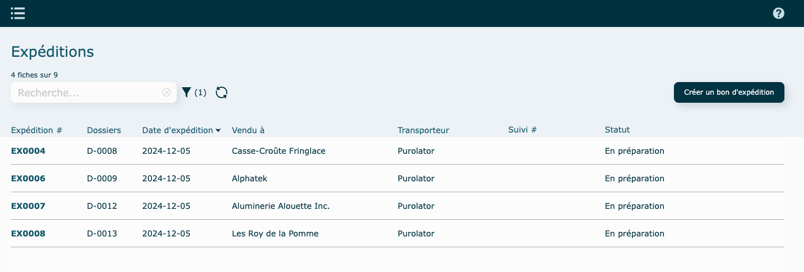

---

## Création d'un bon d'expédition

- Cliquez sur **Créer un bon d'expédition** en haut à droite de la liste.

* Depuis un dossier

  Sélectionner un dossier à expédier. Vous pouvez utiliser le filtre de recherche pour isoler un client.

  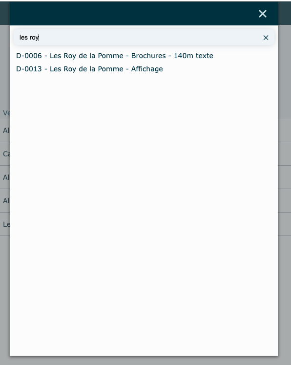

  Le bon d'expédition sera créé automatiquement.

  N'oubliez pas de remplir la case Qté/bte, en cliquant sur la ligne pour faire ouvrir la fenêtre d'édition.

  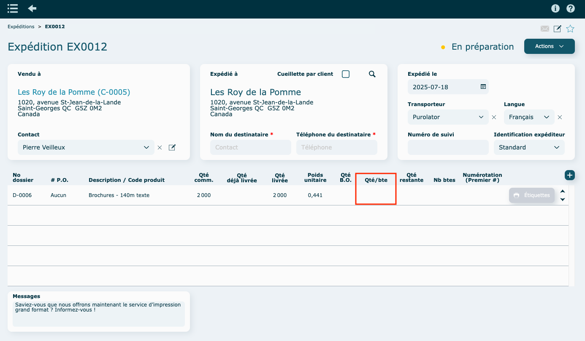

  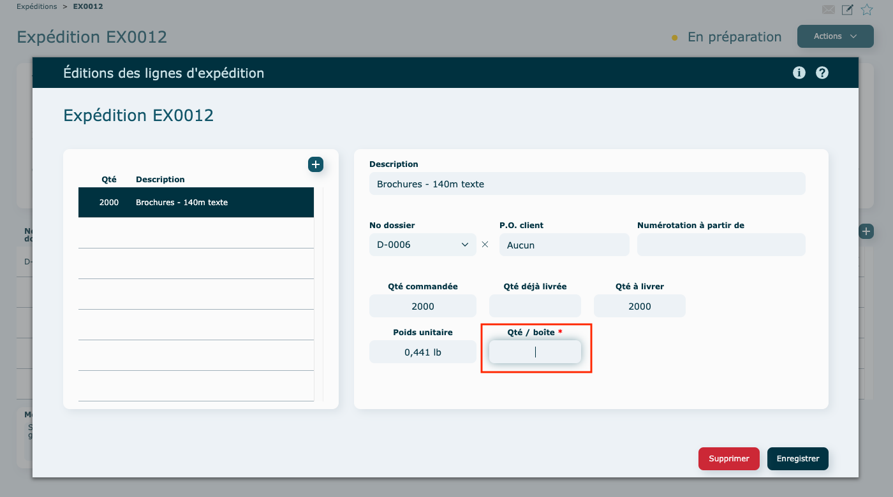

  \*À noter que le message au bas provient de vos [paramètres Système](../09-Paramètres/03-systeme.md#messages-sur-formulaires).

  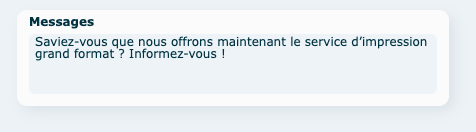

* Nouveau bon sans dossier

  Sélectionner un client

  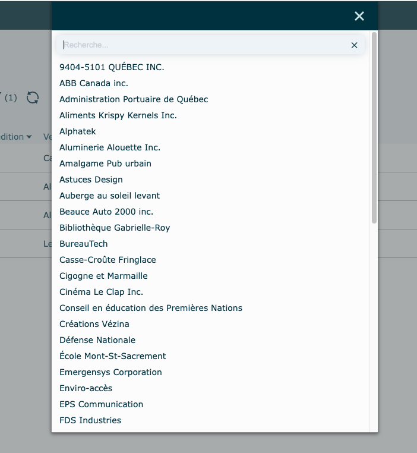

  Le bon d'expédition sera créé automatiquement.

  N'oubliez pas de sélectionner un transporteur.

  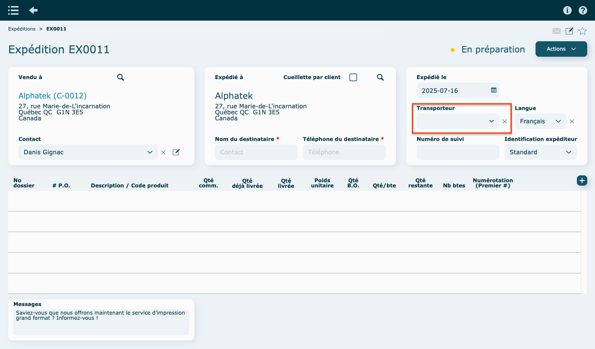

  \*Le message au bas provient de vos [paramètres Système](../09-Paramètres/03-systeme.md#messages-sur-formulaires).

### Ajouter une ligne d'expédition

Cliquez sur **l'icône**

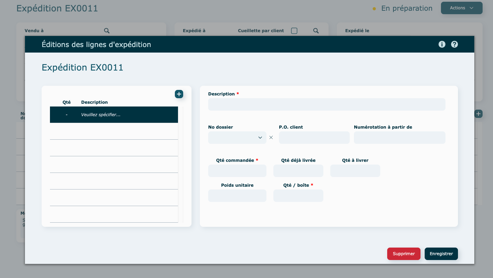

- Avec dossier

  Au besoin : sélectionnez un dossier (non obligatoire).

  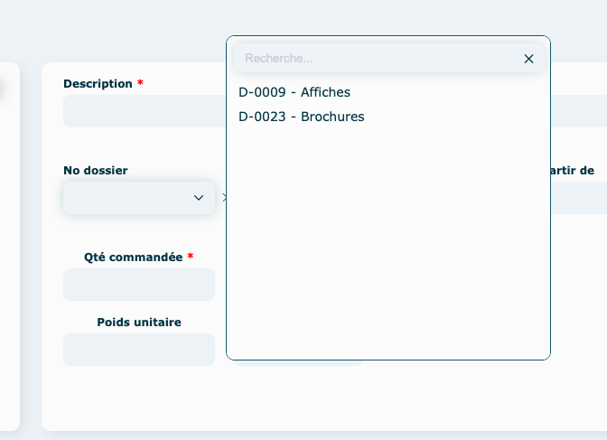

  Remplir les informations manquantes. Les champs marqués d'une [étoile](../03-Fonctionnalités%20générales/04-champs.md#champs-obligatoires) sont obligatoires.
  Inscrire la quantité par boîte, le nombre de boîte requise va se calculer automatiquement.

  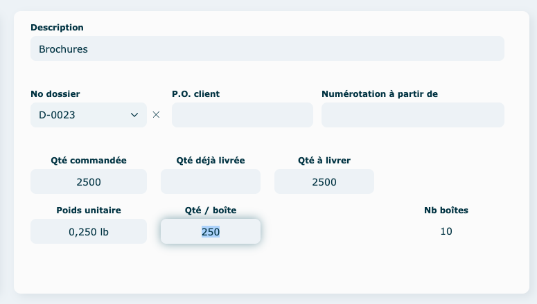

  Pour éditer la ligne à nouveau, il suffit de recliquer sur celle-ci.

  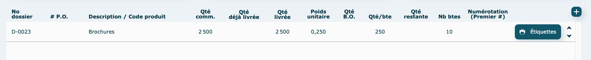

### Étiquettes pour boite

Cliquez sur le bouton **Étiquettes ➝ 4 x 6** pour visualiser l'étiquette et l'imprimer.

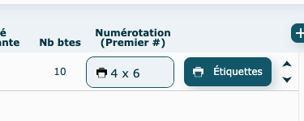

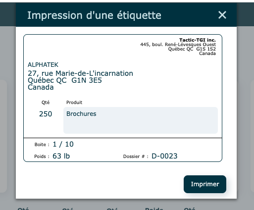

### Divers

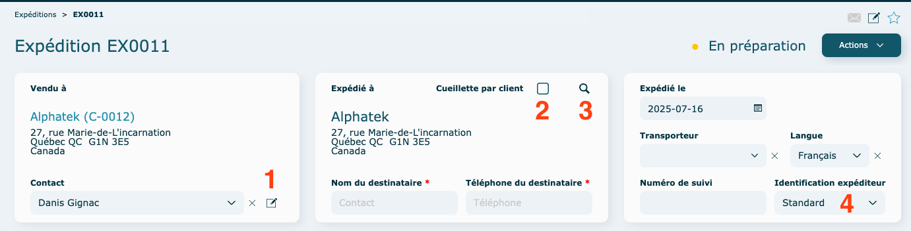

#### **1\. Éditer le contact**

Les changements apportés lors de l'édition du contact seront appliqués dans le système au complet.

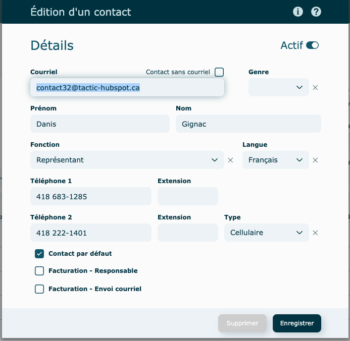

#### **2\. Cueilllette par le client**

Cocher la case pour indiquer que le client vient chercher sa commande.

#### **3\. Adresse Éxpédié à**

Cliquez sur la loupe pour faire une recherche.

Vous y trouverez toutes les adresses liés à votre client.
Si l'adresse est manquante, veuillez vous rendre dans le module [client](../04-Contacts/clients.md#ajouter-une-adresse-dexpédition) pour l'ajouter.

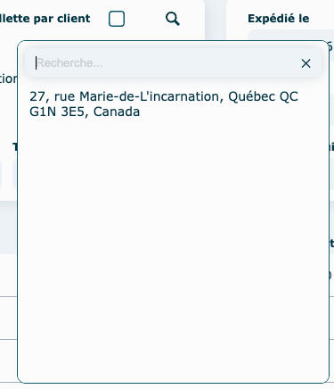

#### **4\. Identification Expéditeur**

Provient de la [fiche contact](../04-Contacts/clients.md#création-dun-client) de votre client, dans l'onglet Informations additionnelles.

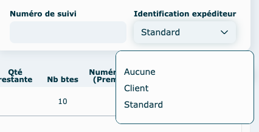

---

###

### Actions diverses

#### En mode [consultation](../03-Fonctionnalités%20générales/02-navigation.md#mode-consultation)

- Valider l'expédition

Cette action vous permettra de pouvoir l'imprimer et/ou l'envoyer au client une fois validé.
Si des informations sont manquantes, le système vous affichera un message d'erreur avec le détail.

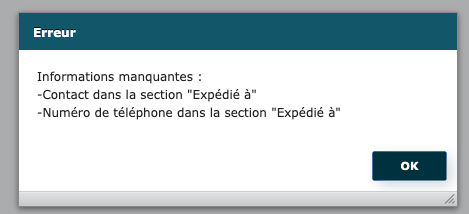

- Visualiser le bon

- Aviser par [courriel](../03-Fonctionnalités%20générales/01-courriels.md)

- Imprimer le bon

- Suivi de la livraison : si vous avez inscrit un numéro de suivi et un transporteur, ceci vous mènera sur le site web de celui-ci pour faire le suivi de la livraison.

- Supprimer

  si le bouton est grisé, impossible de faire la suppression car le bon a été validé.

---

## Vidéo démo du module

[https://www.youtube.com/watch?v=LAlyP316cV0](https://www.youtube.com/watch?v=LAlyP316cV0)
