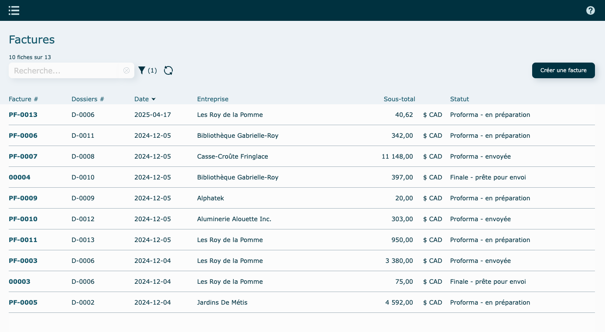
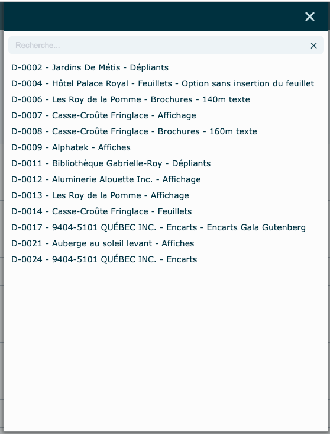
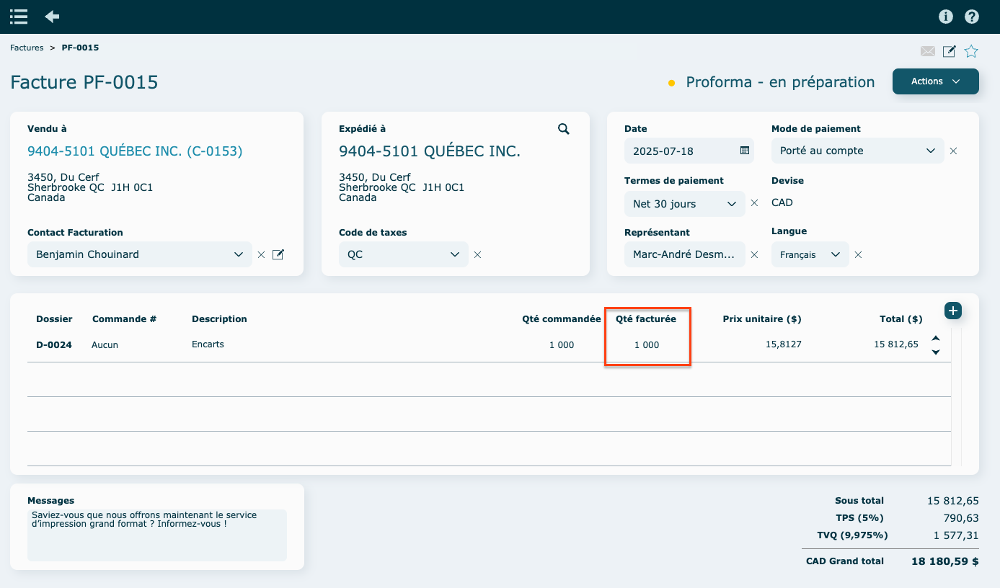
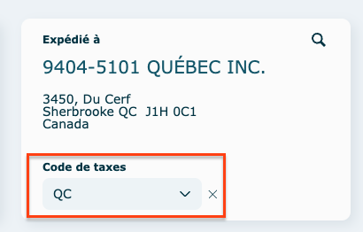
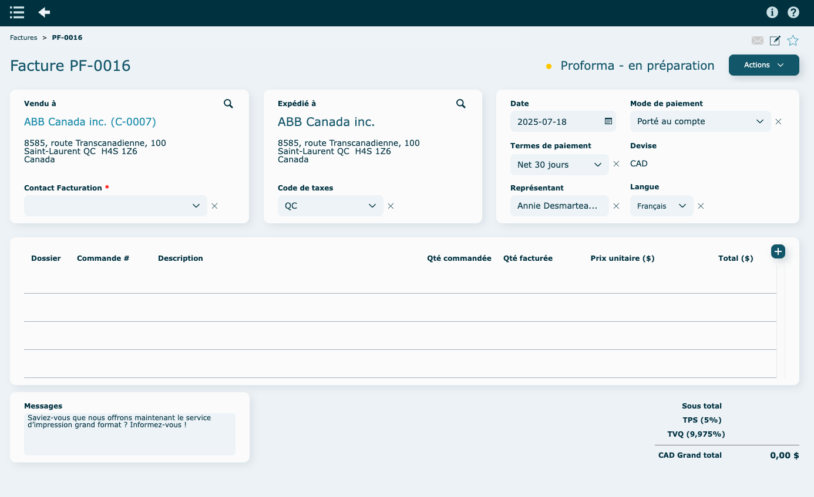
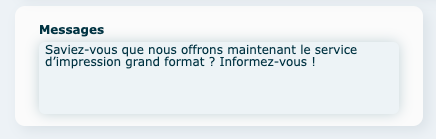
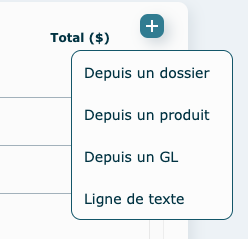

# Factures

* * *

  

## Survol

  

Le module Facturation permet de produire des factures de vente selon la mise en forme souhaitée en rappelant le numéro d’un dossier, ce qui affiche automatiquement le nom du travail, la quantité commandée et le prix unitaire. 

L’intégration avec votre logiciel comptable par notre passerelle de connexion \[interOP • Comptabilité\] permet par la suite de transférer automatiquement ces factures.

  

Ouverture du module en [mode liste](../03-Fonctionnalités%20générales/02-navigation.md#mode-liste).

Par défaut, le [filtre](../03-Fonctionnalités%20générales/02-navigation.md#filtres-et-tris) est à statut : Proforma - En préparation + Proforma - Envoyée + Finale - Prête pour envoi.

  

**En mode** [**consultation**](../03-Fonctionnalités%20générales/02-navigation.md#mode-consultation)

  

## Préfixe du numéro de facture

**PF** : Indique qu'il s'agit d'une facture pro forma. Elle sert principalement à informer l'acheteur des coûts estimés avant la transaction finale. Ceci n'est pas une facture finale.

  
  

* * *

  

## Création d'une facture

  

- Cliquez sur **Créer une facture** en haut à droite de la liste.

*   Depuis un dossier
    
    Sélectionnez un dossier à facturer. Vous pouvez utiliser le filtre pour isoler un client ou trouver un dossier facilement. 
    
    
        
      
    
    La facture sera créée automatiquement.
    
    La **Qté facturée est** la quantité totale du dossier, à laquelle on soustrait les quantités qui pourraient avoir déjà été facturées pour ce dossier. Assurez-vous de la remplir si elle ne l'est pas déjà, en cliquant sur la ligne pour faire apparaitre la boîte d'édition.

    Également, selon votre logiciel comptable, déterminez un compte GL par ligne, s'il n'est pas déjà rempli ( préalablement défini dans le dossier.
    
    

    
    
      
    
    Assurez vous que le code de taxes est bien rempli.
    
    
         
    
*   Nouvelle facture
    
    Sélectionner un client.

    
    
      
    
    La facture sera créée automatiquement.
    
    
    
      
    
    Assurez vous de remplir le code de taxes.
    
    
    
      
    

  

Le message au bas de la facture provient de vos [paramètres Système](../09-Paramètres/02-parametres.md#messages-sur-formulaires).

  

#### Ajouter une ligne de facture

  

Cliquez sur **l'icône**

  

*   Depuis un dossier
    
    Sélectionnez un dossier.
    
      
    
    Remplir les informations manquantes.
    
    
    
      
    
*   Depuis un produit
*   Depuis un GL
    
    Sélectionnez un compte GL.
    
    
    
    Une ligne contenant le [compte GL](https://app.clickup.com/9017115504/v/dc/8cqcgvg-21377/8cqcgvg-17497?block=block-cb1b9623-cfa7-487d-bf66-f39a75749123) va se créer.
    
    
    
    Remplir les informations.
    
      
    
*   Ligne de texte
    
    Une ligne vierge va se créer.
    
    Remplir les informations.
    
    
    
      

  

* * *

  

## Actions diverses

#### En mode consultation

*   Produire facture finale
        la facture proforma sera convertie en facture finale et transmise à votre logiciel comptable par l'API.

*   Visualiser
  
*   Envoyer par [courriel](../03-Fonctionnalités%20générales/01-courriels.md)

*   Imprimer
    
*   Créditer : si le bouton est grisé, c'est que la facture finale n'a pas encore été faite et envoyée dans le système comptable (elle est encore en proforma).

*   Supprimer : si le bouton est grisé, impossible de faire la suppression.

  

* * *

  

## Vidéo démo du module

[https://www.youtube.com/watch?v=7EsPkFZrBQw](https://www.youtube.com/watch?v=7EsPkFZrBQw)