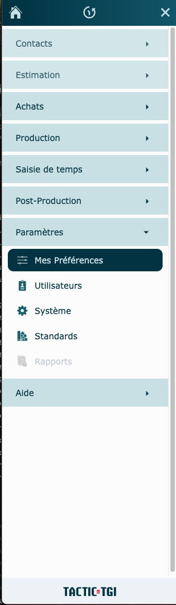
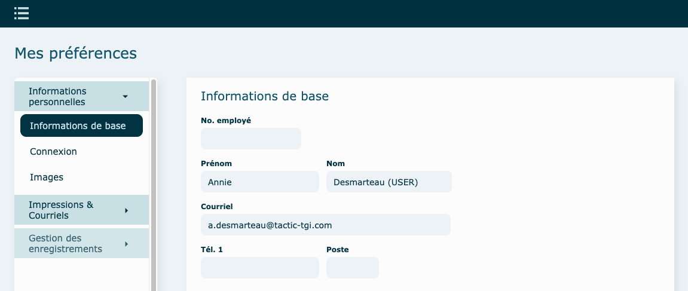
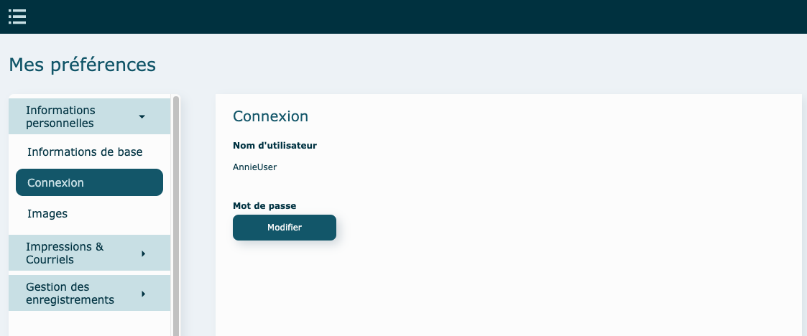
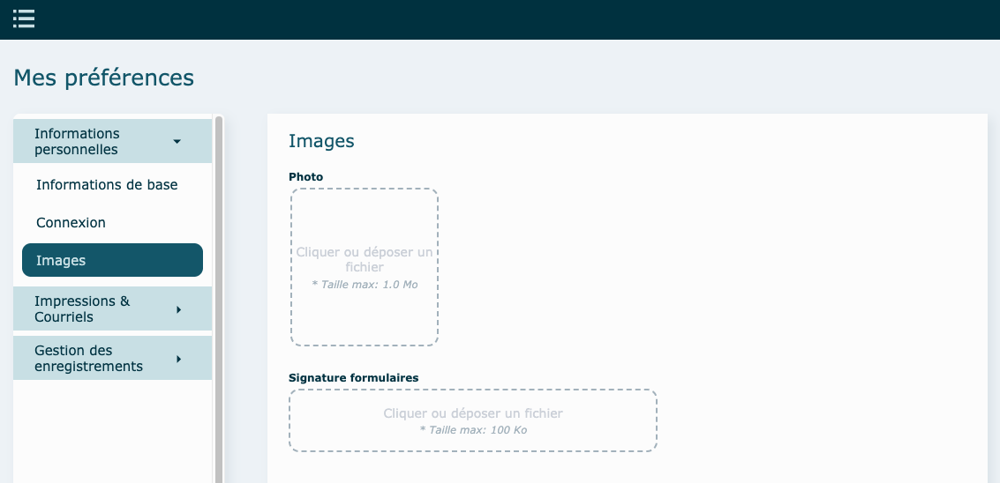
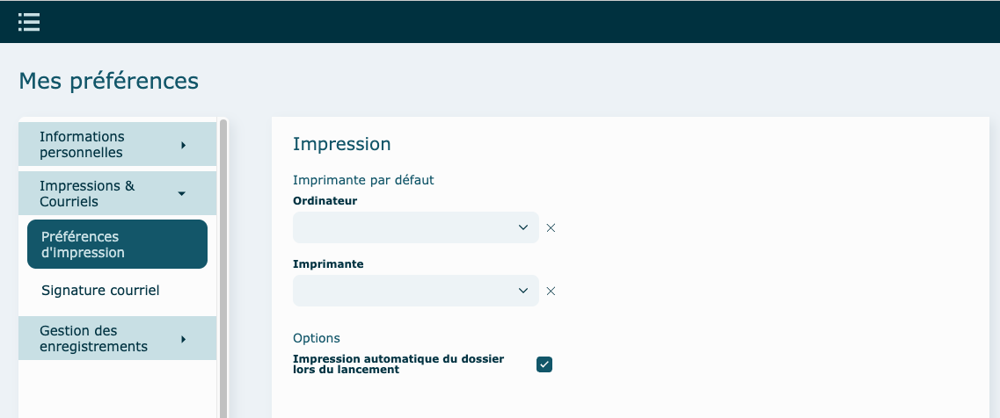
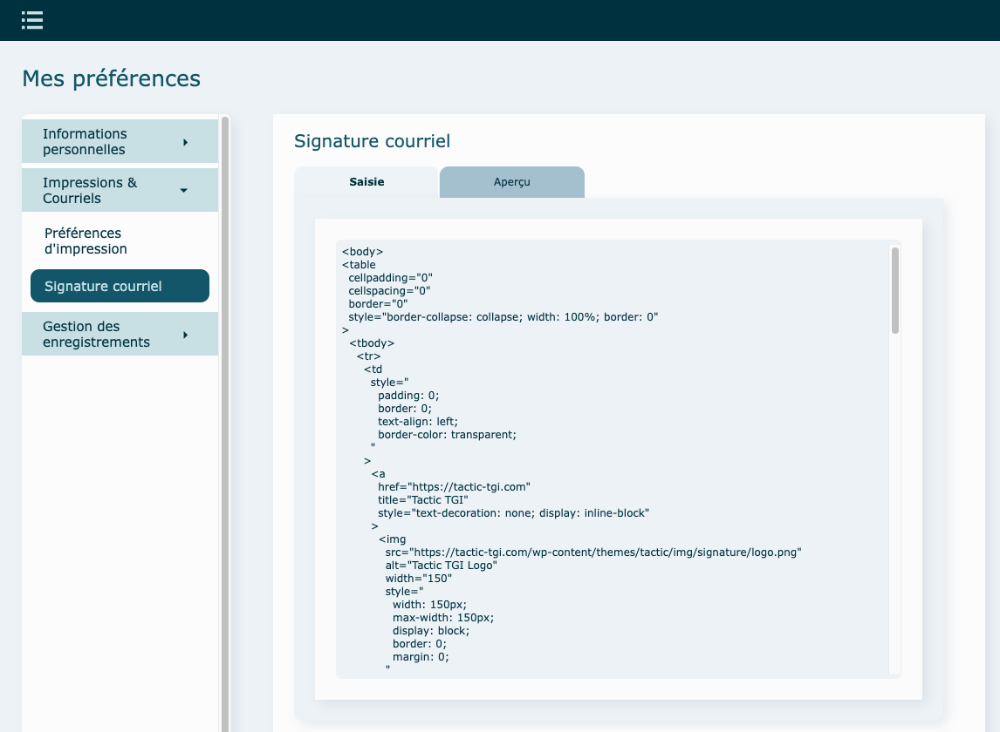
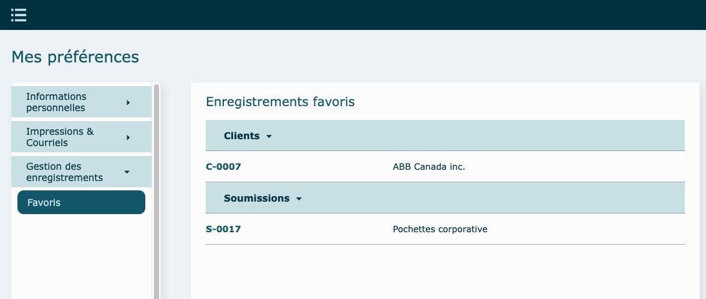

---

## Survol

Avec ce module, gérez facilement vos paramètres du logiciel, selon vos préférences à vous ! Il sert également à le personnaliser pour votre accès. Chaque utilisateur devrait donc aller entrer les différentes données et faire les choix de base, lors de la toute première connexion à InterOP.

## Informations personnelles

### Informations de base

Entrez, si cela n'a pas déjà été fait dans le module Utilisateurs, vos données personnelles.

### Connexion

Affiche votre nom de compte pour entrer dans InterOP et vous permet de modifier votre mot de passe.  

### Images (optionnel) {#images}

Insérez votre photo (pour le module Saisie de temps) et votre signature, pour les différents formulaires.

## Impressions & Courriels {#impressions-courriels}

### Préférences d'impression {#impressions}

Lié à votre compte Printnode, choisissez votre ordinateur et sur quelle imprimante vous voudrez imprimer par défaut.

Vous pouvez également cocher la case si vous voulez qu'au lancement du dossier, l'impression se fasse automatiquement.

### Signature courriel {#signature}

Collez ou modifiez votre signature HTML et visualisez l'aperçu de celle-ci.

## Gestion des enregistrements {#enregistrements}

### Favoris

Visualisez vos favoris au travers de tous les modules. Permet facilement de se rendre dans l'enregistrement en cliquant sur la ligne.

