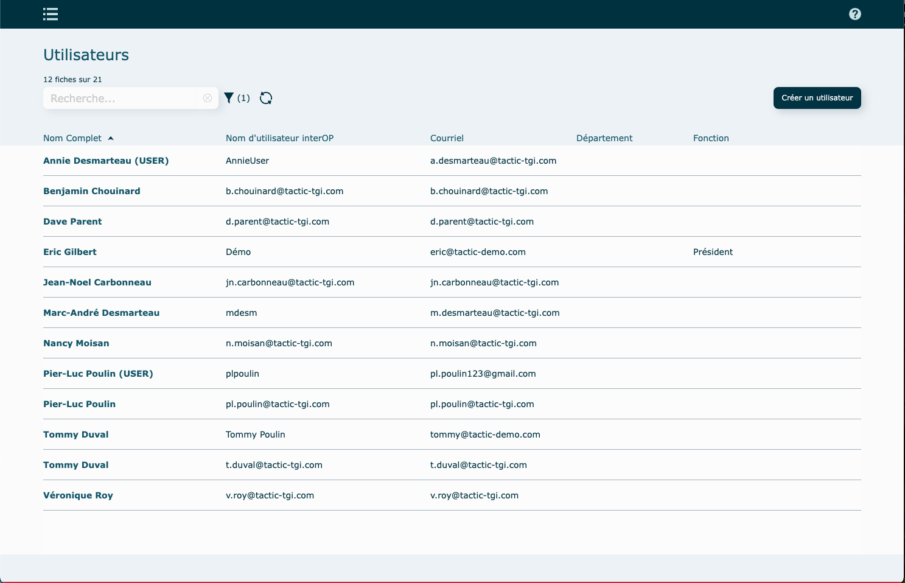
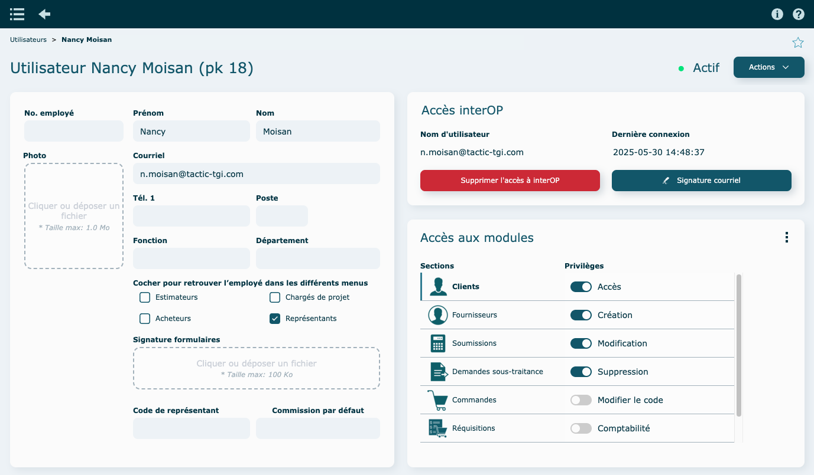
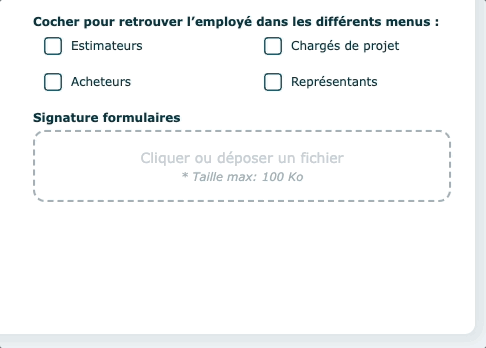
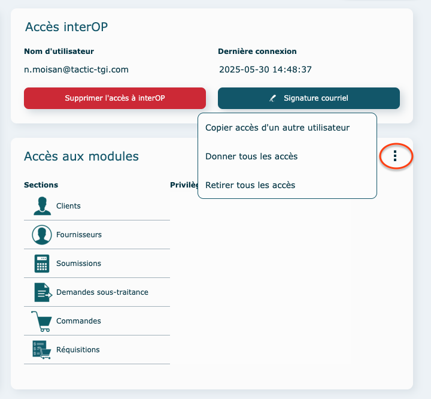
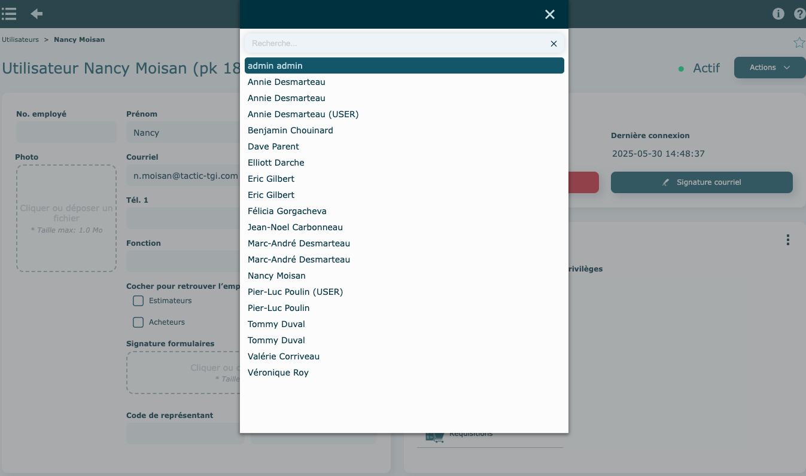
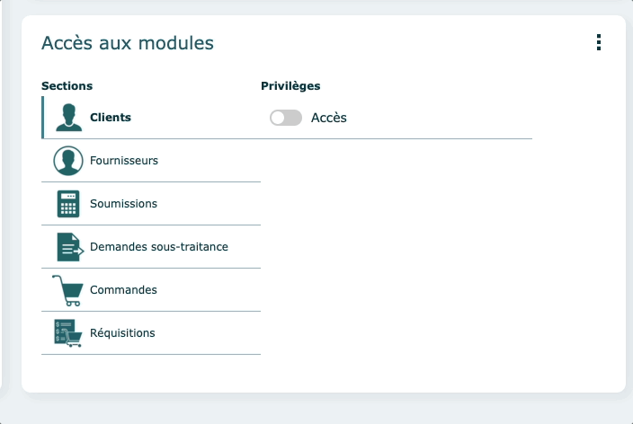
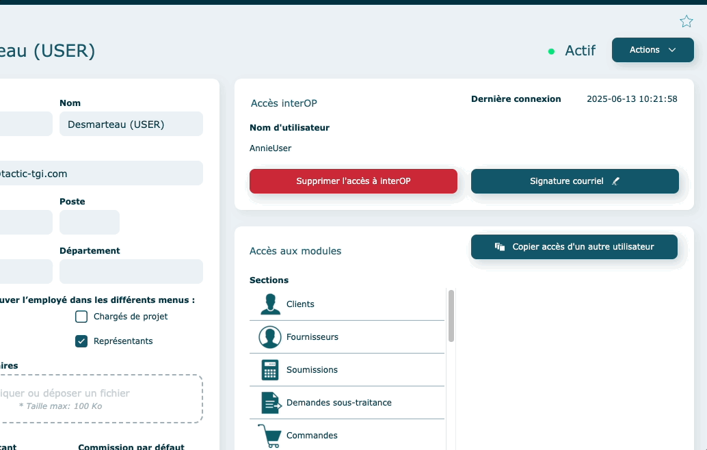
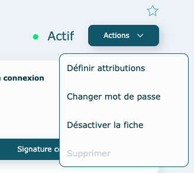
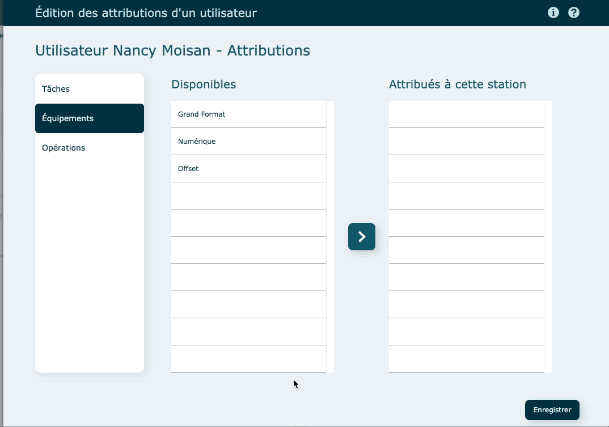

# Utilisateurs

* * *

  

## Survol

Avec ce module, gérez facilement l'accès de tous vos employés.

  

Ouverture du module en mode liste.

Par défaut, le [filtre](https://app.clickup.com/9017115504/v/dc/8cqcgvg-21377/8cqcgvg-17257?block=block-d334b8fe-d65e-4449-a1d9-a27c07e19a53) est à Actif.

  

**En mode** [**consultation**](https://app.clickup.com/9017115504/v/dc/8cqcgvg-21377/8cqcgvg-17257?block=block-fab2c14a-4d75-4bad-9f1c-ba1f4f2460a3)

La partie **gauche** présente les informations générales de l'usager.

La partie **droite** présente les divers accès à interOP.

  

* * *

  

### Création d'utilisateur

  

1. Cliquez sur **Créer un utilisateur**
2. Remplir les informations de base
    *   **Partie gauche**
        *   Entrer son nom, son courriel, sa fonction et son département.
        *   Cochez dans quel(s) menu(s) son nom doit se retrouver.
            Si la case représentant est cochée ; ne pas oublier d'inscrire son code de représentant et la commissions par défaut.

            
        *   *Facultatif* Ajoutez un numéro d'employé.
        *   *Facultatif* Ajoutez sa photo.
        *   *Facultatif* Insérez sa signature ; qui sera utilisée dans les différents formulaires.
    *   **Partie droite**
        *   Entrez un nom d'utilisateur qui servira à la connexion au système.
        *   Cliquez sur **Créer l'accès à interOP**. Un courriel s'ouvrira pour faire parvenir à l'utilisateur son mot de passe lors de sa première connexion.

### Accès & privilèges aux modules

*       Pour attribuer les accès aux différents modules, 2 choix sont possibles :
 
1\. Copier les accès d'un autre utilisateur

  
2\. Attribuez à l'usager, pour chacune des sections, les privilèges dont il aura besoin.

  

3\. Autres informations

Ajoutez une signature courriel lors d'envoie de courriel en texte ou en html.

  

  

#### Modifier un utilisateur ou ces accès

À moins d'un changement de nom de compte Filemaker (où à ce moment, une désactivation du compte est requise), simplement modifier les informations directement dans la fiche de l'utilisateur.

Aucun enregistrement n'est nécessaire.

  

#### Suppression

Utilisez le bouton rouge **Supprimer l'accès à interOP** dans la fiche du client pour lui enlever l'accès.

  

* * *

  

### Actions diverses

  

 

#### En mode consultation

*   Changer le mot de passe
*   Désactiver la fiche

#### Définir attributions

Cette partie est en lien avec la [Saisie de temps](https://app.clickup.com/9017115504/v/dc/8cqcgvg-21377/8cqcgvg-17457?block=block-f4c08a26-6ee4-4871-b251-e8675be858ea).

Permet de définir des tâches, équipements et opérations liés à l'employé afin qu'il ne voit pas des informations qu'il ne devrait pas ou qui sont non pertinents pour lui.

**Exemple** : Un pressier pourrait être attribué aux équipements numériques seulement, puis voir seulement les tâches d'impression des dossiers et les tâches connexes comme : la calibration de machine, l'entretien, l'inventaire , etc.

