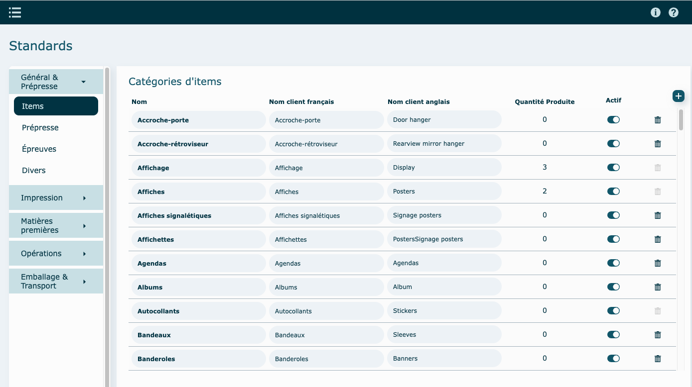
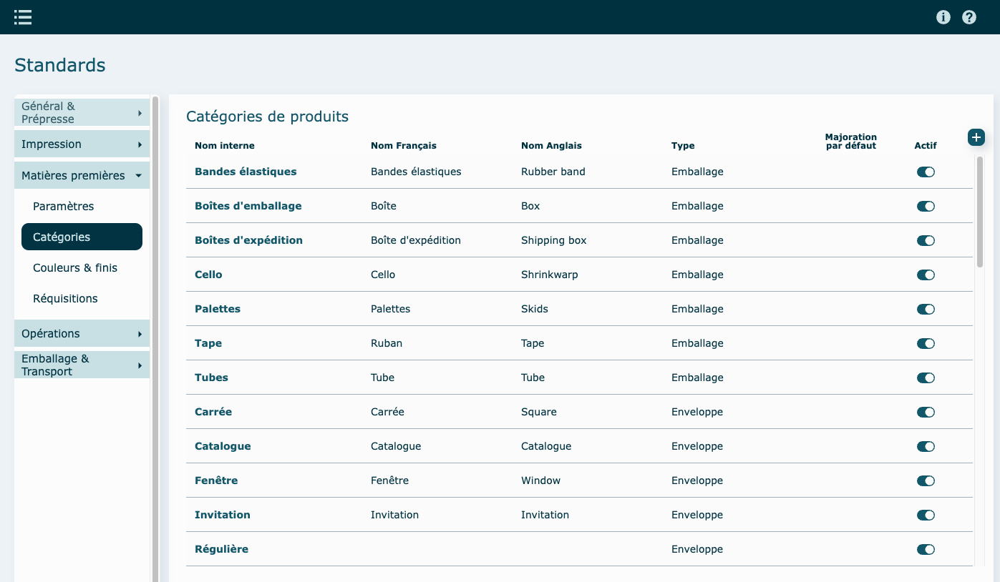

---

## Survol

Cette section a été élaborée pour consigner tous les standards requis afin de produire une soumission. Vous y consignerez vos différentes majorations, vos taux horaires (coûtant/vendant), la liste de vos équipements d'impression, les opérations diverses internes et externes, etc.

---

## Général & Prépresse

### Items

Définissez tous les nom d'items qui pourront être utilisé dans la soumission.

Un item avec une quantité produite ( colonne **Produits**) ne peut pas être supprimé.

### Prépresse

### Épreuves

### Divers

Sur la **Proposition client,** vous avez la possibilité de :

- désigner comme signature celle du représentant ou de l'estimateur (la signature provient de la fiche Utilisateurs de l'employé).
- faire afficher ou non le prix vendant unitaire et/ou au mille
- faire afficher ou non le prix vendant unitaire et/ou au mille

En lien avec le **Sommaire** de votre soumission :

- Inscrire le % de commission par défaut

  si aucune commission n'est inscrite dans le champ "commission par défaut" dans la fiche de l'employé , celle-ci sera utilisée.

- Inscrire le % de majoration ou de profit par défaut

- Déterminer la méthode de calcul du prix vendant total et y inscrire le % par défaut

  Majoration = Prix coûtant x (1 + % )

  Marge de profit = Prix coûtant / ( 1 - %)

  Exemple :

  100 $ / 25 %

  Majoration = 100$ x ( 1 + 0,25 ) = 125 $

  Marge de profit = 100$ / (1 - 0,25 ) = 133,33$

Un **frais d'ouverture de dossier** peut être ajouté à votre soumission.

Noter que si un frais d'ouverture a été ajouté dans la [fiche du client](../04-Contacts/clients.md) , ce dernier aura préséance sur celui-ci.

---

## Impression

### Équipements & Opérations simultanées

  

### Encres

---

## Matières premières

### Majoration, valeurs par défaut et réquisitions

### Catégories

Définissez vos catégories de produits ( matières premières ou autres), les couleurs et finis possible.

### Couleurs et finis

### Réquisitions

Voir explications dans module [Réquisitions](../06-Achats/02-requisitions.md#comment-paramétrer-ce-qui-sera-créer-comme-une-réquisition)

### Opérations

### Paramètres généraux

### Familles

### Tâches

---

## Emballage & Transport

### Emballage

### Transport

