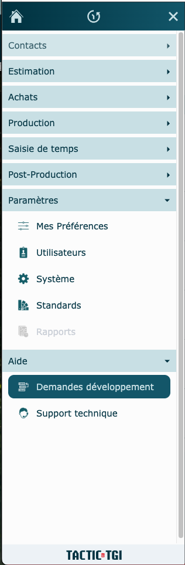
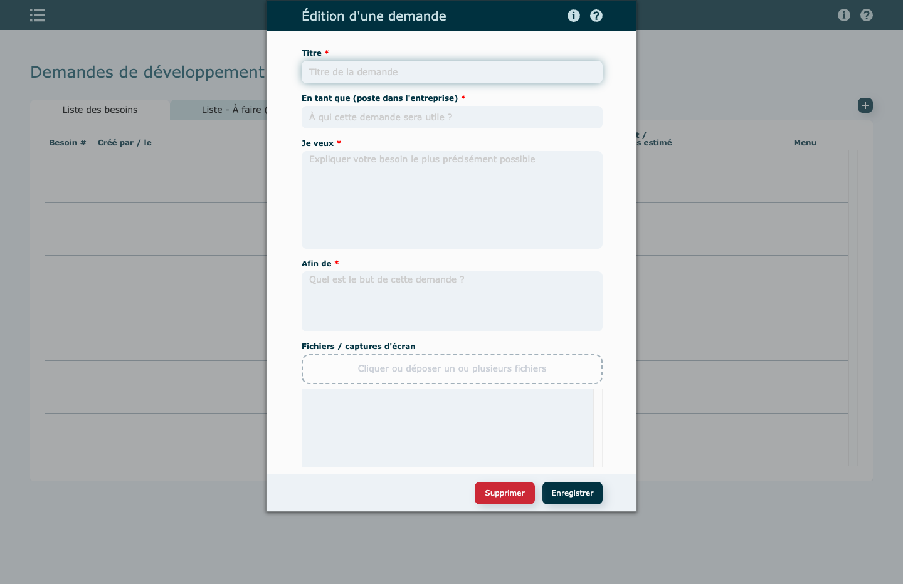
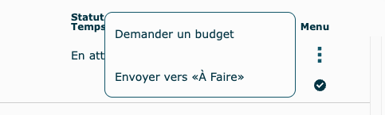
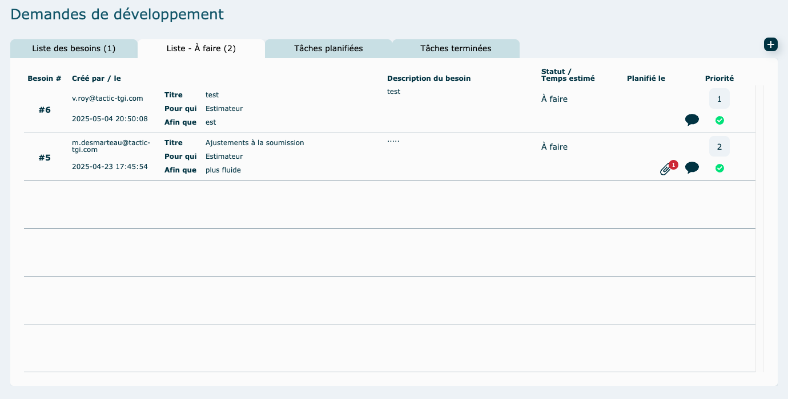

# Demandes développement

  

Vous avez une nouvelle demande de développement à nous faire ?

Une fois l'implantation de votre logiciel complétée, vous voudrez peut-être améliorer votre système, faire développer de nouvelles fonctionnalités.

Cliquer sur **Demandes développement** dans le menu latéral pour nous en informer.

  

Dans les demandes de développement, cliquez sur l'icône  pour ouvrir la fenêtre pour composer votre demande.

**Demande de développement**

*   **Titre** = Résumé du besoin
*   **En tant que** = Pour qui sera développée cette fonctionnalité dans le système (estimateur, administration, etc.)

*   **Je veux** = Description détaillée de votre besoin
*   **Afin que** = Pourquoi cette fonctionnalité doit être développée

  
N'hésitez pas à joindre des fichiers ou images qui pourraient nous aider à comprendre votre besoin.

  
**Enregistrer** votre nouvelle demande.

**Important : à ce point-ci, la demande n'est pas encore officiellement dans notre système de traitement de tâches. 
Il faut donc poursuivre avec la procédure suivante pour vous assurer que nous recevrons bien votre demande !**  

Lorsque la demande est complétée, via le portail, cliquez sur le menu des trois petits points au bout de la ligne. 
Choisissez entre demander de faire la tâche (sans évaluation) ou si vous préférez avoir une évaluation avant qu'on procède.

 Si vous demandez un budget, la demande sera analysée et vous pourrez, par la suite, décider de la faire développer ou non.

 **Supprimer** une demande : Pour supprimer une tâche, cliquez sur la ligne de votre demande pour réouvrir la fenêtre d'édition et appuyez sur supprimer.

Lorsque vous envoyez une tâche dans **À faire**, donc que vous nous donnez l'autorisation de procéder, vous pouvez ensuite mettre un ordre de priorité, qui sera très utile si plusieurs tâches sont à faire et qu'elles sont faites sur plusieurs journées. 

Pour finir, pour suivre l'avancement de vos demandes, consultez les onglets **Tâches planifiées** et **Tâches terminées**. 
Des courriels de confirmation vous seront acheminés pour vous confirmer que la tâche a évolué (évaluation terminée, date de planification inscrite ou bien quand la tâche sera terminée).
 
