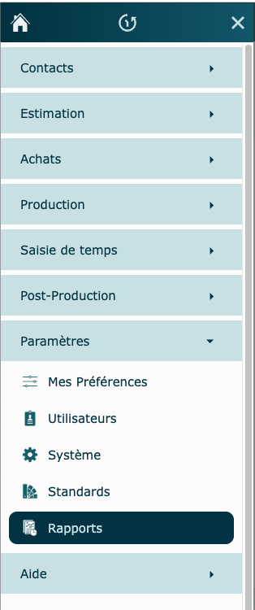
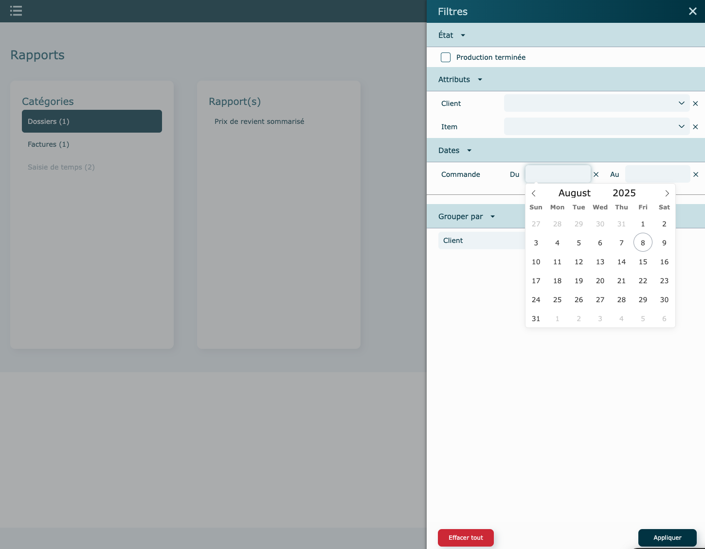
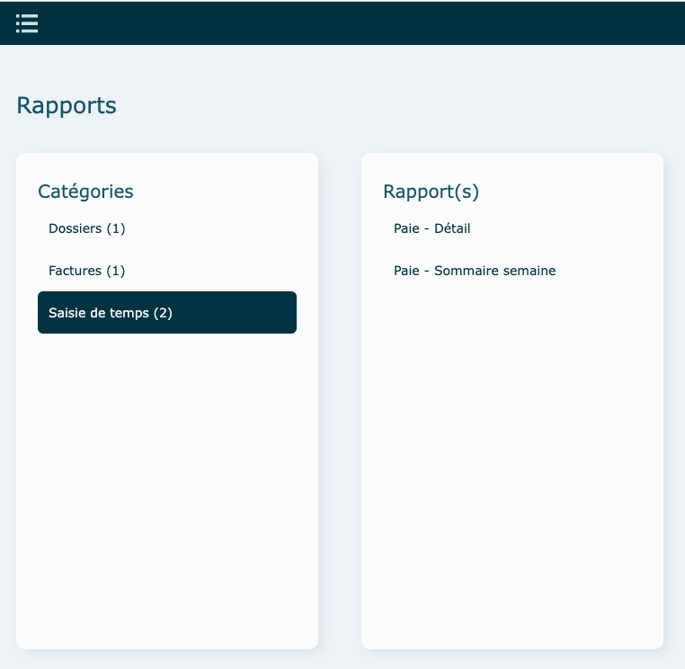

# Rapports

* * *

  
Tous les rapports disponibles se retrouvent dans le [menu latéral](../03-Fonctionnalités%20générales/05-menus.md#menu-latéral), dans la section **Paramètres**.

  

Afin d'avoir accès aux différents rapports, vos [privilèges utilisateurs](../09-Paramètres/01b-utilisateurs.md#accès--privilèges-aux-modules) doivent vous le permettre.

  

## Dossier

  

### Prix de revient sommarisés

  

Rapport permettant d'avoir une vue d'ensemble de tous vos dossiers.

Ouverture du rapport sur la fenêtre Filtres. Les filtres permettent de générer le rapport.

*   Déterminez les critères et cliquez sur **Appliquer.**
    
    
    

Une ligne grisée indique que le dossier n'a pas été lancé en production.

Consultez le dossier lié en cliquant sur sa ligne, puis vous pourrez consulter le prix de revient de celui-ci en allant dans le menu Actions du dossier, puis [Ouvrir prix de revient](../07-Production/01-dossiers.md#prix-de-revient).

Une fois le rapport généré, vous pouvez retourner dans le filtre pour changer des paramètres ou bien chercher un travail en particulier, par le filtre du haut.  

Résultat du rapport ⤵️

  
* * *

## Facturation

  

### Ventes

  

Rapport de ventes détaillées.

Ouverture du rapport sur la fenêtre Filtres. Les filtres permettent de générer le rapport.

*   Déterminez les critères et cliquez sur **Appliquer.**
    
    

Vous pourrez valider les ventes du mois et/ou de l'année, pour un client en particulier ou pour tous les clients, etc.

Pour aller à la facture liée, cliquez sur la ligne correspondante.

Une fois dans le rapport, vous pouvez changer le filtre pour recréer un nouveau rapport ou chercher une facture directement par le filtre du haut.

Par le menu **Actions** en haut à droite, pour pourrez imprimer votre rapport (et le sauvegarder en pdf au besoin). 

Résultat du rapport ⤵️

  

#### Actions

*   Imprimer

  

* * *

  

## [Saisie de temps](../07-Production/04-saisietemps.md)

  

### Paie - Détail

Ouverture du rapport sur la semaine en cours.

Les filtres permettent de générer le rapport.

*   Cliquez sur **Filtres** pour modifier les critères et cliquez sur **Appliquer.**
    
    
    

  

Résultat du rapport pour l'année 2024 ⤵️

`si une note est inscrite dans le détail du punch sous Notes, ce logo sera visible`

  
  

#### Modification/Suppression d'un punch

  

Pour modifier un punch, cliquez directement sur la ligne correspondante.

Tous les champs affichés à l’écran sont modifiables.

Cette fenêtre permet également de supprimer un enregistrement, au besoin.

  

#### Création d'un punch

Cliquez sur le bouton **Créer un temps.**

  

Sélectionnez un utilisateur.

  

Remplir les informations à l'écran et cliquez sur **Enregistrer.**

  

### Paie - Sommaire Semaine

  

Ouverture du rapport sur la semaine en cours pour tous les employés.

Il vous est possible de naviguer d'une semaine à l'autre en utilisant les **flèches** ou de choisir une date précise, en cliquant sur le rectangle entre les 2 flèches, pour afficher sa semaine.

