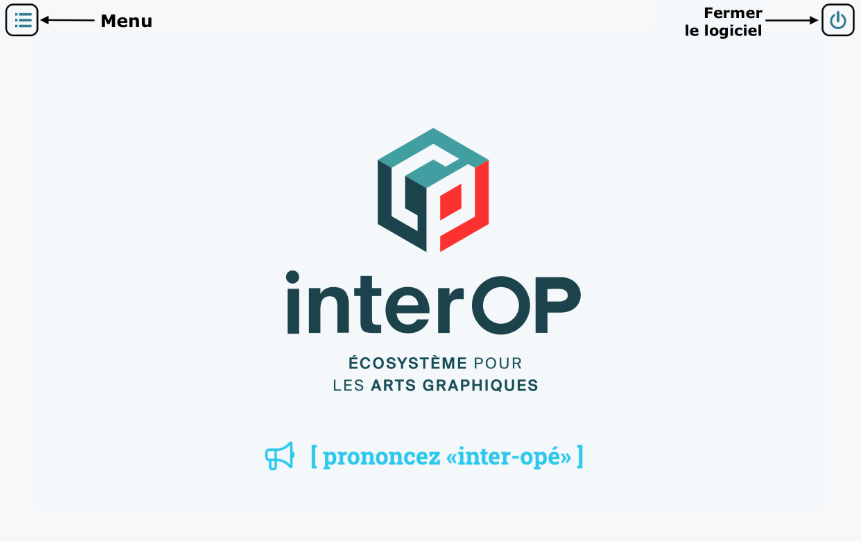

---

Bien que la page d'accueil est à la base seulement la porte d'entrée du logiciel, elle comporte aussi une réinitialisation de certaines caches de session.

Si un comportement du logiciel vous parait bizarre, comme l'accès à un module que vous devriez pouvoir accéder qui vous est refusé, vous pouvez essayer de revenir à l'accueil par l'icône de la maison du menu principal avant de fermer l'onglet et réouvrir le logiciel.

## Menu principal {#menu}

Débutez votre navigation ou retournez à un enregistrement visité dans une session précédente en ouvrant le menu principal.

Dans ce même menu principal, c'est l'icône de la maison qui vous fera revenir à l'accueil.

## Fermer le logiciel {#fermeture}

Il est préférable de fermer complètement le logiciel à la fin de votre journée de travail. Utilisez le bouton à cet effet, dans le coin supérieur droit de l'écran.
