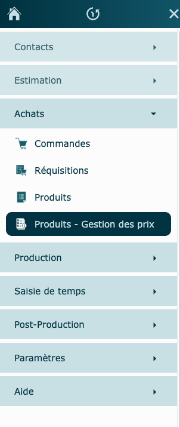
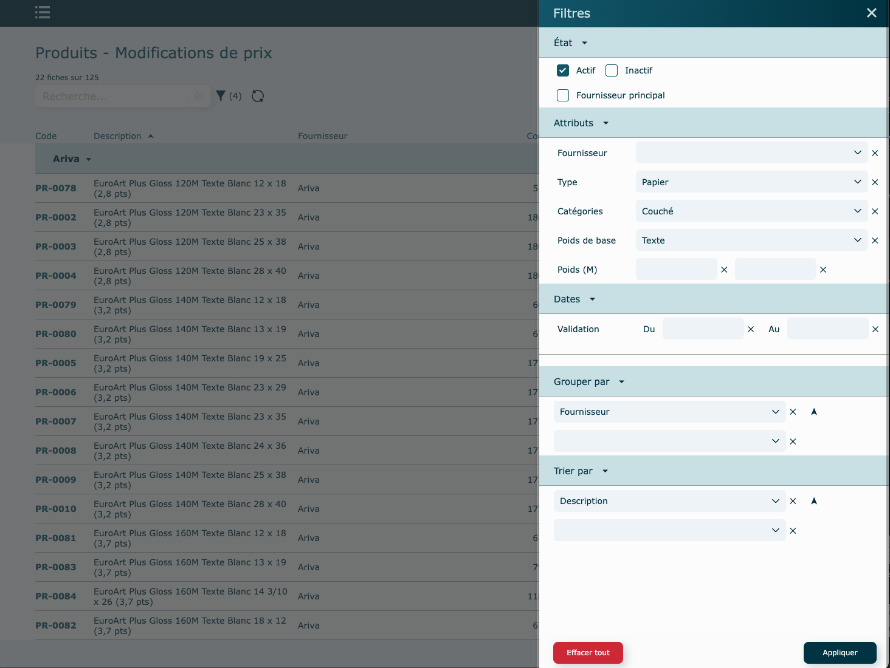
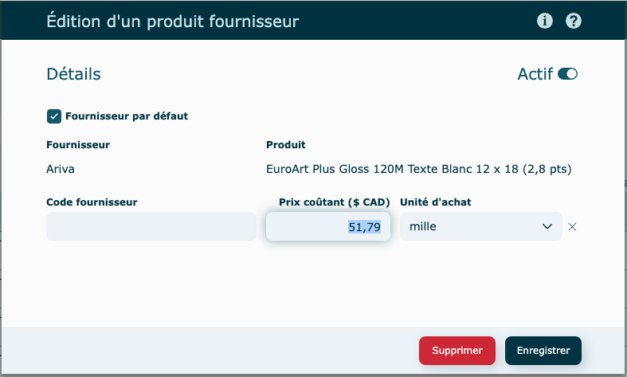
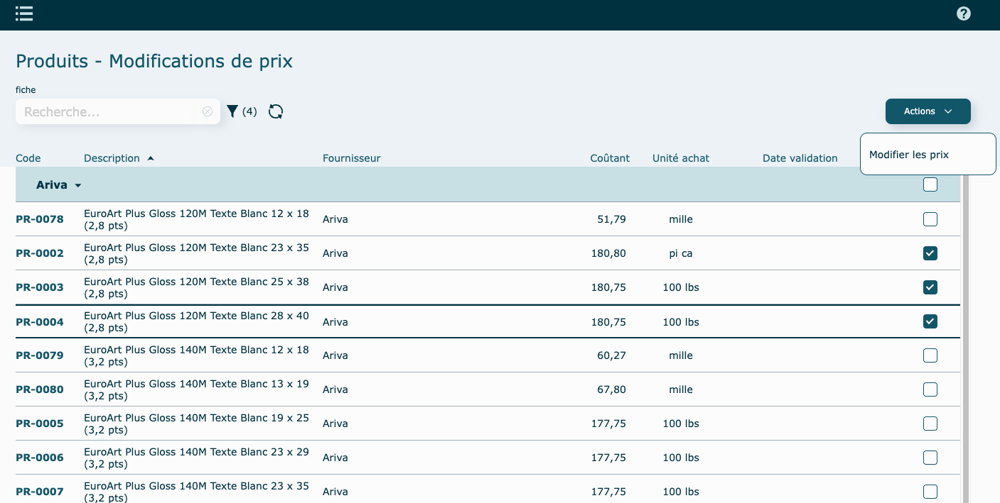
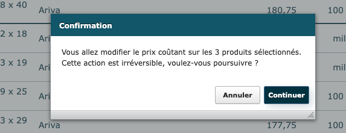
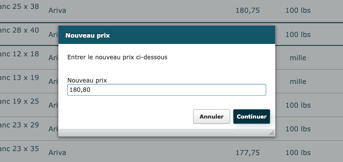
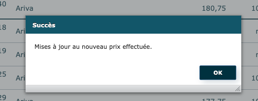
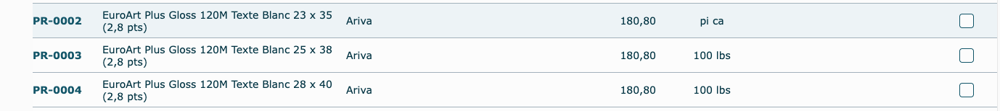

---

La gestion des prix pour les produits est accessible dans le [menu principal](../menu.md)

Remplir les critères souhaités dans la fenêtre **Filtres**, puis cliquez sur **Appliquer** pour générer la liste des produits correspondant aux filtres appliqués.

#### Individuellement

Pour modifier le prix coûtant d’un produit, cliquer directement sur le prix affiché. Vous pourrez ensuite ajuster le montant et faire Enregistrer.

#### En lot

Sélectionnez les produits dont vous souhaitez modifier le prix coûtant. Veuillez noter que seuls les produits d'un même fournisseur peuvent être modifiés simultanément.

La case à cocher située dans l’entête bleu du fournisseur permet de sélectionner tous les produits associés à ce fournisseur, mais assurez-vous d'avoir bien isolé la famille de produit que vous vouliez modifier.

Cliquez sur **Actions** ➝ Modifier les prix et suivre les instructions à l'écran.

