---

## Survol {#survol}

Le module Produits permet de consigner toute l’information pertinente pour chaque papier ou autre substrat standard utilisé dans vos mandats. Ces données alimenteront les modules d’estimation et d’achats, ainsi que les réceptions et consommations.

Ouverture du module en [mode liste.](../fonctionnalites-generales/navigation.md#mode-liste)

Par défaut, le [filtre](../fonctionnalites-generales/navigation.md#filtres-tris) est à Actif.
Pour choisir un type, vous pouvez ajuster votre filtre ou bien utiliser la barre de recherche en haut pour trouver un papier spécifique, par exemple.

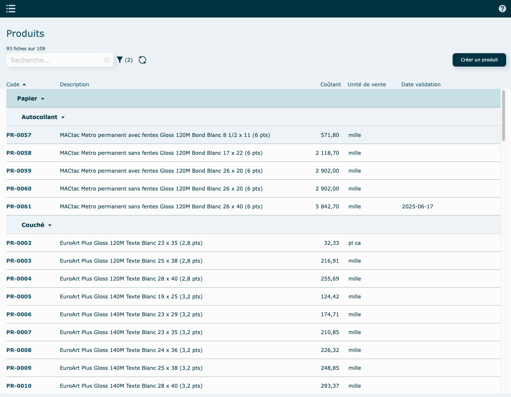

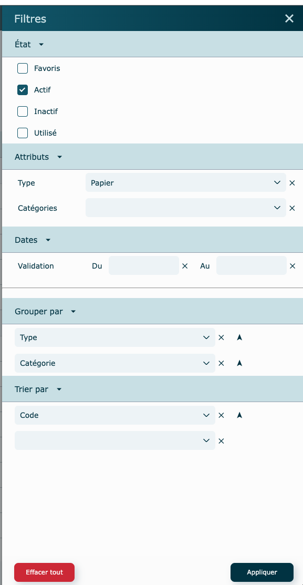

Fiche en mode [**consultation**](../fonctionnalites-generales/navigation.md#mode-consultation).

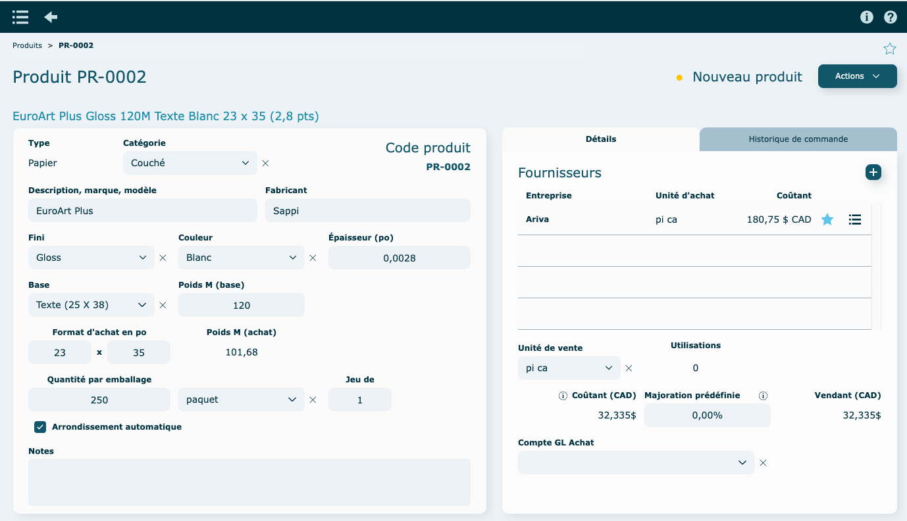

Chaque produit doit être associé à l'un des 7 types suivants : Emballage, Enveloppe, Film, Général, Grand format, Papier, Reliure documents.

---

## Nouveau produit {#nouveau-produit}

Cliquez sur **Créer un produit**, en haut à droite du mode liste.

- Sélectionner un type de produit

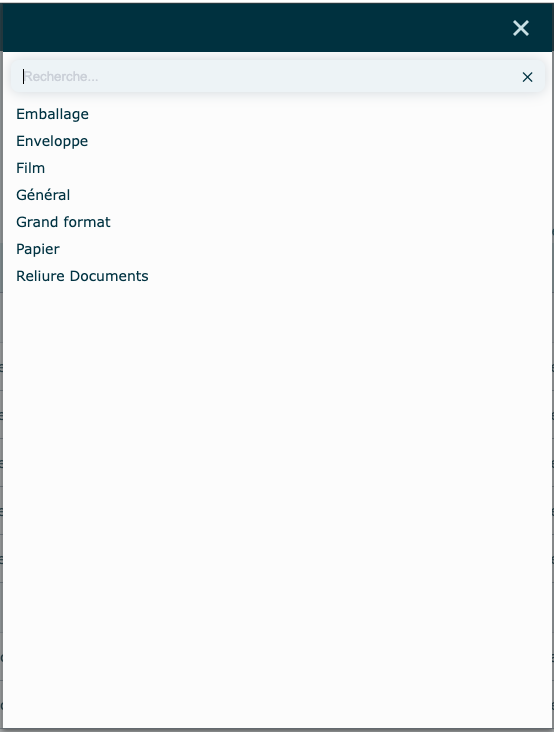

- Sélectionner une catégorie

  les catégories sont définies dans vos [standards.](../parametres/standards.md#categories)

  Par exemple ici, après avoir sélectionné le type Papier, nous avons plusieurs catégories de ce type et il suffit d'en choisir une pour poursuivre la création.

  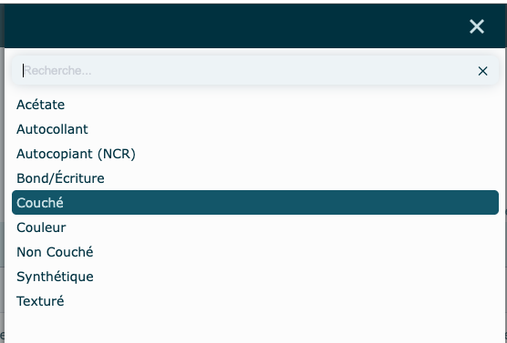

Finaliser l'entrée des données de votre produit, en lui donnant une description, un format, etc.
Les couleurs et finis sont définis dans vos [standards.](../parametres/standards.md#couleurs-finis)

Il est primordial que tous les champs marqués d'une [étoile](../fonctionnalites-generales/champs.md#champs-obligatoires) soient remplis, car ils sont obligatoires.

    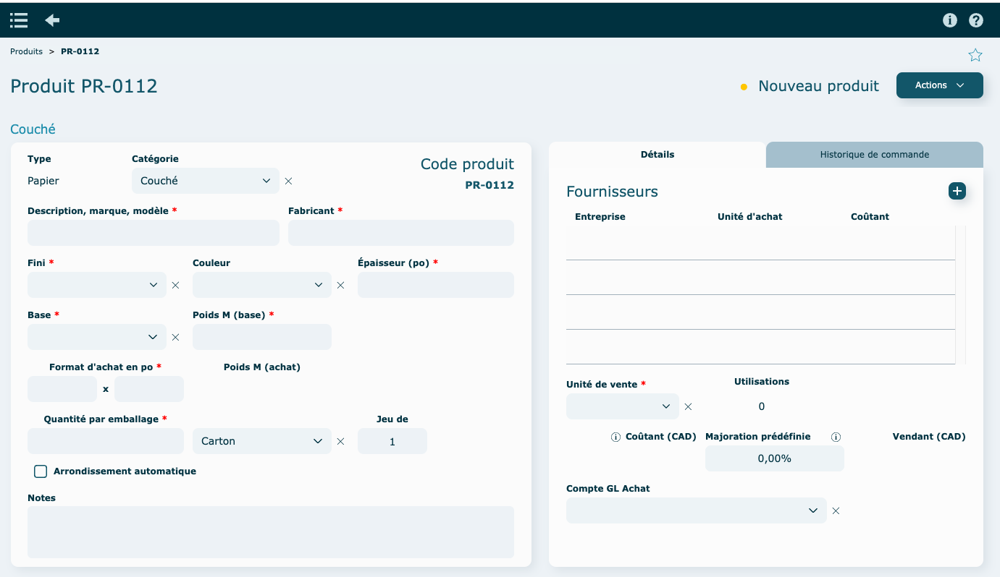

Pour préciser le nom que vous voudrez donner à la soumission (client) et au dossier de production (interne), cliquer sur le nom en haut pour faire ouvrir une fenêtre d'édition.

    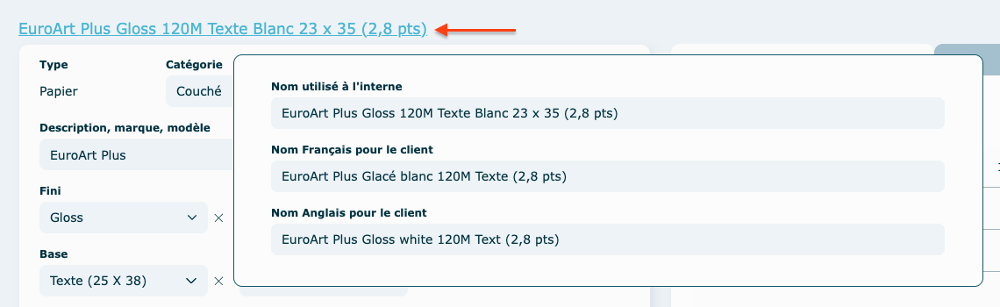

Chaque produit doit avoir, au moins, un fournisseur de base avec un prix coutant et son unité d'achat ainsi qu'une unité de vente.

      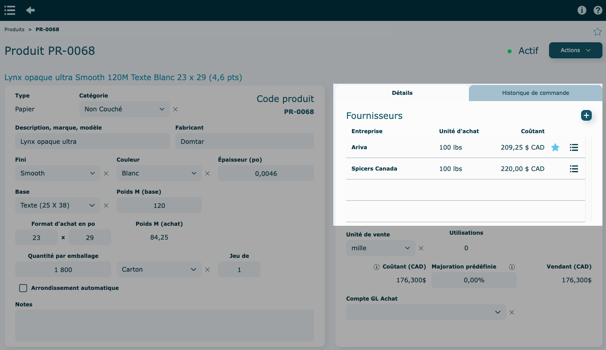

      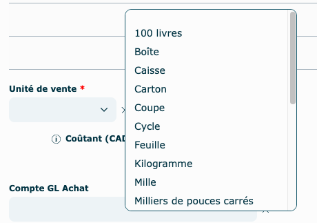

### Modifier un produit {#modifier}

Simplement modifier les informations directement dans la fiche du produit.

Aucune sauvegarde n'est nécessaire.

---

## Historique de commande {#historique}

Permet de consulter l'historique de commande par produit.

Cliquez sur une ligne pour consulter la commande.

    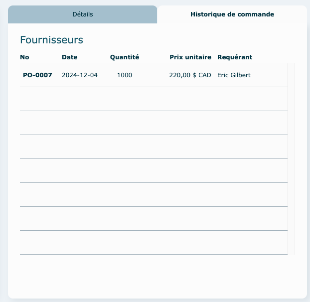

---

## Actions diverses {#acions}

#### En mode consultation

- Modifier le code de produit

  Suivre les étapes à l'écran

  Souvent cette étape sera réservée à certains utilisateurs seulement.

- Rendre actif/inactif

  Inactif : le produit apparaitra grisé dans la liste

- Supprimer

  Si le produit a été utilisé dans le système, la fiche ne pourra être supprimée, rendre plutôt le produit **Inactif**.

- Dupliquer
- Valider prix

  Cliquez pour inscrire la date du jour comme validation. L'information se retrouve dans le coin inférieur droit de la fiche du produit ou dans la colonne date validation en mode liste.

      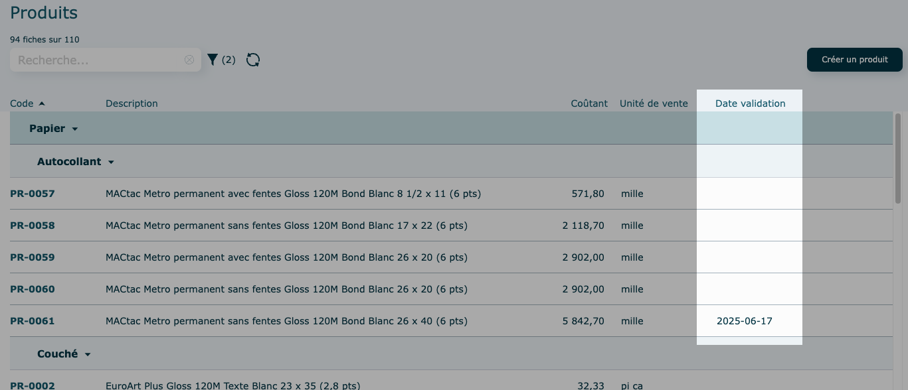

---

## Autres {#autres}

### Majoration {#majoration}

À définir seulement si vous souhaitez un pourcentage fixe et différent du standard de base.

Sinon, le pourcentage par défaut sera celui saisi dans vos [standards](../parametres/standards.md#majoration), au moment de la soumission.

### Modification de prix {#modifications-prix}

Permet de modifier le prix sur plusieurs produits en même temps ou individuellement.

Consultez cette [section](../achats/gestion-prix.md) pour plus d'informations.

---

## Vidéo démo du module {#video}

[https://www.youtube.com/watch?v=O6KTExyDvww&t=4s](https://www.youtube.com/watch?v=O6KTExyDvww&t=4s)
