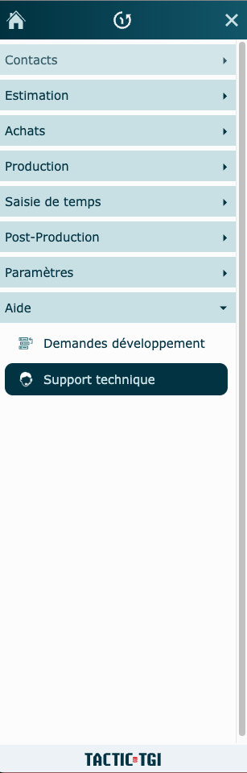
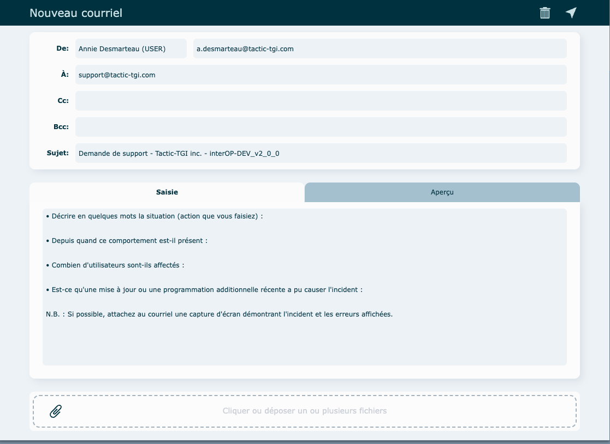

---

Vous avez besoin d'une assistance pour une situation problématique ?

Cliquez sur **Support Technique** dans le menu principal pour nous en informer.

Assurez-vous d'être dans la fenêtre où se trouve le problème avant de cliquer.

Une fenêtre de nouveau courriel s'ouvrira et il sera prérempli de quelques questions à répondre afin de nous aider dans votre demande.

Lorsque vous prenez le temps de nous donner ces détails, notre intervention sera plus rapide et plus efficace.

N'oubliez pas d'attacher des captures écrans démontrant l'endroit de l'incident ainsi que les erreurs affichées, s'il y en a.

