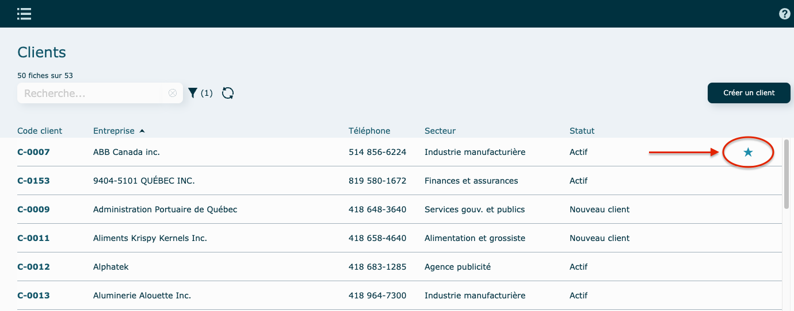
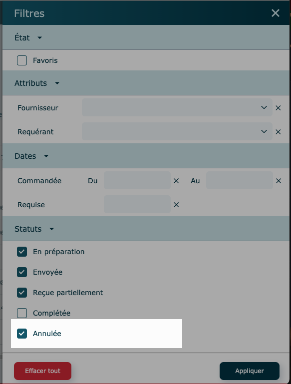
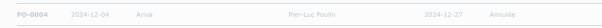
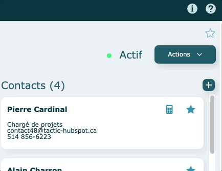
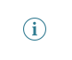
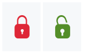

---

### Favoris {#favoris}

Le bouton **Favoris** se retrouve dans la portion supérieure droite du mode consultation.

Il permet d'identifier une fiche comme Favori.

Par défaut, aucun favori n'est attribué et ils sont propres à chaque usager.

Cliquer sur l'étoile blanche pour identifier une fiche comme Favori, elle deviendra bleue.

Cliquer sur l'étoile bleue pour enlever une fiche comme Favori, elle deviendra blanche.

En mode Liste, on retrouve l'étoile bleue à l'extrémité de chaque ligne.

À noter que tous vos favoris se retrouveront dans le module [Mes Préférences](../parametres/preferences.md), dans la Gestion des enregistrements, où vous pourrez facilement y retourner en cliquant sur celui-ci.

### Fiche annulée {#fiche-annulee}

Son statut changera pour Annulée.

Par défaut, les enregistrements annulés ne sont pas visibles dans les listes, à moins de cocher la case dans votre filtre.

**En mode liste** : la ligne sera grisée

Il faudra alors faire l'action de Réutiliser pour pouvoir remettre l'enregistrement actif.

### **Icônes** {#icones}

Positionner la flèche de votre souris sur l'un des icônes afin de faire afficher son utilité.

Si le pointeur de votre souris se transforme en main, ceci indique qu'il s'agit d'un bouton et qu'une action sera faite en cliquant dessus. S'il reste en flèche, l'icône sert de repère seulement.

Exemple :

### **Information** {#infos}

Cliquez sur ce bouton pour consulter le contenu informatif.

###

### Verrouiller / déverrouiller {#cadenas}

Permet de verouiller ou déverrouiller une fiche ou un enregistrement.

