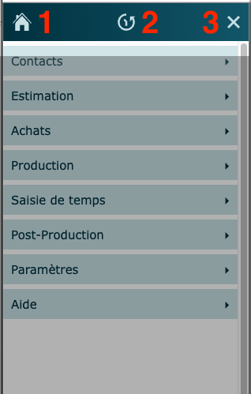
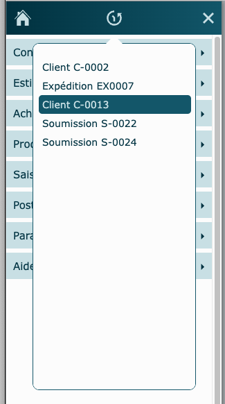
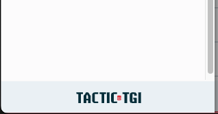

---

## Fonctionnement

Le menu principal est accessible à travers le logiciel dans la plupart des écrans au coin supérieur gauche de l'écran. Il permet la navigation entre les les différents modules.

Les modules, identifiés par des icônes, sont classés dans des sections pour une suite logique des opérations. Vous pouvez appuyer sur le bandeau de chaque section pour l'ouvrir ou la fermer.

Un clic sur une ligne de module à l'intérieur d'une section vous déplacera à l'entrée de ce module, qui est généralement le mode liste.

:::tip

Si votre poste vous amène à toujours utiliser plusieurs des sections, ou que vous ne vous souvenez pas rapidement où un module se trouve, tenez la touche "shift" en cliquant sur les sections pour toutes les dérouler ou les fermer en même temps!

:::

## Boutons du haut {#boutons}

### 1 - Retour à l'accueil {#accueil}

Cliquez pour revenir à la page d'accueil.

### 2 - Historique de navigation {#historique}

Cliquez pour faire afficher l'historique de navigation.

Il contient les 20 derniers enregistrements officiels visités (tables principales de module), permettant de retourner rapidement au dernier travail effectué.

### 3 - Fermeture du menu {#fermer}

Cliquez pour annuler le déplacement et fermer le menu.

## Site internet {#site}

Cliquez pour accéder au site internet de Tactic-Tgi.

