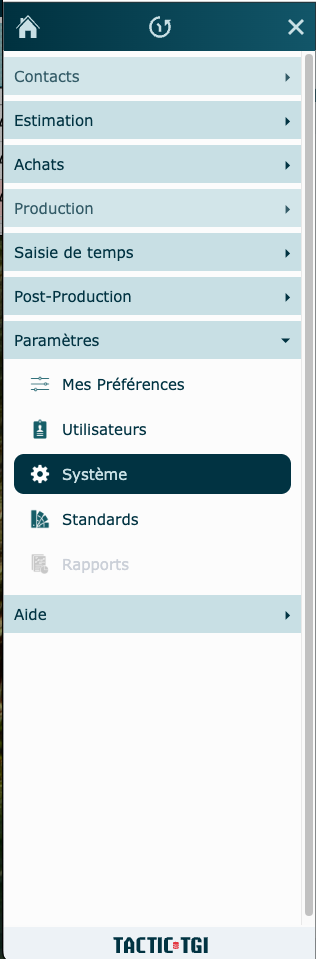
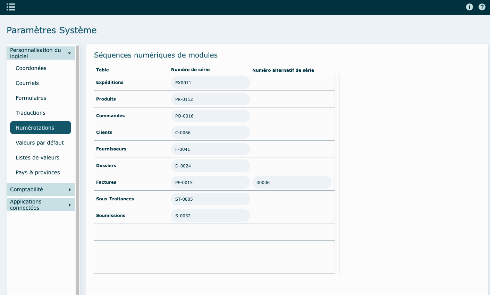
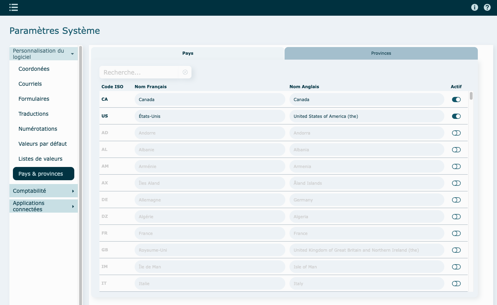
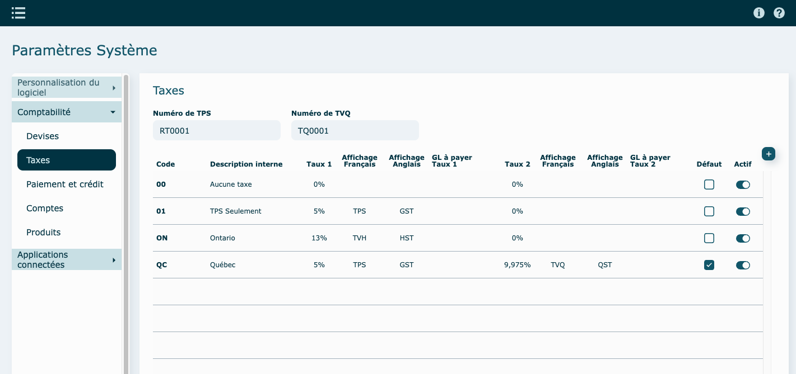
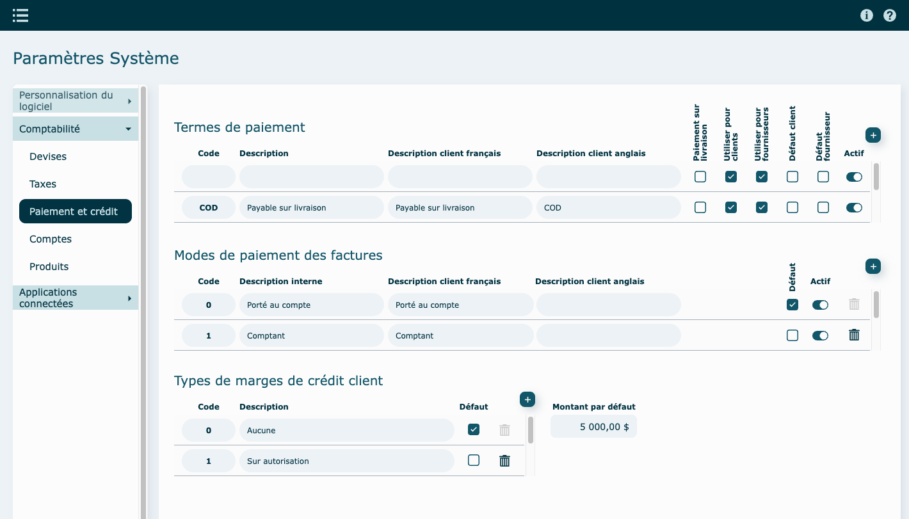
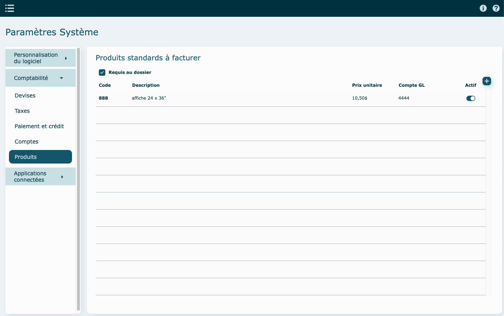
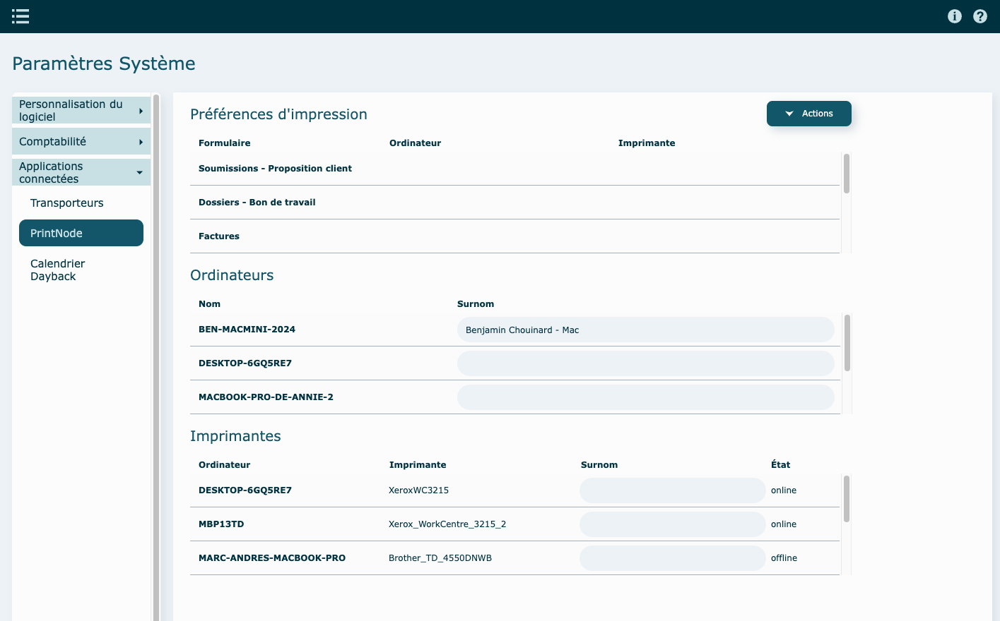

---

## Survol {#survol}

Cette section du logiciel vous permet de le personnaliser selon votre entreprise.

Tout changement ici, sera reproduit ailleurs dans le logiciel.

---

## Personnalisation du logiciel {#personnalisation}

### Coordonnées {#coordonnees}

Inscrire vos coordonnées d'entreprise , ajouter vos logos et sélectionner le logo à utiliser dans les différents formulaires.

### Textes / Modèles de courriels {#courriels}

Gérez ici les différents textes/salutations qui apparaitront par défaut sur la proposition aux clients.

Voici la liste des modèles disponibles et utilisés dans le logiciel lors de l'envoi d'un courriel.

Afin d'uniformiser vos envois courriels, veuillez remplir chacun des modèles.

Utilisez les données variables admissibles pour les personnaliser.

**Exemple** : Avis d'expédition

### Messages sur formulaires {#formulaires}

Gérez ici les messages qui apparaitront par défaut sur les formulaires d'envois aux clients.

Vous avez la possibilité, pour chaque message, de les faire afficher sur :

- la proposition de prix au client
- le bon d'expédition
- la facture

### Traductions {#traductions}

Ayez la latitude de modifier les termes qui apparaissent sur les différents formulaires envoyés aux clients.

### Numérotations {#numerotations}

Personnalisez la numérotation de vos différents modules.

### Valeurs par défaut {#defauts}

Définir les valeurs par défaut de votre système.

### Listes de valeurs modifiables {#listes-valeurs}

Ces listes peuvent être modifiées. Elles apparaissent comme menu déroulant dans différents modules.

### Gestion des pays, provinces et devises {#pays-provinces}

Pour rendre **actif** un Pays, une Province ou une Devise cliquez sur le bouton au bout de la ligne.

---

## Comptabilité {#comptabilite}

Cette section permet la configuration selon votre logiciel de comptabilité.

### Devises {#devises}

Le bouton **Synchroniser avec Passerelle** récupère les taux en vigueur pour la journée. Ces taux sont actualisés une fois par jour via la passerelle. Ainsi, même si vous cliquez plusieurs fois sur le bouton de mise à jour, les taux resteront inchangés jusqu'au jour suivant.

Taux de base et supplément d'achat

Le taux de base représente le taux "réel" des devises.

Afin de se protéger contre les fluctuations, il est possible d'ajouter un supplément au taux d'achat. Par exemple, si le taux est de 1,5, vous pouvez ajouter 0,05 pour obtenir un taux d'achat de 1,55. Cela permet d'absorber une variation de 5% sans impacter le prix prévu.

Paramètres modifiables

- Le supplément appliqué au taux d'achat
- Le suffixe de la devise

### Taxes {#taxes}

Dans cette section, déterminez les éléments suivants :

- Numéro TPS / TVQ
- Groupes de taxes

### Paiements & Crédits {#paiements}

Dans cette section, déterminez les éléments suivants :

- Termes de paiements
- Modes de paiements
- Types de marge de crédit
- Montant de la marge par défaut
- Devises - unité monétaire

### Comptes {#comptes}

Inscrivez la liste de vos comptes GL (Revenus et Dépenses).

### Produits standards à facturer {#produits-facturation}

Section à compléter si vous travaillez avec des produits dans votre système comptable.

---

## Applications connectées {#applications}

### Transporteurs {#transporteurs}

Gestion de vos différents transporteurs.

### Printnode {#printnode}

Système de gestion des imprimantes. Lié à votre compte Printnode, choisissez votre ordinateur et sur quelle imprimante vous voudrez imprimer par défaut.

### Calendrier Dayback (Abonnement requis) {#dayback}

Vous devez avoir activé le module pour avoir accès au calendrier Dayback. Voir section [calendrier](../production/calendrier.md) pour plus d'information.

Dans cette section, vous pourrez contrôler les statuts d'opérations qui se trouvent dans le calendrier.

