---

## Survol

Le module Facturation permet de produire des factures de vente selon la mise en forme souhaitée en rappelant le numéro d’un dossier, ce qui affiche automatiquement le nom du travail, la quantité commandée et le prix unitaire.

L’intégration avec votre logiciel comptable par notre passerelle de connexion \[interOP • Comptabilité\] permet par la suite de transférer automatiquement ces factures.

Ouverture du module en [mode liste](../fonctionnalites-generales/navigation.md#mode-liste).

Par défaut, le [filtre](../fonctionnalites-generales/navigation.md#filtres-et-tris) est à statut : Proforma - En préparation + Proforma - Envoyée + Finale - Prête pour envoi.

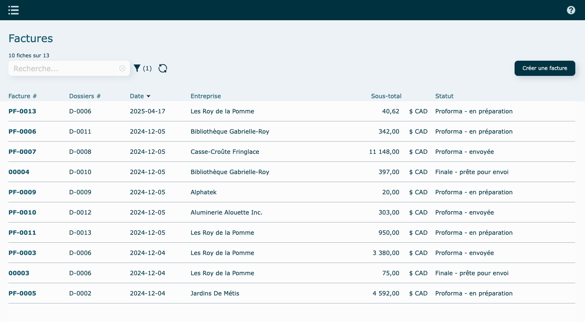

**En mode** [**consultation**](../fonctionnalites-generales/navigation.md#mode-consultation)

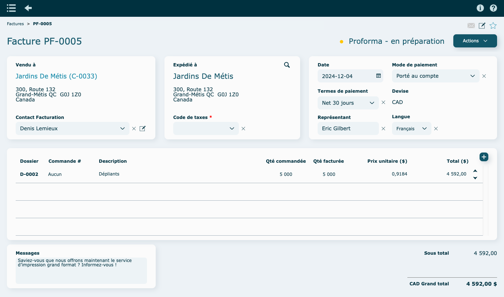

## Préfixe du numéro de facture

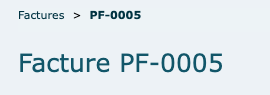

**PF** : Indique qu'il s'agit d'une facture pro forma. Elle sert principalement à informer l'acheteur des coûts estimés avant la transaction finale. Ceci n'est pas une facture finale.

---

## Création d'une facture

- Cliquez sur **Créer une facture** en haut à droite de la liste.

### Depuis un dossier

    Sélectionnez un dossier à facturer. Vous pouvez utiliser le filtre pour isoler un client ou trouver un dossier facilement.

    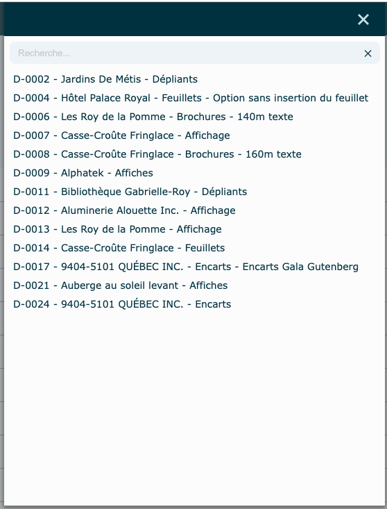

    La facture sera créée automatiquement.

    La **Qté facturée est** la quantité totale du dossier, à laquelle on soustrait les quantités qui pourraient avoir déjà été facturées pour ce dossier. Assurez-vous de la remplir si elle ne l'est pas déjà, en cliquant sur la ligne pour faire apparaitre la boîte d'édition.

    Également, selon votre logiciel comptable, déterminez un compte GL par ligne, s'il n'est pas déjà rempli ( préalablement défini dans le dossier.

    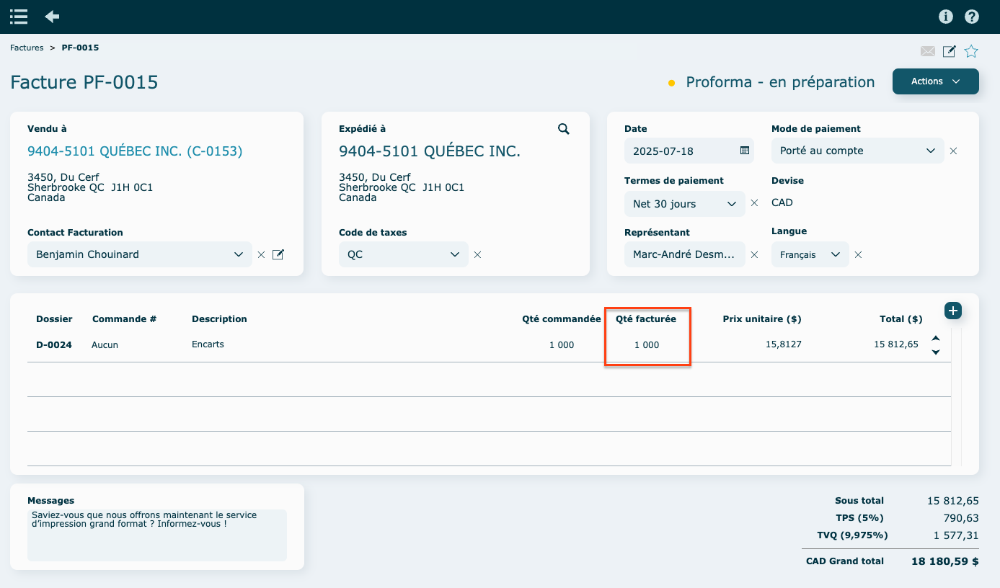

    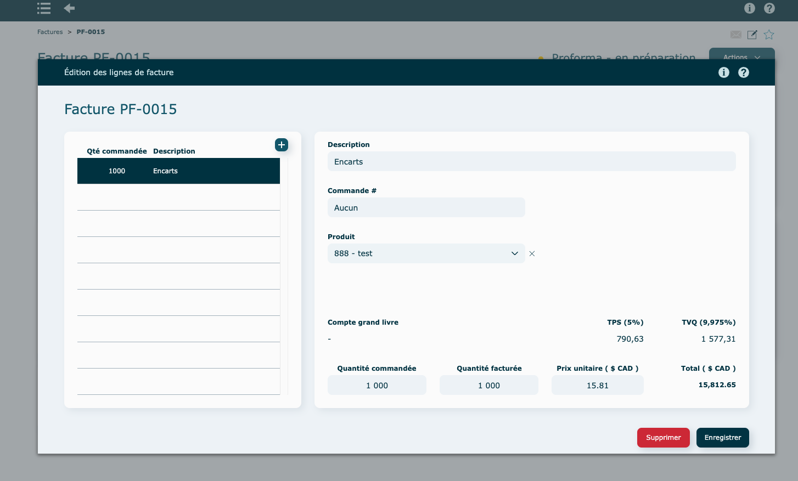

    Assurez vous que le code de taxes est bien rempli.

    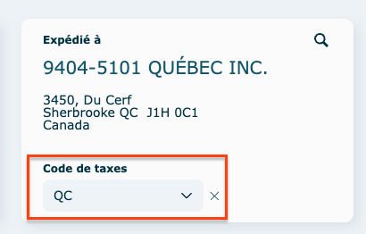

### Nouvelle facture (vide, à partir d'un client)

    Sélectionner un client.

    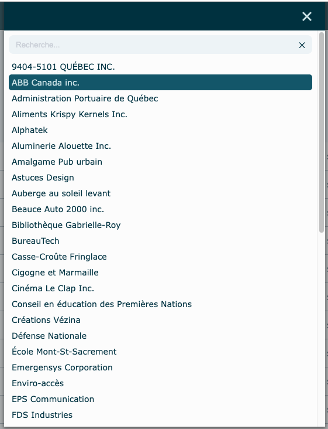

    La facture sera créée automatiquement.

    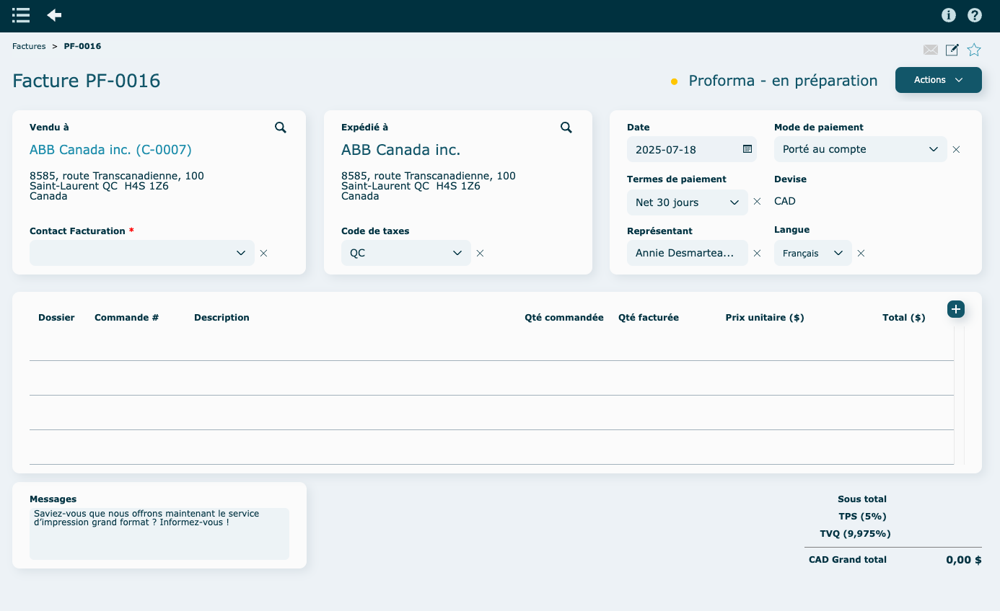

    Assurez vous de remplir le code de taxes.

    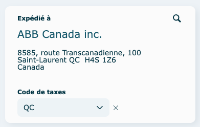

### Responsable facturation

Responsable de la facturation : Veuillez vous référer à la fiche [Clients](../contacts/clients.md#consulter-modifier-ou-supprimer-un-contact) pour voir votre contact de Facturation par défaut.

À noter qu'on ne peut avoir qu'un seul responsable facturation, mais on peut avoir autant de contact que l'on veut qui sont cochés "Facturation - Envoi courriel", un peu comme un utilisateur en CC dans un courriel.

Par défaut, le responsable de la facturation sera dans l'envoi courriel ainsi que tous ceux cochés dans "Envoi courriel". Si on ne coche aucun contact dans "Envoi courriel", le responsable de la facturation va quand même recevoir la facture.

## Ajouter une ligne de facture

Cliquez sur **l'icône** et choisir l'option désirée.

Ne pas oublier que vous pouvez changer ensuite l'ordre des lignes à l'aide des flèches se situant à droite du portail.

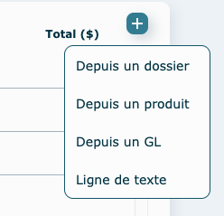

### Depuis un dossier

    Sélectionnez un dossier : certaines informations seront recopiées automatiquement, comme la description et le numéro de commande.

    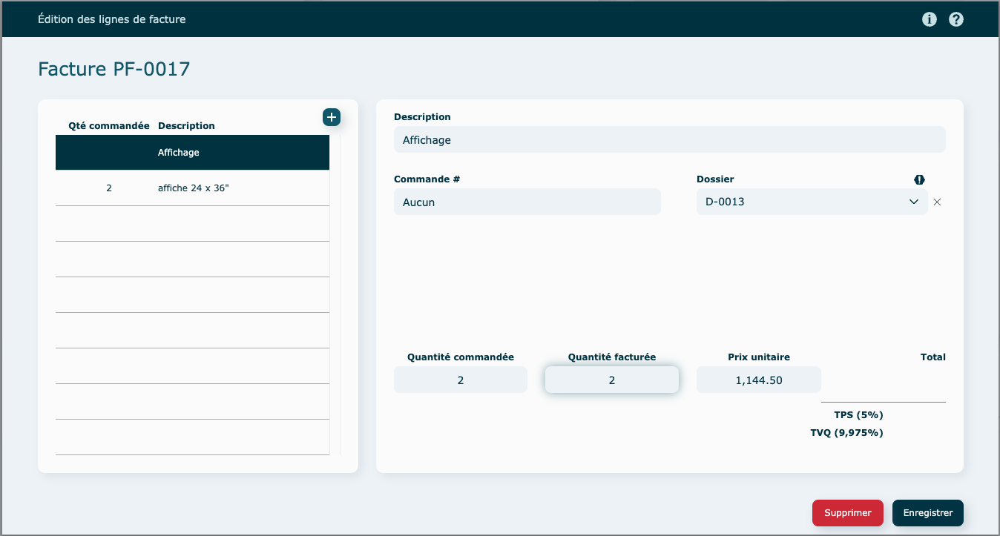

    Remplir la quantité et tout autre information manquante.
    Cliquez sur Enregistrer et la ligne sera ajoutée.

    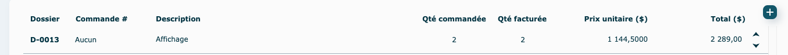

### Depuis un produit

    Sélectionnez un produit et remplir les informations manquantes (quantité, prix) et cliquez sur Enregistrer.

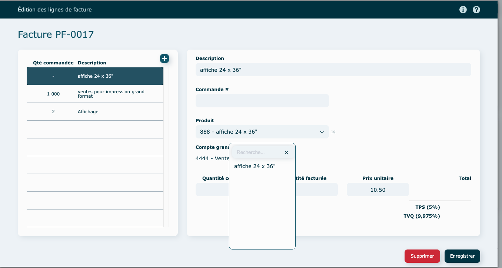

    Une ligne va se créer.
    Pour éditer vos produits standards facturation, veuillez consulter la section [Paramètres](../parametres/systeme.md#produits-standards-à-facturer).

### Depuis un GL

    Sélectionnez un compte GL et remplir les informations (description, quantité, prix) et cliquez sur Enregistrer.

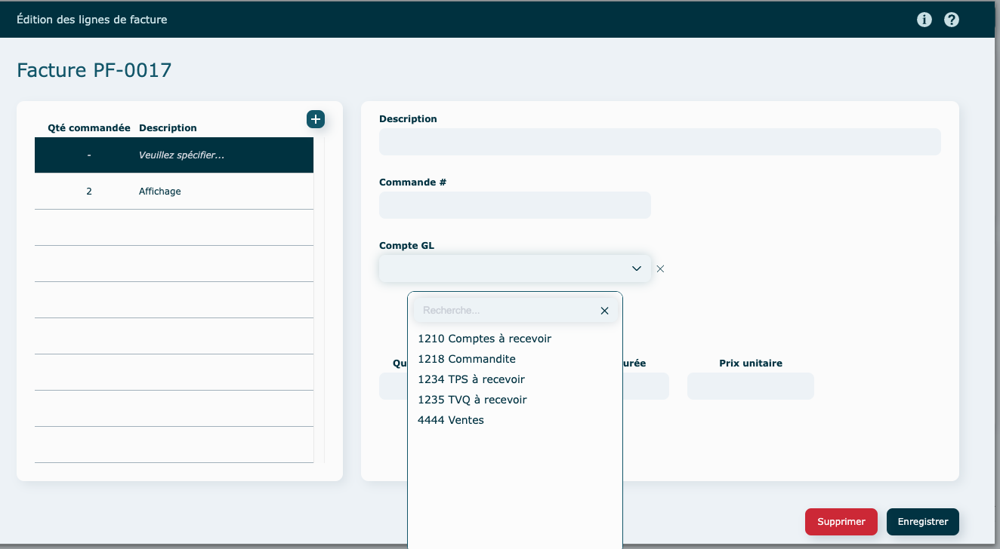

    Une ligne contenant le compte GL va se créer.
    Pour éditer vos comptes GL, veuillez consulter la section [Paramètres](../parametres/systeme.md#comptes-gl).

### Ligne de texte

    Une ligne vierge va se créer.

    Remplir les informations (description, quantité et prix), puis Enregistrer.
    Vous pouvez ajouter d'autres lignes de texte directement dans cette fenêtre, en cliquant sur **l'icône**

    

## Messages

Le message au bas de la facture provient de vos [paramètres Système](../parametres/systeme.md#messages-sur-formulaires).

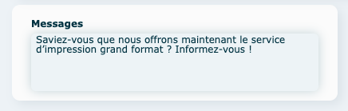

---

## Actions diverses

#### En mode consultation

- Produire facture finale : la facture proforma sera convertie en facture finale et transmise à votre logiciel comptable par l'API.

- Visualiser

- Envoyer par [courriel](../fonctionnalites-generales/courriels.md)

- Imprimer
- Créditer : si le bouton est grisé, c'est que la facture finale n'a pas encore été faite et envoyée dans le système comptable (elle est encore en proforma).

- Supprimer : si le bouton est grisé, impossible de faire la suppression.

---

## Vidéo démo du module

[https://www.youtube.com/watch?v=7EsPkFZrBQw](https://www.youtube.com/watch?v=7EsPkFZrBQw)
