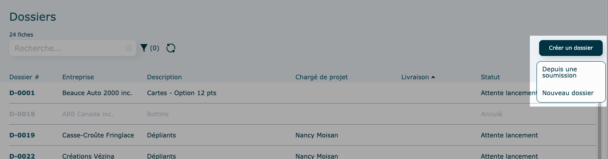
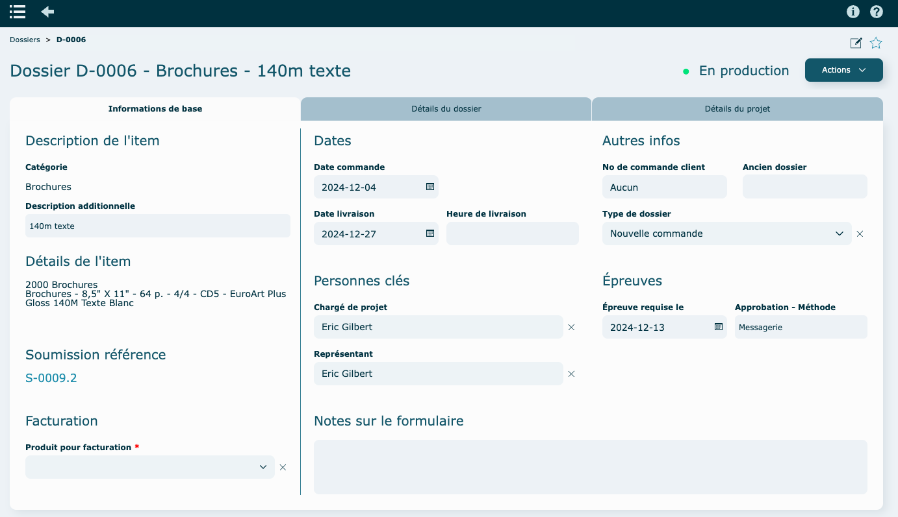
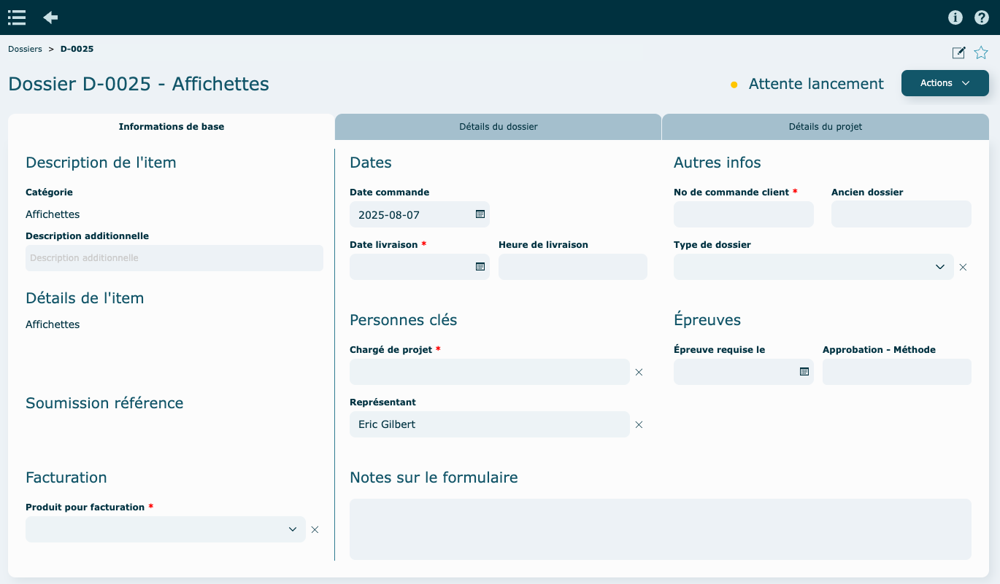
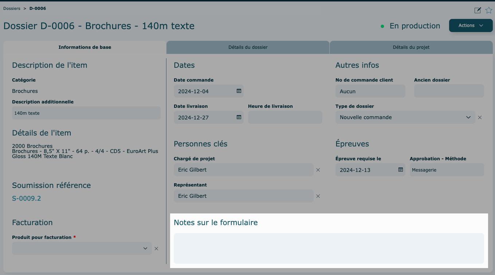
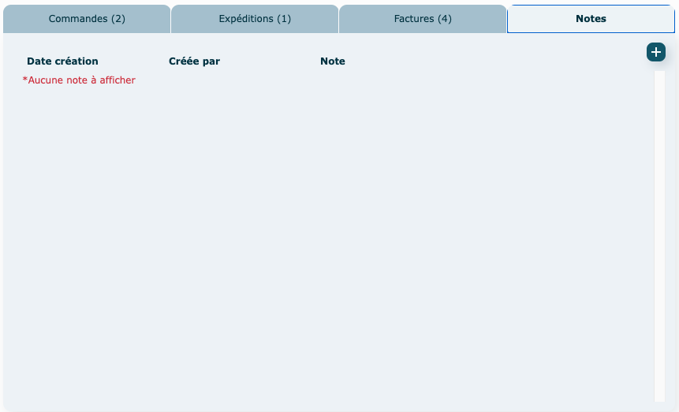
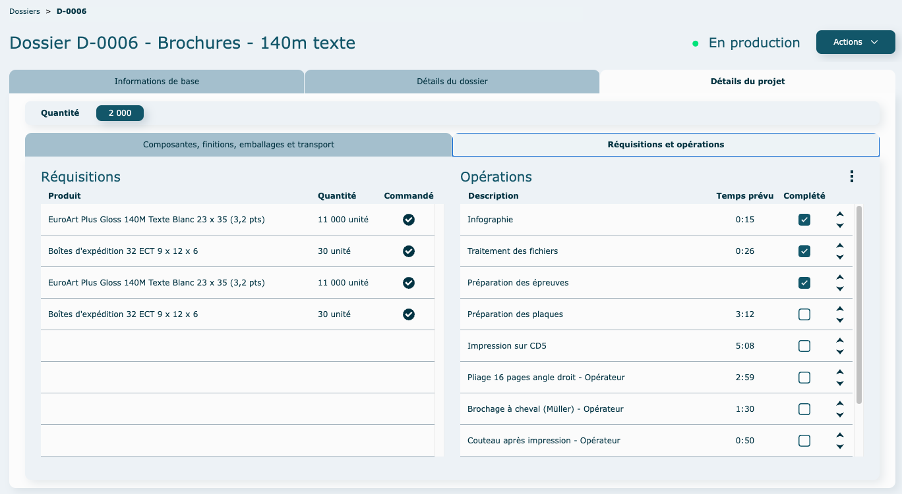

---

## Survol {#survol}

Accessible dans la section Production, ce module sert à consigner les détails qui permettent de produire correctement le travail commandé. Toute l’information est accessible et centralisée, votre équipe de production aura donc un outil efficace pour compléter la commande de votre client !

En plus, un bon de travail peut être imprimé lors du lancement du contrat en production, selon la mise en forme souhaitée.

Ouverture du module en [mode liste.](../fonctionnalites-generales/navigation.md#mode-liste)

Par défaut, le [filtre](../fonctionnalites-generales/navigation.md#filtres-tris) est à statut : Attente lancement + En production + Expédié + Complété.

Bien que vous ayez le contrôle absolu sur les filtres, nous vous conseillons de ne pas toujours montrer tous les dossiers qui sont terminés. Cela permettra de garder votre liste plus épurée et l'affichage sera plus rapide.

**Statuts**

- Attente lancement

  Le dossier n'a pas encore été lancé en production.

- Annulé

  un dossier **annulé** apparaitra grisé dans la liste et avec un fond rouge en mode [consultation](../fonctionnalites-generales/navigation.md#mode-consultation).

---

## Création d'un dossier {#creation}

### Créer un dossier depuis la soumission (par Soumissions) {#depuis-soumission}

Le plus commun est de créer un dossier à partir d'une soumission existante. Veuillez vous rendre dans le module soumission, puis dans l'item qui sera envoyé en dossier.

Faire ensuite le bouton Actions et choisir Créer dossier.

### Créer un dossier depuis la soumission (par la liste des dossiers) {#depuis-liste}

Il est aussi possible de créer votre dossier à partir du [mode liste](../fonctionnalites-generales/navigation.md#mode-liste) du module Dossiers.

    Cliquez sur **Créer un dossier** et puis sur **Depuis une soumission**.

    

    Sélectionnez un client.

    

        Sélectionnez une soumission (doit être au statut **En Calcul**)

    

    Sélectionnez l'item commandé.

    

    Sélectionnez une quantité.

    

    Le dossier sera créé automatiquement.

    Révisez votre dossier et lancez-le en production par le menu **Actions**.

### Créer un dossier manuellement (sans soumission) {#creation-manuelle}

Vous ne voulez pas faire de soumission mais bien simplement créer un dossier ?
Ceci est possible. Vous devez vous rendre dans le [mode liste](../fonctionnalites-generales/navigation.md#mode-liste) du module Dossiers.

Cliquez sur **Créer un dossier** et puis sur **Nouveau dossier**.

    

    Sélectionnez un client.

    

    Sélectionnez un item.

    

    La base du dossier sera créé automatiquement.

    Vous référez à la documentation de cette page pour remplir chacune des sections.
    N'oubliez pas de remplir tous les [champs obligatoires](../fonctionnalites-generales/champs.md#champs-obligatoires).

    

---

## Informations de base {#infos-base}

Dans l'onglet informations de base, la portion de gauche représente l'information générale du projet, soit la description de l'item, le détails de celui-ci et la soumission de référence.

Vous pouvez cliquer sur le numéro de soumission pour vous y rendre rapidement.

Dans le coin gauche en bas, vous pouvez inscrire un produit de facturation ou un compte GL associé au projet.

À droite, vous aurez diverses informations générales à remplir, comme la date de livraison, le type de dossier, les épreuves, etc.

**Approbation par courriel**

Sélection des contacts d'approbation d'épreuves possible lorsque la méthode d'approbation est par courriel. Cliquez dans le champs Approbation - Par pour en faire la sélection.

    *   Possibilité illimitée d'ajouter des contacts client en CC.
    *   Possibilité d'ajouter le Représentant.

    *   Affichage des courriels sur le bon de production.

**Notes sur le formulaire**

    Ces notes seront visibles sur le formulaire pdf ou imprimé du dossier de production.

    

---

## Détails du dossier {#details}

### Vendu à et Facturé à {#vendu-facture}

Dans cet onglet, vous verrez les informations relatives au client lié à ce dossier (**Vendu à**) ainsi que celui lié à la facturation (**Facturé à**), qui peut être différent.

Il est possible de changer le client ou d'éditer un contact pour les sections **Vendu à** et **Facturé à**

- Pour changer le client

Cliquez sur la **loupe**  pour faire une recherche et sélectionnez un client.

    

Si le client est manquant, veuillez aller le créer dans le module [Clients](../contacts/clients.md#creation).

- Pour éditer un contact

  Cliquez sur le **crayon.**

  

  Les changements apportés lors de l'édition du contact seront appliqués dans le système au complet.

  

### Enregistrements liés {#enregistrements}

Dans la portion de droite, vous trouverez des portails qui vous permettront de voir et d'accéder rapidement à tout ce qui est lié à votre dossier : commande d'achat, expédition, factures et les notes.

Pour accéder à l'enregistrement, cliquer sur la ligne directement.

**Commande(s) liées**

**Bon(s) d'éxpédition liés**

#### Créer un bon d'expédition

Le dossier doit être lancé en production.

- Cliquez sur **l'icône**
  Vous référez au [module Expéditions](../post-production/expeditions.md) pour en apprendre d'avantage.

**Factures**

#### Créer une facture

Le dossier doit être lancé en production.

- Cliquez sur **l'icône**

  Vous référez au [module Factures](../post-production/factures.md) pour en apprendre d'avantage.

**Notes de production**

Les notes de production sont propres à un dossier et peuvent être consultées à l'écran seulement. Elles ne se retrouvent pas sur le dossier pdf ou imprimé.

#### Ajouter une note

Cliquez sur **l'icône**

Pour consulter, modifier, supprimer une note ou insérer et consulter des pièces jointes, vous référez à cette [section](../fonctionnalites-generales/notes.md#notes-actions).

## Détails du projet {#details-projets}

Cet onglet représente le détail du travail à faire. Généralement, il provient de la soumission lié.

**Il est important de mentionner que tous changements apportés à un dossier de production ne change pas la soumission liée et vice versa.**

Si une modification mineure a été apportée et que vous voulez facturer une soumission révisée, vous pouvez simplement lier la nouvelle soumission au dossier. Vous devrez faire le changement manuellement au dossier (ex : ajout de bande élastique) pour avertir la production du changement.

Si les modifications sont trop importantes, il est préférable d'annuler le dossier et d'en recréer un nouveau avec la nouvelle soumission, surtout si le travail n'était pas encore en production.

### Composantes, finitions, emballages et transport {#composantes}

Pour toutes les informations relatives au fonctionnement des divers blocs présents, veuillez vous référer aux sections suivantes (même informations que le module de Soumission) :

- [Quantités](../estimation/soumissions.md#quantites)
- [Composantes](../estimation/soumissions.md#composantes)
- [Opérations globales](../estimation/soumissions.md#operations-globales)
- [Emballages globaux](../estimation/soumissions.md#emballages-globaux)
- [Transports & Livraisons](../estimation/soumissions.md#transports)

### Réquisitions et opérations {#requisitions}

Vous trouverez l'ensemble des **réquisitions d'achat** du dossier.

Le crochet indique si le produit a été commandé.
Consulter cette [section](../achats/requisitions.md) pour en apprendre d'avantage.

Dans la portion de droite se trouve la liste des **opérations** à effectuer.

Il est possible de cliquez sur une opération pour modifier le temps réalisé ou pour Terminer l'opération. La [procédure](../production/liste-suivi.md) est la même que dans la **Liste de suivi.**

Vous pouvez également changer l'ordre des opérations en cliquant sur les petites flèches pour monter ou descendre une opération.

Pour mettre à jour les opérations lorsqu'il y a eu un changement à la soumission lié, vous pouvez cliquer sur l'icône des 3 petits points et faire Mettre à jour les opérations (Exemple ➝ ajouter une finition, modifier la quantité, etc.)

Vous pouvez aussi, par ce menu, compléter toutes les opérations en un seul clic.

## Prix de revient {#prix-revient}

Pour valider vos coûtants, vos vendants et votre marge de profit, l'outil Prix de revient est essentiel. Le report de tous les coûts se retrouvent à cet endroit. Vous pourrez les valider, les ajuster et confirmer que le travail a été profitable pour vous !

Le dossier doit être lancé en production et vous devez avoir les [accès nécessaires](../parametres/utilisateurs.md#acces) pour consulter le prix de revient.

Vous pouvez également ajouter des frais en cliquant sur **l'icône**, taper une description, inscrire une quantité et un coûtant.

Au besoin, ajoutez ce frais à votre facture !

Exemple : vous pouvez ajouter un coût non prévu de mise en élastique dans la portion Matériaux et autres, puis ajouter une opération d'emballage avec le temps que votre employé a pris pour faire l'opération.

Une poubelle apparaitra au bout des lignes ajoutées manuellement, pour vous permettre de les retirer. Les coûts qui ont été entrés automatiquement depuis la soumission n'auront pas l'icône de suppression, il faudra retourner corriger la soumission au besoin.

---

## Actions diverses {#actions}

#### En mode [consultation](../fonctionnalites-generales/navigation.md#mode-consultation)

- Lancer en production
- Visualiser ou Imprimer bon production

  Ceci ouvrira la proposition dans un nouvel onglet de votre navigateur. Vous pourrez ainsi la télécharger ou l'imprimer.
  

- Mettre les réquisitions à jour
  Voir explication dans le module [**Réquisition**](../achats/requisitions.md#mettre-a-jour)

- Ouvrir prix de revient

  Voir section [Prix de revient](../production/dossiers.md#prix-revient)

- Changer l'estimé de référence

      Attention : ceci doit être utilisé seulement si les modifications à la soumission sont mineures et que vous voulez facturer une soumission autre que celle de départ. Si vous avez fait des changements sur les quantités, les composantes et autres, vous devrez les refaire dans le dossier au besoin, pour les gens de production.

- Annuler
  Une fois que le dossier est annulé, vous aurez la possibilité de le remettre actif par ce menu, en faisant **Réutiliser**.

---

## Vidéo démo du module {#video}

[https://www.youtube.com/watch?v=0rQdB5g8RfA](https://www.youtube.com/watch?v=0rQdB5g8RfA)
