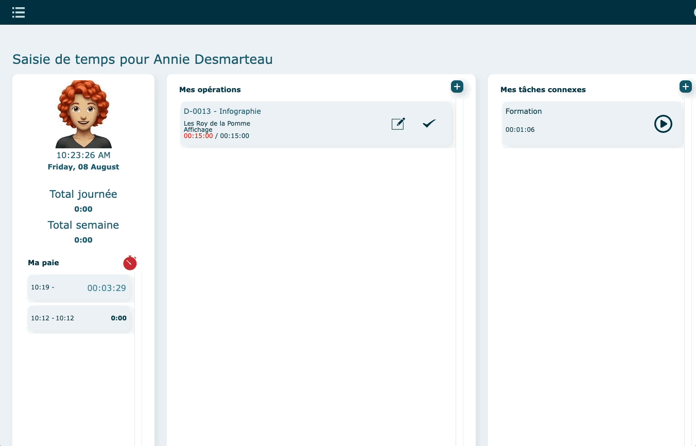
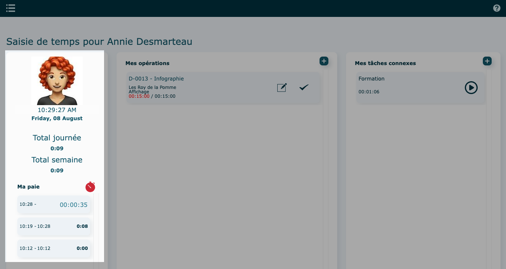
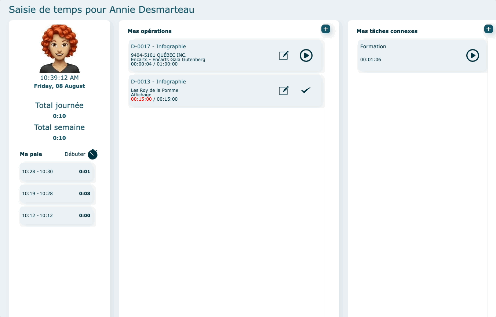
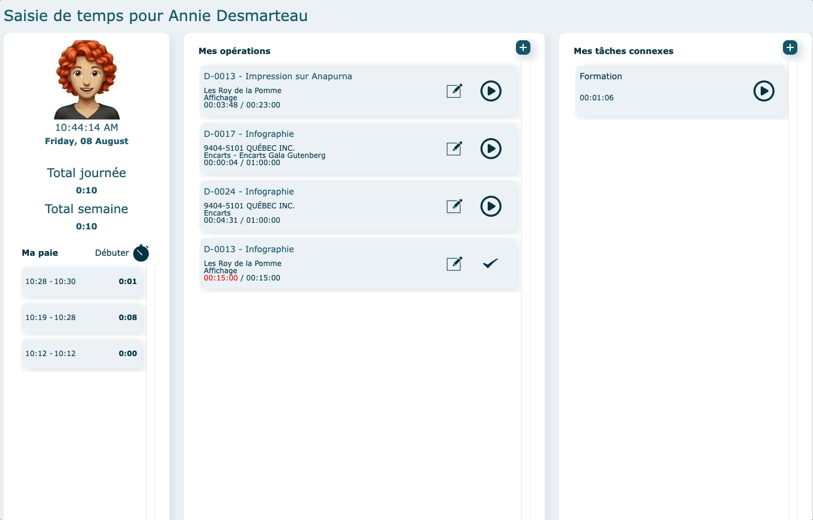
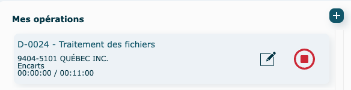
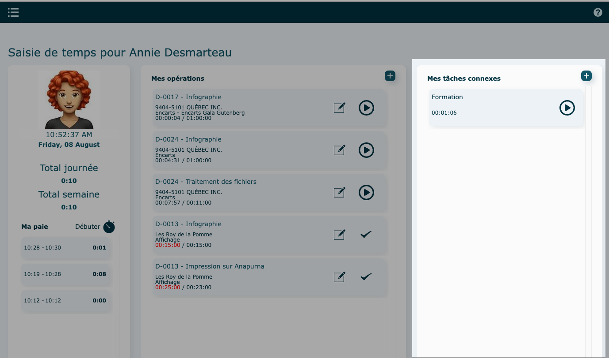

---

# Survol

Grâce à ce module, vous pouvez consigner rapidement et clairement le temps investi dans des opérations de main-d’œuvre. La préparation des fiches de paie d’employés est aussi simplifiée.

Un mode d’affichage additionnel par station permet également à plusieurs employés d’utiliser le même appareil de saisie des temps.

#### Attributions

Les opérations et tâches connexes visibles proviennent des [attributions définies dans la fiche](../parametres/utilisateurs.md#actions-diverses) de l'utilisateur.

- Pour y accéder

  Cliquez sur la photo de l'employé dans le coin supérieur gauche.

  Apportez vos changements et cliquez sur **Enregistrer** (vous devez avoir les accès nécessaires pour le faire).

  

---

## En mode individuel

Le module s'ouvre directement sur l'interface de paie de l'employé.

### Ma Paie

Permet de débuter votre période de travail à comptabiliser.

Cette partie présente également le total d'heures de la journée et de la semaine en cours ainsi que tous vos punchs de la journée .

Cliquez sur **Débuter** pour commencer un punch et sur le **chronomètre rouge** pour le terminer.

Pour apporter des modifications à un punch, vous référez au rapport [suivant.](../parametres/rapports.md#paie---détail)

---

### Mes Opérations

Permet de comptabiliser le temps passé sur des opérations reliées à un dossier de production.

Il est possible de repartir le chronomètre d'une opération, non terminée, réalisée plus tôt dans la journée ; cliquez sur le bouton démarrer. Le total se cumulera.

Le crochet désigne une opération terminée.

- Ajouter une nouvelle opération

  Cliquez sur **l'icône**

  - Par attribution

    Sélectionnez une opération (attribution, ex : infographie), puis un dossier. Le chronomètre partira automatiquement.

    

  - Par dossier

    Recherchez toutes les opérations reliées à un dossier précis.

    Entrer un numéro de dossier et **Chercher.**  
    Pour revenir en arrière, utilisez la flèche bleue.

    Sélectionnez une opération. Le chronomètre partira automatiquement.

    

- Arrêter un chronomètre

  Pour arrêter le chronomètre, cliquez sur le **bouton rouge arrêt.**

  

#### Éditer/terminer une opération

Cliquez sur le **crayon** au bout de la ligne d'opération.

- Éditer

  Vous pouvez apporter des changements aux [champs éditables](../fonctionnalites-generales/champs.md#champs-éditables) et/ou ajouter une note.

  **Enregistrer**

- Terminer

  Cliquez sur **Terminer opération**. Le punch s'arrêtera automatiquement.

  **Enregistrer**

---

### Mes tâches connexes

Permet de comptabiliser le temps passé sur des tâches connexes.

Ces tâches ne sont pas rattachées à un dossier de production.

Il est possible de repartir le chronomètre d'une tâche déjà réalisée plus tôt dans la journée ; cliquez sur le bouton démarrer. Le total se cumulera.

- Ajouter une nouvelle tâche

  Cliquez sur sur **l'icône**

  Sélectionnez une tâche. Le chronomètre partira automatiquement.

- Arrêter un chronomètre

  Pour arrêter le chronomètre, cliquez sur le **bouton rouge arrêt.**

  

---

## En mode partagé

L'employé partage l'appareil de saisie de temps avec d'autres.

Connectez-vous a interOP, sur l'ordinateur partagée, avec les accès d'une station.

**Exemple : Prépresse**

Nom de compte Filemaker = prepresseA

Mot de passe = prepresseA_motdepasse

- **Connexion sécurisée**

  Dans l'interface d'accueil de Saisie de temps, l'employé doit y inscrire son nip personnel et appuyer sur le crochet.

  Il sera automatiquement dirigé vers son interface de paie.

  

- **Connexion non sécurisée**

  Dans l'interface d'accueil de Saisie de temps, tous les employés assignés à cette station seront visible à droite de l'écran.

  L'employé clique sur son nom pour avoir accès son interface de paie.

  

Pour revenir à l'écran d'accueil, cliquez sur la flèche en haut à gauche.

### Stations

Une station permet à plusieurs employés de se puncher sur un ordinateur commun.

Il est donc possible de créer 1 station par département ou par équipement.
Exemple : presse, reliure, expédition etc.

Pour accéder aux stations, cliquez sur **Stations** dans le [menu principal](../menu.md).

#### Créer une nouvelle station

Cliquez sur **l'icône**.

Remplir chacun des onglets :

- **INFORMATIONS**

  Remplir les informations.

  Le nom de la station est seulement un nom d'affichage tandis que le nom de compte Filemaker sera le nom d'utilisateur à utiliser pour se connecter à interOP sur la station.

  

  Créer l'accès à interOP et confirmez un mot de passe.

  
  

  Pour **sécuriser** l'accès des employés, cochez la case suivante.
  Un nip personnel devra être confirmé dans l'onglet **Utilisateurs**.

  

  Également, vous pouvez choisir un délai **(temps d'inaction)** avant que l'utilisateur ne soit sortie de son interface. Cela permet à l'utilisateur de ne pas bloquer la session s'il quitte pour travailler. Généralement, nous conseillons de mettre 60 ou 120 sec maximum.

  Si l'utilisateur fait une action comme partir un temps ou éditer un punch, le chronomètre va se réinitialiser et il aura de nouveau 60 ou 120 secondes pour procéder à une autre action, avant d'être sorti par le système.

  Une fois dans son interface de paie, il verra un petit sablier s'écouler.

  

- **UTILISATEURS**

  Attribuez des utilisateurs à cette station.

  Les utilisateurs doivent être existant dans la liste des [utilisateurs](../parametres/utilisateurs.md).

  

  Si l'accès a été préalablement sécurisé dans l'onglet **Informations**, définir un nip personnel à chaque utilisateur. Ce nip lui permettra de se connecter à sa fiche de paie.

  

- **TÂCHES**

  Attribuez des tâches à la station.

  

- **ÉQUIPEMENTS**

  Attribuez des équipements à la station.

  

- **OPÉRATIONS**

  Attribuez des opérations à la station.

  

#### Actions diverses

- Modifier le mot de passe (de la station)
- Supprimer

---

## Vidéo démo du module

[https://www.youtube.com/watch?v=6sbG8gCGAFY](https://www.youtube.com/watch?v=6sbG8gCGAFY)
