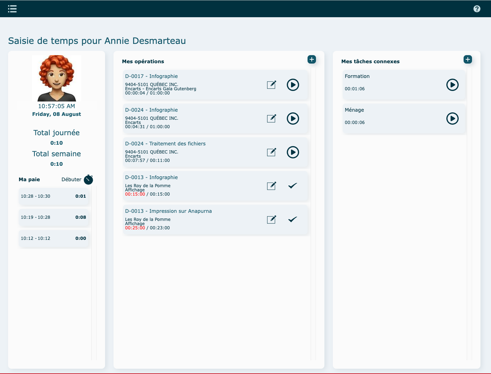
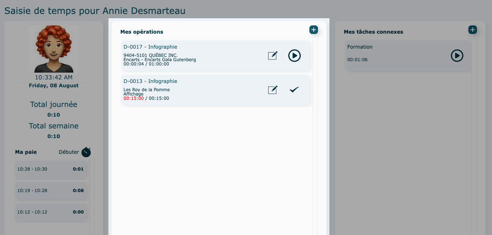
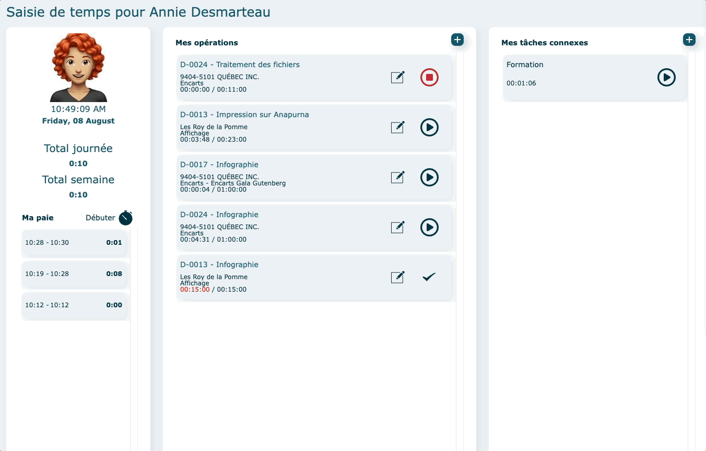
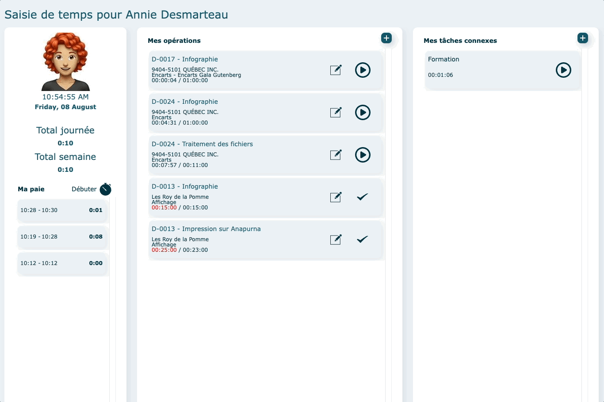

---

# Survol {#survol}

Grâce à ce module, vous pouvez consigner rapidement et clairement le temps investi dans des opérations de main-d’œuvre. La préparation des fiches de paie d’employés est aussi simplifiée.

Un mode d’affichage additionnel par station permet également à plusieurs employés d’utiliser le même appareil de saisie des temps.

#### Attributions

Les opérations et tâches connexes visibles proviennent des [attributions définies dans la fiche](../parametres/utilisateurs.md#actions) de l'utilisateur.

- Pour y accéder

  Cliquez sur la photo de l'employé dans le coin supérieur gauche.

  Apportez vos changements et cliquez sur **Enregistrer** (vous devez avoir les accès nécessaires pour le faire).

  

---

## En mode individuel {#mode-invididuel}

Le module s'ouvre directement sur l'interface de paie de l'employé.

### Ma Paie {#ma-paie}

Permet de débuter votre période de travail à comptabiliser.

Cette partie présente également le total d'heures de la journée et de la semaine en cours ainsi que tous vos punchs de la journée .

Cliquez sur **Débuter** pour commencer un punch et sur le **chronomètre rouge** pour le terminer.

Pour apporter des modifications à un punch, vous référez au rapport [suivant.](../parametres/rapports.md#paie-detail)

---

### Mes Opérations {#mes-operations}

Permet de comptabiliser le temps passé sur des opérations reliées à un dossier de production.

Il est possible de repartir le chronomètre d'une opération, non terminée, réalisée plus tôt dans la journée ; cliquez sur le bouton démarrer. Le total se cumulera.

Le crochet désigne une opération terminée.

- Ajouter une nouvelle opération

  Cliquez sur **l'icône**

  - Par attribution

    Sélectionnez une opération (attribution, ex : infographie), puis un dossier. Le chronomètre partira automatiquement.

    

  - Par dossier

    Recherchez toutes les opérations reliées à un dossier précis.

    Entrer un numéro de dossier et **Chercher.**  
    Pour revenir en arrière, utilisez la flèche bleue.

    Sélectionnez une opération. Le chronomètre partira automatiquement.

    

- Arrêter un chronomètre

  Pour arrêter le chronomètre, cliquez sur le **bouton rouge arrêt.**

  

#### Éditer/terminer une opération

Cliquez sur le **crayon** au bout de la ligne d'opération.

- Éditer

  Vous pouvez apporter des changements aux [champs éditables](../fonctionnalites-generales/champs.md#champs-editables) et/ou ajouter une note.

  **Enregistrer**

- Terminer

  Cliquez sur **Terminer opération**. Le punch s'arrêtera automatiquement.

  **Enregistrer**

---

### Mes tâches connexes {#mes-taches}

Permet de comptabiliser le temps passé sur des tâches connexes.

Ces tâches ne sont pas rattachées à un dossier de production.

Il est possible de repartir le chronomètre d'une tâche déjà réalisée plus tôt dans la journée ; cliquez sur le bouton démarrer. Le total se cumulera.

- Ajouter une nouvelle tâche

  Cliquez sur sur **l'icône**

  Sélectionnez une tâche. Le chronomètre partira automatiquement.

- Arrêter un chronomètre

  Pour arrêter le chronomètre, cliquez sur le **bouton rouge arrêt.**

  

---

## Vidéo démo du module {#video}

[https://www.youtube.com/watch?v=6sbG8gCGAFY](https://www.youtube.com/watch?v=6sbG8gCGAFY)
