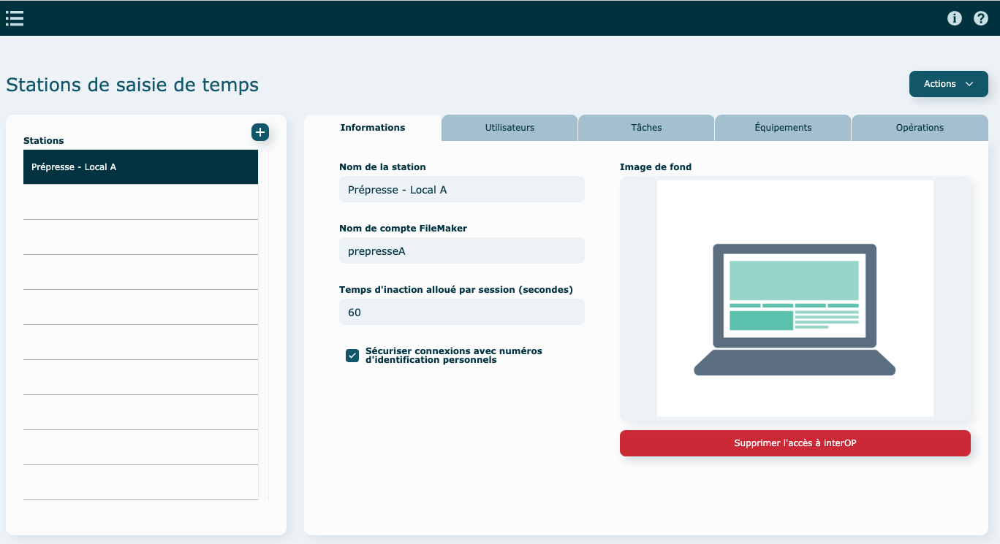
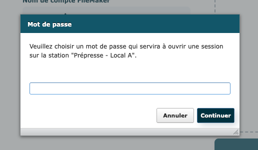
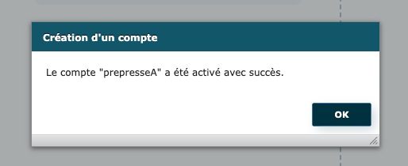
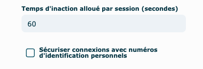
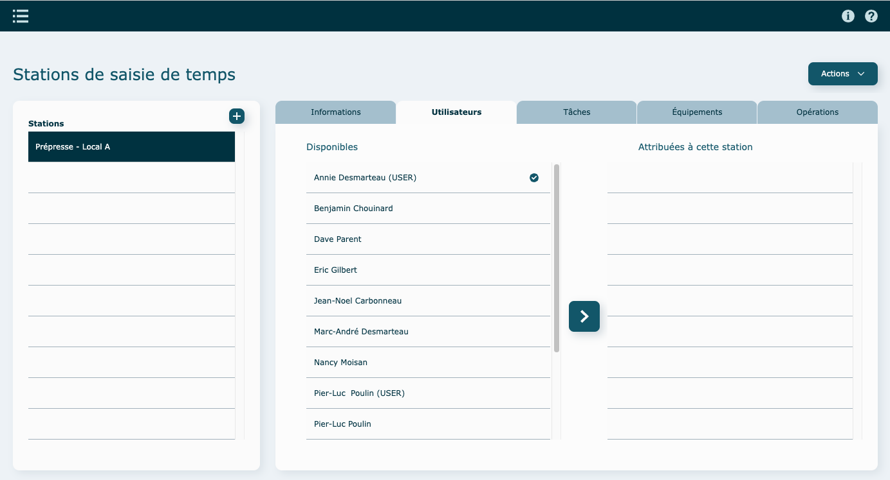
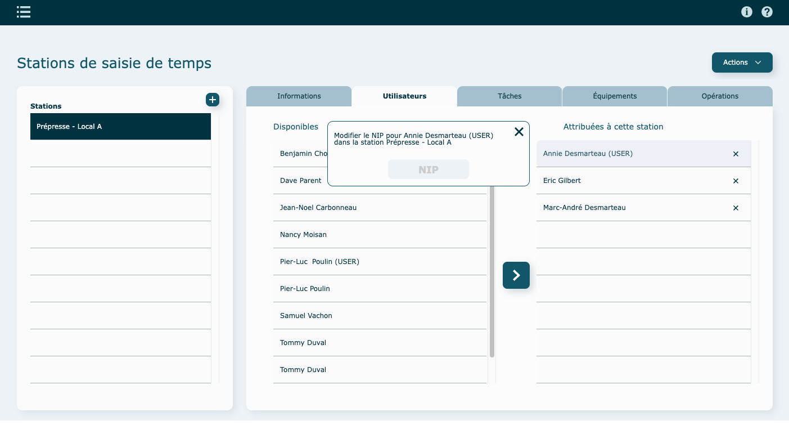
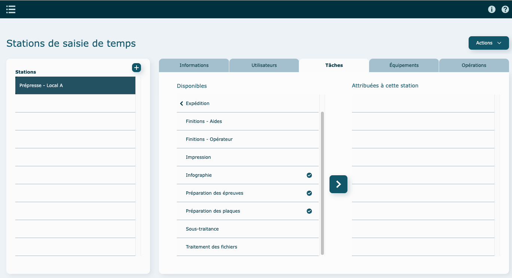
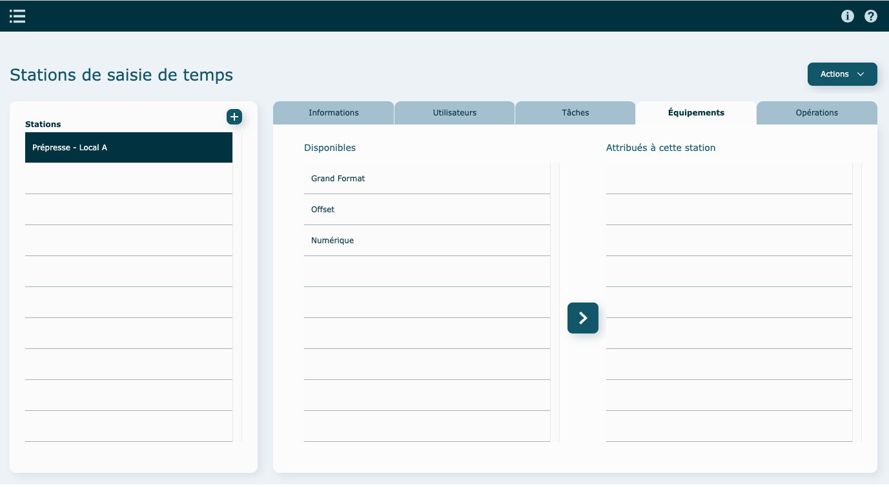
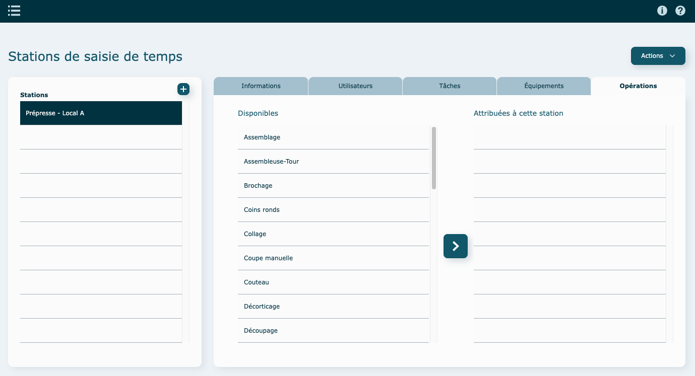
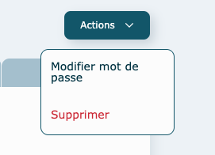

---
## En mode partagé {#mode-partage}

L'employé partage l'appareil de saisie de temps avec d'autres.

Connectez-vous a interOP, sur l'ordinateur partagée, avec les accès d'une station.

**Exemple : Prépresse**

Nom de compte Filemaker = prepresseA

Mot de passe = prepresseA_motdepasse

- **Connexion sécurisée**

  Dans l'interface d'accueil de Saisie de temps, l'employé doit y inscrire son nip personnel et appuyer sur le crochet.

  Il sera automatiquement dirigé vers son interface de paie.

  

- **Connexion non sécurisée**

  Dans l'interface d'accueil de Saisie de temps, tous les employés assignés à cette station seront visible à droite de l'écran.

  L'employé clique sur son nom pour avoir accès son interface de paie.

  

Pour revenir à l'écran d'accueil, cliquez sur la flèche en haut à gauche.

### Stations {#stations}

Une station permet à plusieurs employés de se puncher sur un ordinateur commun.

Il est donc possible de créer 1 station par département ou par équipement.
Exemple : presse, reliure, expédition etc.

Pour accéder aux stations, cliquez sur **Stations** dans le [menu principal](../menu.md).

#### Créer une nouvelle station

Cliquez sur **l'icône**.

Remplir chacun des onglets :

- **INFORMATIONS**

  Remplir les informations.

  Le nom de la station est seulement un nom d'affichage tandis que le nom de compte Filemaker sera le nom d'utilisateur à utiliser pour se connecter à interOP sur la station.

  

  Créer l'accès à interOP et confirmez un mot de passe.

  
  

  Pour **sécuriser** l'accès des employés, cochez la case suivante.
  Un nip personnel devra être confirmé dans l'onglet **Utilisateurs**.

  

  Également, vous pouvez choisir un délai **(temps d'inaction)** avant que l'utilisateur ne soit sortie de son interface. Cela permet à l'utilisateur de ne pas bloquer la session s'il quitte pour travailler. Généralement, nous conseillons de mettre 60 ou 120 sec maximum.

  Si l'utilisateur fait une action comme partir un temps ou éditer un punch, le chronomètre va se réinitialiser et il aura de nouveau 60 ou 120 secondes pour procéder à une autre action, avant d'être sorti par le système.

  Une fois dans son interface de paie, il verra un petit sablier s'écouler.

  

- **UTILISATEURS**

  Attribuez des utilisateurs à cette station.

  Les utilisateurs doivent être existant dans la liste des [utilisateurs](../parametres/utilisateurs.md).

  

  Si l'accès a été préalablement sécurisé dans l'onglet **Informations**, définir un nip personnel à chaque utilisateur. Ce nip lui permettra de se connecter à sa fiche de paie.

  

- **TÂCHES**

  Attribuez des tâches à la station.

  

- **ÉQUIPEMENTS**

  Attribuez des équipements à la station.

  

- **OPÉRATIONS**

  Attribuez des opérations à la station.

  

#### Actions diverses {#actions}

- Modifier le mot de passe (de la station)
- Supprimer

